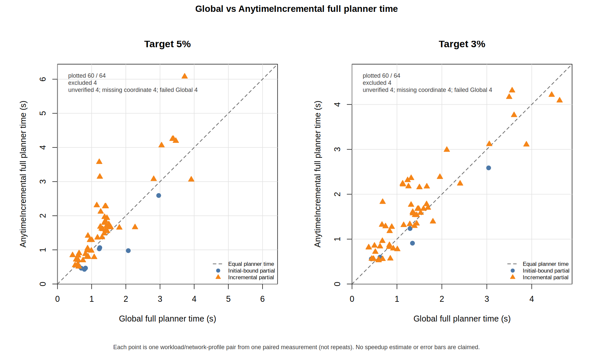

# Compact Global과 Incremental Anytime: 3%·5% planning 검증 보고서

작성일: 2026-09-09 (Europe/Berlin). 실험 식별자는 시작일인 2026-09-08 UTC를 유지한다.

16개 입력과 네 네트워크 cost profile의 128개 Anytime 시도 중 120개가 독립 Global로 검증된 목표 인증에 도달했다. 이 중 107개는 실제 consistency 복원 후에도 일부 coupling을 남긴 채 종료했고, 13개는 초기 LB만으로 충분했다. 일부 coupling을 남긴 인증과 Global 대비 짧은 전체 planning을 함께 만족한 경우는 38개이며, 그중 실제 incremental 작업을 수행한 경우는 26개다.

검증 가능한 120쌍의 전체 planner 중앙값은 Global 1.255초, Anytime 1.446초다. 목표 인증 성공률과 planning 속도는 별개의 결과이며, 이 측정만으로 Anytime이 항상 더 빠르다고 결론 내리지 않는다.

## 1. 구현과 평가 범위

Global은 exact-preserving compact reduction 뒤 exact solve를 수행한다. 새 `AnytimeIncremental`은 같은 compact 입력의 global replica relaxation을 만들고, 선택한 consistency가 영향을 주는 component만 다시 풀어 LB를 강화한다. 영향받지 않은 component 결과는 재사용한다. 모든 결과는 원래 legality와 canonical modeled objective를 기준으로 검증한다.

3%·5% 인증을 목표로 한다. 1%는 compact Global exact 사용을 권장하며 이번 비교에는 포함하지 않았다. Threshold를 보고 Global로 자동 전환하는 코드는 추가하지 않았다.

so007에서 Docker를 실행하지 않고 local JVM의 compile-only 경로를 사용했다. Docker 네트워크 profile의 bandwidth/RTT 값만 cost model에 전달했다. 이 실험은 workload 실행시간이나 네트워크 예측 정확도를 검증하지 않는다.

| 항목 | 설정 |
| --- | --- |
| 구현 commit | `db092e3fea85789b28e4e4570f14f9ffc48a0036` |
| JAR SHA-256 | `a9c8afd660d5fdff9a3149a9748646a79a639a36611955465570054b6caa3b1f` |
| 본 검증 | 16 inputs × 4 profiles × 2 thresholds × 2 methods = 256 JVM trials |
| 반복 | cell별 paired 1회; 별도 GLM pilot은 본 검증 분모에 합치지 않음 |
| JVM | fresh sequential JVM, 8 GiB heap, ActiveProcessorCount=8 |
| Privacy / workers | PRIVATE_AGGREGATE / modeled worker 1; worker JVM 실행 없음 |
| Anytime 제한 | width 2, 최대 256 actions, 1 probe/action, primal repair 최대 2회 |
| 작업량 / region | work 1m, active original 최대 24; factor/total cells 1m/5m |
| 시간 | after-seed soft budget 20s, 두 방법 outer process watchdog 60s |
| Global 제한 | production compact exact factor/total caps 10m/50m |

두 방법은 같은 모델과 compact/exact 커널을 사용한다. Resource cap까지 같은 실험은 아니다. Global optimum을 Anytime의 온라인 선택이나 초기 incumbent로 전달하지 않는다.

| Profile | coordinator→worker / worker→coordinator (Mbit/s) | RTT (ms) |
| --- | ---: | ---: |
| LAN | 5000 / 5000 | 1 |
| WAN-light | 2500 / 1000 | 10 |
| WAN-mid | 250 / 200 | 100 |
| WAN-heavy | 100 / 100 | 200 |

입력은 PCA, LM, ALS, KMeans, LogReg, L2SVM, StepLM, GLM, GNMF, GMM-VVI, P1_FULL, P2_PREP, Sliceline의 adult/covtype/kdd98/uscensus 네 입력이다. 기존 frozen input을 사용했으며 새 데이터나 CP reference를 생성하지 않았다.

## 2. 선택 정책과 인증 계약

각 후보는 같은 encoded variable의 분리된 replica group들을 묶는 작업이다. 현재 선택된 optimum들의 최빈값과 다른 group 수를 `modalMinority`로 세고, 영향받는 component에 이미 기록된 elimination assignment 수로 나눈 값을 우선순위로 사용한다.

\[S(x)=\frac{\mathrm{modalMinority}(x)}{\max(1,\sum_{c\in touched(x)}\mathrm{cachedAssignments}(c))}.\]

이 값은 예상 이득/비용을 대신하는 휴리스틱이다. 실제 최대 LB 개선 구간이나 최단 시간을 보장하지 않는다. 최빈값 기준은 replica 순서 의존성을 없애지만 모든 argmin tie를 고려하지는 않는다. 기본으로 후보 하나만 exact 시험하여 탐색 자체의 비용을 제한한다.

복원한 equality class는 exact 입력에서 변수 하나로 치환한다. 원래 cost와 hard factor, 상수는 유지하고 trial 성공 후에만 component 및 equality 상태를 원자적으로 교체한다. Primal projection과 제한된 Regional repair에서 얻은 계획은 원래 모델에서 검증한 뒤 U 개선에만 사용한다. Region 밖 incumbent를 고정한 conditional optimum은 global LB로 게시하지 않는다.

\[L_k\le C^*\le U_k,\quad L_{k+1}\ge L_k,\quad U_{k+1}\le U_k.\]

양수 LB에서 보수적으로 계산한 \((U-L)/L\le\tau\)이면 종료한다. \(L=0<U\)는 상대 인증 성공으로 처리하지 않는다.

큰 MBE 중간 table 전체를 장기간 보관하지 않는다. Component의 factor/변수 정보, exact 결과와 assignment는 유지한다. 따라서 대형 component와 다수 factor의 메모리 비용까지 사라지는 것은 아니다. Root 전체 exact shortcut은 호출하지 않으며, relaxation의 모든 equality가 복원된 경우는 partial 성공에서 제외한다.

## 3. 전체 결과

목표 미달, JVM 실패 및 Global oracle 부재도 전체 분모에 남겼다. `목표 도달`은 checkpoint의 판정이고, `독립 검증 성공`은 paired Global과 모델 identity 및 모든 checkpoint를 대조한 결과다.

| 목표 | 전체 Anytime | 목표 도달 | 독립 검증 성공 | 도달했으나 독립 검증 부재 | 초기 LB / incremental / fully restored | 미달·실패 | partial planner 승리 | 실제 incremental 승리 |
| --- | ---: | ---: | ---: | ---: | ---: | ---: | ---: | ---: |
| 5% | 64 | 60 | 60 | 0 | 8 / 52 / 0 | 4 | 20 | 12 |
| 3% | 64 | 60 | 60 | 0 | 5 / 55 / 0 | 4 | 18 | 14 |

승리는 해당 paired Global보다 전체 planner 시간이 짧은 경우다. 초기 LB만으로 끝난 성공을 실제 incremental 승리로 세지 않았다. `fully restored`는 전체 relaxation coupling이 이미 복원된 경우이며 이 역시 partial 승리에서 제외한다.

| 목표 | 전체 planner 중앙값 Global / Anytime (s) | paired 검증 분모 | 성공 행만의 launcher TTT 중앙값 (s) | TTT 분모 |
| --- | ---: | ---: | ---: | ---: |
| 5% | 1.238 / 1.446 | 60 | 4.831 | 60 |
| 3% | 1.289 / 1.463 | 60 | 4.875 | 60 |

전체 planner는 초기 모델 구성·compact·초기 bound·seed·refinement 등을 포함한 `CompilePhaseFedPlanner`다. Launcher TTT는 JVM launch부터 첫 인증 checkpoint까지의 관측 시간이다. After-seed elapsed만 Global 전체 시간과 비교하지 않았다. 성공 행만의 TTT에는 선택 편향이 있으므로 위 성공률 및 아래 모든 cell 결과와 함께 해석해야 한다.

| Workload | 5% 검증 성공 / 4 | 3% 검증 성공 / 4 | 초기 / incremental / fully restored | partial 승리 / 8 | 실제 incremental 승리 / 8 | planner 중앙값 G / I (s) | 검증 쌍 |
| --- | ---: | ---: | ---: | ---: | ---: | ---: | ---: |
| pca | 4 | 4 | 4 / 4 / 0 | 3 | 0 | 0.562 / 0.558 | 8 |
| lm | 4 | 4 | 0 / 8 / 0 | 5 | 5 | 0.830 / 0.805 | 8 |
| als | 4 | 4 | 2 / 6 / 0 | 5 | 3 | 0.628 / 0.555 | 8 |
| kmeans | 4 | 4 | 0 / 8 / 0 | 1 | 1 | 0.813 / 1.286 | 8 |
| logreg | 4 | 4 | 0 / 8 / 0 | 2 | 2 | 1.295 / 1.352 | 8 |
| l2svm | 4 | 4 | 0 / 8 / 0 | 4 | 4 | 0.875 / 0.815 | 8 |
| steplm | 4 | 4 | 0 / 8 / 0 | 0 | 0 | 1.238 / 2.256 | 8 |
| glm | 4 | 4 | 2 / 6 / 0 | 4 | 2 | 3.050 / 3.090 | 8 |
| gnmf | 4 | 4 | 0 / 8 / 0 | 3 | 3 | 0.522 / 0.764 | 8 |
| gmm-vvi | 4 | 4 | 5 / 3 / 0 | 6 | 1 | 1.274 / 1.151 | 8 |
| P1_FULL | 4 | 4 | 0 / 8 / 0 | 2 | 2 | 3.531 / 4.231 | 8 |
| P2_PREP | 0 | 0 | 0 / 0 / 0 | 0 | 0 | — / — | 0 |
| sliceline-adult | 4 | 4 | 0 / 8 / 0 | 0 | 0 | 1.421 / 1.668 | 8 |
| sliceline-covtype | 4 | 4 | 0 / 8 / 0 | 1 | 1 | 1.532 / 1.674 | 8 |
| sliceline-kdd98 | 4 | 4 | 0 / 8 / 0 | 2 | 2 | 1.514 / 1.687 | 8 |
| sliceline-uscensus | 4 | 4 | 0 / 8 / 0 | 0 | 0 | 1.423 / 1.687 | 8 |

전체 128 paired cell의 목표, gap, modeled regret, Global/Anytime planning 및 launcher TTT, component/equality 수와 peak RSS는 [상세 결과](ANYTIME_INCREMENTAL_RESULTS_MAIN_V5_KO.md)에 있다. 실패 원문과 종료 상태는 `native/runs/main-incremental-v5/analysis/sevenway_analysis.json` 및 각 trial receipt/log에 보존했다.

### Phase별 planning 비용과 메모리

아래는 각 입력의 독립 검증 쌍을 대상으로 목표 시점(미달은 마지막 시점)의 누적 시간을 집계한 중앙값이다. Bound control은 초기 bound와 이후 후보 관리·강화 전체를 포함하며, component preparation/solve는 그 안의 하위 항목이다. 표의 열을 모두 더하면 중복 계산이 된다. 그 밖의 모델 구축·최종 plan emission 등은 전체 planner 시간에 포함된다.

| Workload | compact / ordered seed (s) | projection / region (s) | bound control (s) | 그중 component preparation / solve (s) |
| --- | ---: | ---: | ---: | ---: |
| pca | 0.062 / 0.016 | 0.005 / 0.004 | 0.064 | 0.022 / 0.008 |
| lm | 0.089 / 0.016 | 0.015 / 0.034 | 0.094 | 0.033 / 0.012 |
| als | 0.036 / 0.012 | 0.048 / 0.010 | 0.065 | 0.028 / 0.006 |
| kmeans | 0.090 / 0.020 | 0.097 / 0.031 | 0.248 | 0.130 / 0.035 |
| logreg | 0.090 / 0.020 | 0.313 / 0.014 | 0.235 | 0.123 / 0.022 |
| l2svm | 0.066 / 0.015 | 0.057 / 0.023 | 0.106 | 0.038 / 0.008 |
| steplm | 0.088 / 0.068 | 0.094 / 0.223 | 0.883 | 0.732 / 0.049 |
| glm | 0.243 / 0.050 | 0.328 / 0.025 | 0.471 | 0.172 / 0.060 |
| gnmf | 0.070 / 0.015 | 0.041 / 0.030 | 0.161 | 0.080 / 0.040 |
| gmm-vvi | 0.121 / 0.022 | 0.015 / 0.000 | 0.184 | 0.057 / 0.016 |
| P1_FULL | 0.126 / 0.059 | 0.388 / 0.025 | 0.858 | 0.568 / 0.059 |
| P2_PREP | — / — | — / — | — | — / — |
| sliceline-adult | 0.067 / 0.018 | 0.200 / 0.027 | 0.148 | 0.064 / 0.012 |
| sliceline-covtype | 0.066 / 0.018 | 0.195 / 0.028 | 0.145 | 0.061 / 0.011 |
| sliceline-kdd98 | 0.067 / 0.017 | 0.195 / 0.026 | 0.152 | 0.064 / 0.012 |
| sliceline-uscensus | 0.073 / 0.018 | 0.192 / 0.026 | 0.156 | 0.061 / 0.012 |

관측된 JVM peak RSS의 중앙값은 Global 1169.7 MiB, Anytime 1213.9 MiB다. Heap 설정은 두 방법 모두 8 GiB이며, 이 값은 heap 사용량만이 아닌 프로세스 RSS다. 큰 intermediate table을 캐시하지 않아도 component 결과와 모델 데이터의 메모리는 필요하다.

### 실패와 품질 미달의 처리

독립 oracle 상태는 `{"failed": 8, "verified": 120}`이며, JVM 실패 분류는 `{"privacy": 16}`다. 실패 분류의 단위는 두 방법을 합한 JVM 시도이고, 목표 성공률의 단위는 Anytime 시도이므로 분모가 다르다.

P2_PREP는 `PRIVATE_AGGREGATE`가 전파된 transformencode metadata 출력 `FunOut M:M`에서 privacy-safe placement를 찾지 못하는 공통 planning 제약이 있다. 해당 실패 행에는 유효 계획이나 인증서를 만들어 채우지 않았다. 이번 작업에서 metadata privacy나 원래 placement legality를 바꾸지 않았으며, 이 입력의 feasible planning 성능은 검증할 수 없다. Log의 `DMLRuntimeException`이라는 클래스명은 이번 compile-only 비교에서 workload를 실행했다는 뜻이 아니다.

## 4. GLM에서 측정하며 바꾼 내용

| 버전 | 핵심 변경 | 목표 성공 / 8 | 실제 incremental partial / 8 | WAN Anytime planner 범위 (s) |
| --- | --- | ---: | ---: | ---: |
| V1 | Replica projection seed + equality 한 개씩 복원 | 0 | 0 | 3.588–4.862 |
| V2 | Ordered greedy seed + 변수별 equality batch + projection 재사용 | 8 | 6 | 12.159–22.146 |
| V3 | 복원 equality를 정확히 변수 치환해 component compile 축소 | 8 | 6 | 8.634–11.428 |
| V4 | Modal minority / cached work 우선순위 + 1 probe | 8 | 6 | 3.131–4.360 |

V1은 유효한 인증 구간을 유지했지만 초기 U가 약하고 복원 진전이 느려 모두 목표 미달이었다. V2는 목표를 달성했지만 WAN의 반복 component preparation이 병목이었다. V3의 exact-preserving contraction은 그 비용을 줄였다. V4는 저렴한 후보를 앞세우고 버리는 trial 계산을 줄여 WAN planning을 다시 낮췄다.

이 표는 측정→개선→재측정 이력이다. 특히 V2와 V4는 여러 변경을 함께 포함하므로 각 구성요소의 독립 기여를 분리한 factorial ablation이나 통계적 speedup 증거는 아니다. 각 버전의 Global도 동일 버전 compact+exact 경로에서 독립 측정했다. 이전에 Global만 uncompacted였던 비교는 이 표에 포함하지 않았다.

## 5. 후보 관리 비용 감소

V5는 V4의 선택 순서와 score, work/cell cap, 수치 처리 및 primal 정책을 유지한다. 각 replica가 속한 component를 배열로 찾아 조회 비용을 O(1)로 줄였다. Component를 성공적으로 합칠 때만 모든 replica의 index를 O(R)에 재구성하며, 중단되거나 실패한 trial은 index를 바꾸지 않는다. Representative 중복 검사는 첫 등장 순서를 보존하는 집합으로 처리한다.

또한 V4의 P1이 시간 예산을 소진하기 전에 64-step 제한으로 종료한 결과를 바탕으로, 단계 상한을 256으로 늘렸다. 시간 budget, 개별 solve work와 cell cap은 유지했다. 따라서 V4→V5는 관리 비용 감소와 단계 제한 변경을 함께 평가한 비교이며, index만의 독립 성능 효과로 해석하지 않는다.

이 변경은 큰 component 목록을 반복 검색하는 알고리즘 내부 관리 비용을 줄이기 위한 것이다. 개별 hotspot의 wall-clock 비율을 프로파일링했다는 뜻은 아니다.

P1의 목표 인증은 V4 0/8에서 V5 8/8로 바뀌었다. V5 P1 전체 planner 중앙값은 Global 3.531초, Anytime 4.231초이며, partial planner 승리는 2/8이다. 목표까지 실제 refinement action 수는 78~81회였다. 단계 제한 확대가 품질 미달을 해소했는지와 전체 planning 시간이 짧아졌는지는 따로 판단한다.

V4/V5의 256개 JVM 시도를 같은 workload/profile/target/repetition/method로 대응했다. 정상 완료한 240개 시도의 analysis/cost fingerprint가 일치했고, 120개 Anytime의 초기 L/U, 초기·seed assignment fingerprint와 replica partition도 일치했다. 112개 Anytime은 시간 항목을 제외한 전체 checkpoint 경로가 같았다. 나머지 8개는 P1이며 최초 68개 checkpoint, 즉 64번째 action까지 같고 V4의 STEP_LIMIT 종료 지점에서 V5가 65번째 action을 계속했다. P2의 16개 실패 시도는 대응 목록에 보존했지만, 빈 trajectory를 유효한 탐색 경로 일치의 근거로 세지 않았다. 이는 관측된 경로 비교이며 index 변경만의 시간 단축을 입증하지 않는다. 원본은 `validation/main-v4-v5-comparison.json`과 요약 JSON에 있다.

### 전체 paired 시간 그림

점선 아래는 해당 Global보다 Anytime이 빠른 측정이다. 파란 원은 초기 LB 성공, 주황 삼각형은 실제 incremental 강화 성공이다. 각 패널은 64개 시도 중 검증된 60개 좌표를 표시하며, P2의 4개 실패는 수치를 만들지 않고 제외 수로 표시한다. Unverified/missing coordinate/failed Global은 중복되는 제외 사유다. 각 점은 반복 평균이 아닌 하나의 workload/network 조건 측정이며, 두 패널의 축 범위가 다르다.

[PDF 그림](figures/ANYTIME_INCREMENTAL_MAIN_V5.pdf), 원본 점 CSV와 panel metadata는 evidence의 `validation/figures/main-v5-planner-scatter.*`에 보존했다. 설치된 base R로 생성했으며 새 dependency를 설치하지 않았다.

## 6. 검증, 한계와 재현 경로

로컬과 so007에서 각각 22개 focused 클래스의 191 tests가 실패·오류·skip 없이 통과했다. 7,506개 source 파일을 build 전후 검증했고 두 host의 JAR SHA-256이 같았다. 별도 Python harness 최종 45 tests도 통과했다. 전체 repository test suite는 아니며 build에서 checkstyle/spotless/license/RAT는 생략했다.

완료된 각 campaign의 선언된 모든 trial, 명령·설정·로그·receipt를 원본에서 재검증하고 frozen runtime/input 자산 해시를 대조했다. JVM 성공만으로 목표 성공을 선언하지 않으며, target miss와 oracle 부재를 숨기지 않는다. 작은 exhaustive oracle 회귀는 LB enclosure, 단조성, hard feasibility, canonical parity, cancellation과 resource 실패 후 상태 보존을 검증한다.

성능 한계는 다음과 같다.

- Cell당 본 측정은 1회다. 공유 서버에서 다른 사용자의 작업도 관측했으며 서버 독점이나 통계적 우위를 주장하지 않는다.
- Modal disagreement와 cached work는 실제 gain·시간의 근사치다. Zero-gain 복원을 여러 번 수행할 수 있다.
- Resource-blocked 후보의 key는 replica roots를 기준으로 보존된다. 다른 merge가 component 비용을 바꿔도 같은 key를 자동 재시도하지 않으므로 자원 종료가 보수적일 수 있다.
- Initial component 계산에 별도 누적 work cap이 없고, 실행 중 exact kernel은 강제 중단하지 못한다. 20초는 after-seed soft budget이고 60초 외부 watchdog 종료는 인증 성공이 아니다.
- 작은 compact model은 Global exact 자체가 저렴하여 Anytime 초기화·진단·projection overhead를 회수하기 어렵다. 3%·5% 허용만으로 언제나 Global보다 빨라진다는 보장은 없다.

| 자료 | 절대 경로 |
| --- | --- |
| 상세 구현 | `/home/mchoi/so007-anytime-incremental-20260908/docs/ANYTIME_INCREMENTAL_IMPLEMENTATION_REPORT_KO.md` |
| 전체 paired 결과 | `/home/mchoi/so007-anytime-incremental-20260908/docs/ANYTIME_INCREMENTAL_RESULTS_MAIN_V5_KO.md` |
| Frozen 본 protocol | `/home/mchoi/so007-anytime-incremental-evidence-20260908/native/protocol-main-incremental-v5.json` |
| 본 raw campaign | `/home/mchoi/so007-anytime-incremental-evidence-20260908/native/runs/main-incremental-v5` |
| 집계 JSON | `/home/mchoi/so007-anytime-incremental-evidence-20260908/validation/incremental-final-aggregate.json` |
| 원본 감사 | `/home/mchoi/so007-anytime-incremental-evidence-20260908/validation/main-incremental-v5-audit.json` |
| Java / Python 검증 | `/home/mchoi/so007-anytime-incremental-evidence-20260908/validation/local-tests-v5.json`, `native-tests-v5.json`, `harness-final-tests-v5.json` |

각 trial의 `command.json`에 JVM argv와 네트워크 cost 환경이 있으므로 동일 입력·설정을 재현할 수 있다. 전체 planning-only 재실행은 frozen protocol/context에 새 campaign 이름을 지정해 `native/run_sevenway.py --phase measured`로 수행한다. 기존 evidence directory는 덮어쓰지 않는다.
