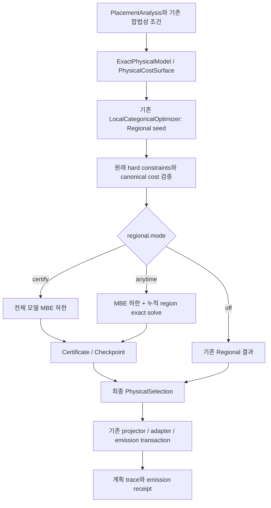

# Certified / Anytime Regional 구현 및 planning-only ablation 상세 보고서

| 문서 정보 | 값 |
| --- | --- |
| 작성일 | 2026-09-08 |
| 대상 서버 | **so007 (`dams-so007`)** |
| 구현 기준 | `feature/certified-regional-20260908` |
| 구현 commit | `6a2cf13a2253f0f1de0624a3de928cb62302fa3a` |
| 기존 결과 문서 commit | `e30b08b64f` |
| 실험 범위 | **compiler/planner 단계까지. Workload 실행 및 worker JVM 실행 제외.** |

이 보고서는 이번에 실제 추가한 코드, 보장에 필요한 전제, 수행한 검증과 실험 결과를 설명한다. 후속 실험 제안은 별도로 표시하며, 제안한 실험을 이미 수행한 것으로 취급하지 않는다. 보고서 작성 과정에서는 기존 증거를 분석했으며 새로운 workload 실험은 수행하지 않았다.

## 1. 주요 결과

기존 Regional planner가 만든 feasible plan에 전역 최적값의 하한을 붙이고, 계산 예산에 따라 하한과 계획을 개선하는 Certified / Anytime Regional을 구현했다. 핵심 결과물은 각 checkpoint에서 유지하는 다음 구간이다.

\[
L_k \le C^* \le U_k.
\]

여기서 \(C^*\)는 **현재 코드가 인코딩한 동일한 finite cost model의 최적값**이다. 실제 분산 실행시간의 최적값이나 모델 밖의 모든 가능한 계획을 뜻하지 않는다.

| 항목 | 확인된 결과 |
| --- | --- |
| Global lower bound | 전체 encoded factor model에 대한 mini-bucket elimination, MBE |
| Feasible upper bound | 기존 Regional seed 및 원래 모델에서 재검증한 개선 계획의 canonical cost |
| 단조성 | 지금까지의 최선의 하한 유지, strict feasible improvement만 수용 |
| Region 확장 | 누적 region, 기존 포함 결정을 재최적화, 모든 activation auxiliary를 자유 변수로 유지 |
| 정책 | `DISAGREEMENT`, `STRUCTURAL`, `RANDOM` |
| Global endpoint | 모든 원래 결정을 자유롭게 한 exact solve가 완료되면 \(L=U=C^*\) |
| 테스트 | Java 97개 + harness 42개 + collector 9개 = **148개 통과** |
| Docker 실험 | KMeans/P2P2D에서 계획한 8종 모두 성공, 비교 검사 10개 모두 통과 |
| 실행 범위 | 모든 성공 행의 workload execution time **0**, workload output 없음 |

Docker KMeans에서 얻은 핵심 수치는 다음과 같다.

\[
\begin{aligned}
L &\approx 28020.9543606126,\\
C^* &= 29057.63845842688,\\
U &= 29701.732755786634.
\end{aligned}
\]

단위는 모두 **모델이 계산한 비용 ms**다. 실제 실행을 측정한 ms가 아니다.

- Regional의 실제 모델 격차: \((U-C^*)/C^* = 2.216609\%\).
- Global을 풀지 않고 인증서만으로 제시할 수 있는 상대 격차 상한: \((U-L)/L \approx 5.998291\%\).
- 이번 width 2→4, 3회, 최대 24개 원래 결정의 확장에서는 정책별 비용 개선이 관측되지 않았다.

따라서 이번 결과는 **계획별 모델 품질 인증과 anytime 실행 구조가 동작함**을 보여준다. 현재 설정에서 disagreement 정책의 우위, 1% 인증 달성 또는 통계적인 planning speedup을 보여주는 결과는 아니다.

## 2. 해결하려던 문제와 용어

### 2.1 기존 Global과 Regional의 차이

원래 결정 변수의 assignment를 \(\alpha\), privacy 및 placement legality를 만족하는 finite feasible set을 \(D\)라고 하자. 비용 모델은 min-sum factor 형태다.

\[
C(\alpha)=\sum_{\psi\in\Psi}\psi(\alpha_{\mathrm{scope}(\psi)}),
\qquad C^*=\min_{\alpha\in D} C(\alpha).
\]

Global은 동일한 encoded model 전체의 exact optimization을 완료했을 때 \(C^*\)를 반환한다. Regional은 선택한 region \(Q\) 안의 결정만 바꾸고 밖의 결정을 현재 계획으로 고정한다.

\[
\min_{\gamma_Q} C(\gamma_Q,\alpha_{\bar Q}).
\]

이 계산이 region 내부에서 exact라는 사실만으로 전체 최적값과의 거리 \(C_R-C^*\)를 알 수는 없다. 또한 제한된 region 방문 순서는 모든 가능한 region에 대한 fixed point를 자동으로 보장하지 않는다.

### 2.2 이번 구현이 추가한 정보

Regional이 반환한 계획이 원래 모델에서 feasible하면 그 비용은 전역 최적값의 상한이다.

\[
U=C(\alpha_R),\qquad C^*\le U.
\]

여기에 전체 factor model을 완화해서 얻은 하한 \(L\le C^*\)를 연결한다. 계획을 바꾸지 않고도 \([L,U]\)를 반환할 수 있으며, 계획을 개선할 때도 같은 인증 체계를 유지한다.

| 용어 | 이 구현에서의 의미 |
| --- | --- |
| Original decision | 실제 physical plan 선택을 나타내는 원래 categorical 변수 |
| Auxiliary variable | 기존 exact activation/cost encoding에 필요한 보조 변수 |
| Hard factor | 모델의 합법성 조건을 표현하는 0 / \(+\infty\) 비용 |
| Canonical cost | 원래 physical contributions로 재평가한, 기존 코드가 사용하는 기준 비용 |
| Raw lower bound | 해당 width에서 완료된 MBE 한 번의 결과 |
| Published lower bound | 지금까지 완료된 유효 하한들의 최댓값 |
| Certificate gap | 최악의 modeled regret를 제한하는 \(U-L\) 또는 양수 \(L\)에 대한 상대 gap |
| Planning receipt | compile-only 설정, 출력 부재, trace 및 파일/모델 식별 정보를 검증한 결과 기록 |

## 3. 구현 구조와 변경 범위

### 3.1 Planner 통합 경로



`FederatedPlanLocalCost`는 기존 placement analysis와 cost surface를 만든 뒤 `LocalPhysicalOptimizer`를 호출한다. `LocalPhysicalOptimizer`는 먼저 기존 Regional seed를 만들고, 모드가 활성화돼 있으면 새 optimizer를 실행한다. 최종 assignment는 기존 selection/projector/emission 경로로 전달된다.

모든 모드에서 같은 종류의 원래 결정과 cost surface를 사용한다. 인증을 위해 runtime fallback을 넣거나, 비용이 불리해 보이는 합법적인 FED 후보를 임의로 제거하는 방식을 사용하지 않았다. `mode=off`가 기본값이며 기존 Regional 비교 기준으로 남아 있다.

### 3.2 핵심 Java 파일

공통 디렉터리: `src/main/java/org/apache/sysds/hops/fedplanner/fedCostBased/fedExact/`.

| 파일 | 변경 | 역할 |
| --- | --- | --- |
| [MiniBucketLowerBound.java](../src/main/java/org/apache/sysds/hops/fedplanner/fedCostBased/fedExact/MiniBucketLowerBound.java) | 신규 | MBE symbolic plan, bounded partition, 하한 계산, argmin disagreement 및 작업 통계 |
| [CertifiedRegionalOptimizer.java](../src/main/java/org/apache/sysds/hops/fedplanner/fedCostBased/fedExact/CertifiedRegionalOptimizer.java) | 신규 | 옵션, incumbent, bound envelope, 누적 region, exact solve, 종료 사유와 checkpoint |
| [LocalPhysicalOptimizer.java](../src/main/java/org/apache/sysds/hops/fedplanner/fedCostBased/fedExact/LocalPhysicalOptimizer.java) | 수정 | 기존 Regional seed와 인증 optimizer 연결, canonical objective 검증, 최종 assignment 선택 |
| [FederatedPlanLocalCost.java](../src/main/java/org/apache/sysds/hops/fedplanner/fedCostBased/fedExact/FederatedPlanLocalCost.java) | 수정 | 설정을 invocation 단위로 읽고 CONFIG/checkpoint/FINAL trace를 출력 |

`ExactCategoricalSolver`, `ExactPhysicalModel`, `ExactPhysicalCostModel`의 기존 exact activation encoding과 physical emission 체계를 재사용한다. 새 패키지 의존성은 추가하지 않았다.

### 3.3 모델과 evaluator를 묶는 경계

인증은 lower bound가 푼 문제와 upper bound가 평가한 문제가 같아야 성립한다. 이를 위해 package 내부 physical 진입점은 `ExactPhysicalModel`과 그 모델에 속한 `PhysicalCostSurface`를 받는다.

이 경계에서 원래 hard factors, 필요한 forced-state audit 조건, exact auxiliary factor set과 canonical evaluator를 함께 구성한다. 후보 계획의 canonical cost만 확인하는 대신 원래 hard constraints도 확인한다. 무관한 evaluator와 auxiliary encoding을 임의로 조합하는 API를 제공하지 않는다.

작은 generic-model 테스트용 진입점도 같은 원래 factor들을 solver와 evaluator에서 사용한다. 단, factor nonnegativity는 계약의 전제다. 시간 예산이 0이면 모든 상태의 factor cost를 열거해 검증하는 절차까지 실행하는 것은 아니다.

## 4. Lower bound: Mini-bucket elimination

### 4.1 완화가 하한을 주는 이유

변수 \(x\)를 제거하는 exact bucket이 다음과 같다고 하자.

\[
g(a,b,c)=\min_x\{f_1(x,a)+f_2(x,b)+f_3(x,c)\}.
\]

bucket을 두 그룹으로 나누면 다음 메시지를 만들 수 있다.

\[
\tilde g(a,b,c)=\min_x\{f_1(x,a)+f_2(x,b)\}+\min_x f_3(x,c).
\]

두 그룹이 같은 \(x\)를 선택해야 하는 coupling을 제거했으므로,

\[
\tilde g(a,b,c)\le g(a,b,c).
\]

이 관계를 elimination 과정에 반복 적용하면 전체 최적값의 하한을 얻는다. 이 min-sum 부등식 자체는 nonnegative cost에만 한정된 성질이 아니다. **이번 구현**은 초기 하한 0, 하향 합산 처리와 기존 physical model의 계약을 위해 nonnegative factor cost를 요구한다.

하한 계산은 region 밖의 결정을 incumbent로 고정하지 않는다. 원래 결정과 auxiliary를 포함한 **전체 global factor model**을 대상으로 한다. 밖을 고정한 문제의 최솟값을 global lower bound라고 사용하면 인증이 성립하지 않을 수 있으므로 테스트에서도 이를 별도로 검사한다.

### 4.2 실제 elimination 및 partition 방법

현재 MBE는 전달된 변수 리스트의 index 순서로 변수를 제거한다. 새로운 min-fill ordering optimizer를 추가한 구현은 아니다.

각 변수의 bucket에서 factor를 입력 순서대로 읽고, 기존 mini-bucket에 greedy하게 합칠 수 있는지 확인한다. 합치는 조건은 다음 두 가지다.

1. 합친 scope의 변수 수가 `iBound` 이하다. **제거하는 변수도 이 수에 포함한다.**
2. 제거 후 생성할 output table의 cell 수가 factor cell 한도 이하다.

조건을 만족하지 못하면 별도 mini-bucket을 만든다. 따라서 width뿐 아니라 domain 크기와 cell limit도 partition에 영향을 준다.

### 4.3 Native factor의 width 예외

처음부터 입력 factor의 scope가 지정한 width보다 넓을 수 있다. 이때 원래 factor를 삭제하거나 내부 항을 임의 분해하지 않고 **분할할 수 없는 독립 mini-bucket**으로 유지한다. 그 factor에서 생긴 descendant도 scope가 width 안으로 들어올 때까지 이 성질을 유지한다.

이 예외 때문에 “width=2이면 모든 원래 factor와 중간 계산이 두 변수 이하”라고 해석하면 안 된다. Native factor도 cell ceiling은 만족해야 한다. 큰 native factor가 존재할 때의 비용은 별도로 남으며, width 하나만으로 모든 메모리·시간 비용을 설명할 수 없다.

### 4.4 자원 검사와 실제 평가

먼저 scope/domain 정보를 이용해 symbolic elimination plan과 필요한 table 크기를 검사한다. 한도를 초과하는 계산을 발견하면 불필요한 대규모 factor 평가나 할당 전에 자원 오류로 처리한다. 이후 실제 factor를 평가하고 mini-bucket 메시지를 materialize한다.

검사 대상에는 per-factor cells, 누적 materialized cells와 overflow가 포함된다. 이 cell 한도는 바이트 단위의 전체 JVM 메모리 한도와 같지 않다. 기존 seed 생성, 객체와 인덱스 구조, trace 등 다른 메모리도 필요하다.

MBE는 내부 cell loop에서도 취소와 시간 예산을 확인한다. 취소된 계산은 완료된 하한으로 게시하지 않는다.

### 4.5 수치 처리

하한의 덧셈은 `Math.nextDown`을 사용하는 보수적인 방향으로 처리한다. Nonnegative 계약 아래 결과는 0 미만으로 낮추지 않으며, hard infeasibility를 나타내는 \(+\infty\)는 유지한다. NaN이나 음수 비용, malformed scope, 유효하지 않은 모델 입력은 성공적인 인증으로 간주하지 않는다.

이 때문에 exact 값에 매우 가까운 하한도 몇 ulp만큼 낮을 수 있다. 작은 physical fixture에서 관측된 tiny residual은 성능 격차로 해석하지 않는다.

## 5. Disagreement 진단과 region 확장

### 5.1 실제 disagreement score

MBE는 output assignment마다 해당 mini-bucket이 선호하는 제거 변수의 argmin을 저장한다. Equal-cost tie에서는 가장 낮은 domain value를 선택한다.

Elimination을 역순으로 따라가며 reconstructed relaxed context에서 각 mini-bucket의 선택 \(v_1,\ldots,v_m\)을 읽는다. 첫 선택 \(v_1\)을 기준으로 다음 score를 계산한다.

\[
d(x)=\frac{\sum_{j=2}^{m}\mathbf{1}[v_j\ne v_1]}{m-1},\qquad m\ge2.
\]

충돌을 보고하는 scope는 해당 제거 step의 mini-bucket union scope들을 합친 것이다. 이 값은 서로 다른 factor 그룹이 서로 다른 결정을 선호한다는 **탐색 신호**다.

다음과 같은 더 강한 의미는 갖지 않는다.

- 각 factor가 전체 \(U-L\)에 기여한 비용을 정확히 분해한 값.
- 해당 coupling을 합쳤을 때의 lower-bound 개선량.
- 해당 region을 풀면 반드시 얻는 incumbent 개선량.
- Tie에 무관한 유일한 conflict 판정.

즉 사용자 아이디어의 “bound가 약한 주변을 확장한다”를 argmin disagreement heuristic으로 구체화한 첫 구현이다. Local merge-loss 같은 더 직접적인 금액 기반 진단은 이번 범위에 구현하지 않았다.

### 5.2 세 가지 정책

| 정책 | 실제 선택 방식 | 해석상 주의점 |
| --- | --- | --- |
| `DISAGREEMENT` | 양수 conflict를 score 내림차순, 동점이면 variable key 순으로 정렬하고 conflict 변수와 scope를 seed로 넣어 factor incidence를 따라 확장 | 정확한 gap 원인 분석이나 개선 보장은 아님 |
| `STRUCTURAL` | 기존 region과 원래 결정 index를 seed로 삼아 factor incidence를 따라 BFS 형태로 확장 | Graph centrality를 계산하는 정책은 아님 |
| `RANDOM` | invocation 시작 시 `Random(seed)`로 원래 결정 index를 한 번 섞고 그 순서의 prefix를 누적 선택 | 매 round마다 새로 독립 표본을 추출하는 방식은 아님 |

진단 기반 탐색에서도 새로운 original decision을 찾지 못하면 남은 original decision을 순서대로 탐색할 수 있다. Region은 반드시 하나의 연결 성분만으로 이루어져야 하는 구조는 아니다.

### 5.3 누적 확장과 재방문

Region은 다음과 같이 유지된다.

\[
Q_k\subseteq Q_{k+1},\qquad
|Q_{k+1}|=\min\{|Q_k|+g,\ q_{\max},\ n\}.
\]

여기서 \(g\)는 `regionGrowth`, \(q_{\max}\)는 `maxRegion`, \(n\)은 원래 결정 수다. 이미 region에 들어온 결정은 다음 exact solve에서도 다시 자유롭게 선택된다.

이번 Docker 설정은 `regionGrowth=8`, `rounds=3`, `maxRegion=64`였지만 실제 방문 크기는 **8→16→24**였다. `maxRegion=64`가 64개를 반드시 방문한다는 뜻은 아니다. 원래 결정 327개 중 마지막 region은 약 7.34%였으며, 이 비율만으로 어떤 critical coupling이 누락됐는지는 판단할 수 없다.

누적 재최적화는 이전 결정을 다시 고려할 수 있게 한다. 그러나 예산 내에서 방문하지 않은 모든 region에 대한 fixed point까지 보장하는 것은 아니다.

### 5.4 Auxiliary와 region 밖의 결정

Conditional exact solve에서는 다음을 적용한다.

- \(Q_k\) 안의 원래 결정: free.
- \(Q_k\) 밖의 원래 결정: incumbent의 값으로 고정.
- **모든 auxiliary variable: free.**

Auxiliary를 이전 계획의 값으로 고정하면 원래 결정의 변경에 따라 activation/cost를 다시 구성할 자유를 잃을 수 있다. 따라서 `regionVariables`는 원래 결정만 세며, 실제 exact solve의 자유 변수 수와 같지 않다.

Reduced factor를 만들 때 free variable만 scope에 남기고 나머지 값은 incumbent로 고정한다. Exact solver가 찾은 후보는 다시 원래 hard constraints와 canonical cost로 검증한다.

## 6. Anytime controller와 보장

### 6.1 실행 순서

```text
alpha = 기존 Regional의 feasible assignment
U = 원래 모델에서 hard feasibility와 canonical cost 검증
L = 0
Q = 빈 region
INITIAL checkpoint 게시

각 refinement round에서:
    시간/취소 및 gap 종료 조건 확인

    첫 round이거나 bound refinement가 필요하면:
        전체 global model의 MBE를 실행
        완료된 유효 raw lower bound만 L = max(L, rawL)에 반영
        BOUND 또는 실패/취소 checkpoint 게시

    certify 모드이면 region solve 없이 다음 bound round 또는 종료

    Q를 정책에 따라 누적 확장
    Q 밖 원래 결정을 고정하고 모든 auxiliary를 free로 둔 exact solve
    후보의 원래 feasibility와 canonical objective를 확인
    후보 비용이 U보다 엄격히 작을 때만 incumbent와 U 갱신

    Q가 모든 원래 결정을 포함하고 exact solve가 완료되면:
        L = U
        GLOBAL checkpoint 게시 후 GLOBAL_EXACT 종료
    아니면 REGION checkpoint 게시

반복/시간/region/resource/gap 종료 조건에 따라 최선의 incumbent와 인증서 반환
```

실제 코드는 오류와 자원 한도, 취소를 구분한다. 위 의사코드는 그 순서를 설명한 것이며 전체 예외 분기를 모두 나열한 코드는 아니다.

### 6.2 상한을 유지하는 방식

현재 incumbent의 원래 비용을 \(U_k\)라고 할 때, 후보는 원래 hard constraints를 만족하고 canonical evaluator 값이 reduced exact solver의 objective와 binary64 raw bit까지 일치해야 한다.

\[
U_{k+1}=\min\{U_k,C(\alpha_{\mathrm{candidate}})\}
\]

실제 assignment 교체는 **strict improvement**일 때만 한다. 동점 후보 때문에 incumbent를 교체하지 않는다. 따라서 유효한 실행에서는 \(U_{k+1}\le U_k\)다.

### 6.3 하한의 단조성: best-so-far envelope

각 width에서 얻은 완료된 하한을 \(\ell_k\)라고 하면 게시하는 값은 다음과 같다.

\[
L_{k+1}=\max\{L_k,\ell_{k+1}\}.
\]

**현재 구현은 nested mini-bucket partition refinement가 아니다.** Width가 커져도 greedy partition이 이전 partition의 엄밀한 coarsening이라는 보장은 없다. 따라서 raw lower bound가 매번 증가한다는 정리를 주장하지 않는다. 단조성은 유효한 하한들의 최댓값을 유지하는 controller가 제공한다.

Region 집합이 nested라는 사실과 mini-bucket partition이 nested라는 주장은 서로 다르다. 이번 구현은 전자는 사용하고, 후자는 요구하지 않는다.

### 6.4 보장문과 증명 개요

다음 전제 아래 보장을 해석한다.

1. Feasible domain은 기존 privacy, placement authority와 hard factors로 정의된 동일한 finite model이다.
2. Factor cost는 nonnegative이며 기존 canonical cost 평가 계약이 성립한다.
3. 기존 exact auxiliary encoding은 원래 physical objective 및 feasibility와 동등하다.
4. 초기 Regional seed가 원래 모델에서 feasible하다.
5. 완료한 MBE 하한과 exact solve 결과에 대해 코드의 자원·수치·모델 일치 검사가 성공한다.

그러면 모든 게시 checkpoint에서 다음을 유지한다.

\[
L_k\le C^*\le U_k,\qquad L_{k+1}\ge L_k,\qquad U_{k+1}\le U_k.
\]

증명 구조는 간단하다. Feasible assignment의 비용은 상한이다. Bucket coupling을 완화한 min-sum 결과는 하한이다. 하한들의 최대도 하한이며, feasible 개선 계획으로 상한을 갱신해도 상한이다. 따라서 절대 gap은 비증가한다.

모든 원래 결정과 auxiliary가 자유롭고 동일한 exact 문제 풀이가 완료되면 Global과 같은 모델의 최적값을 얻으므로 \(L=U=C^*\)를 설정한다. 이때도 solver/canonical objective 일치 검사를 거친다.

이는 코드의 계약에 대한 증명 개요와 테스트로 확인한 구현 보장이다. 전체 프로그램을 proof assistant로 기계 검증한 결과는 아니다. 기존 auxiliary encoding과 exact solver의 정확성도 전제로 사용하며 관련 회귀 테스트를 함께 실행했다.

### 6.5 상대 인증 gap의 의미

\(L>0\)이면 실제 relative modeled regret는 다음으로 제한된다.

\[
\frac{U-C^*}{C^*}
=\frac{U}{C^*}-1
\le\frac{U}{L}-1
=\frac{U-L}{L}.
\]

구현은 \(L<U\)일 때 절대 차이와 양수 \(L\)에 대한 나눗셈을 `Math.nextUp`으로 처리한다. \(L=U\)이면 두 gap은 0이다. \(L=0<U\)이면 relative gap은 \(+\infty\)로 보고하고 절대 gap을 유지한다. 임의의 epsilon 분모로 유한한 approximation ratio가 증명된 것처럼 표시하지 않는다.

“인증 상한 6%”는 “실제로 6% 나쁜 계획”이라는 뜻이 아니다. 이번 KMeans에서는 실제 modeled regret가 2.22%였으며, Global을 풀기 전 인증 정보만으로 말할 수 있는 보수적인 상한이 약 6%였다.

### 6.6 시간과 종료의 정확한 의미

시간 측정은 feasible Regional seed와 원래 비용 평가 이후 시작한다. 따라서 `timeMillis`에는 기존 seed construction과 cost-surface construction 전체가 포함되지 않는다. MBE 내부와 phase 경계에서 예산을 검사하지만, 기존 exact region solver 자체는 강제 중단하지 못한다.

이 구현의 anytime 성격은 **완료된 단계마다 최선의 feasible incumbent와 인증서를 유지하는 것**이다. 임의 시각에 프로세스를 강제 종료해도 최종 계획 파일을 반드시 반환하는 hard real-time API를 구현한 것은 아니다.

| 종료 사유 | 의미 |
| --- | --- |
| `GAP` | absolute 또는 relative tolerance 중 하나 충족 |
| `CERTIFIED` | 계획을 바꾸지 않는 bound 계산 경로 완료. 요청한 gap 달성과 동의어가 아님 |
| `GLOBAL_EXACT` | 전체 원래 결정에 대한 exact endpoint 완료 |
| `ITERATION_LIMIT` | 허용 round 소진 |
| `TIME_BUDGET` | scheduling budget 또는 thread interruption에 따른 중지 |
| `REGION_LIMIT` | region을 더 확장할 수 없는 제한에 도달 |
| `RESOURCE_LIMIT` | 처리 가능한 solver/MBE 자원 한도에 도달 |

초기 seed가 infeasible하거나 모델·비용·canonical equality가 잘못된 경우는 단순한 정상 예산 종료로 숨기지 않는다. `REGIONAL_BOUND_INVALID`, `REGIONAL_CANONICAL_OBJECTIVE_MISMATCH`, `REGIONAL_INCUMBENT_BELOW_BOUND` 등의 오류는 보장 전제가 깨진 상황이다.

## 7. 설정과 로그

### 7.1 Java system properties

아래 모든 key의 prefix는 `sysds.fedplanner.regional.`이다. 설정은 invocation마다 읽는다.

| Key | 기본값 | 의미 |
| --- | --- | --- |
| `mode` | `off` | `off`, `certify`, `anytime` |
| `width` | `2` | 처음 MBE i-bound |
| `maxWidth` | `8` | refinement가 올릴 수 있는 최대 width |
| `rounds` | `4` | 최대 refinement round |
| `refineBound` | certify: `false`, anytime: `true` | 필요한 round에서 width를 1씩 증가 |
| `regionGrowth` | `8` | round마다 추가할 원래 결정 수 |
| `maxRegion` | `64` | 누적 원래 결정 수의 상한 |
| `policy` | `DISAGREEMENT` | 세 가지 region 정책 |
| `seed` | `20260908` | Random 정책의 초기 순열 seed |
| `timeMillis` | `1000` | seed 이후 scheduling budget |
| `absoluteGap` | `0` | 절대 gap 허용치 |
| `relativeGap` | `0.01` | 양수 L에 대한 상대 gap 허용치 |
| `factorCells` | `1000000` | factor table cell 한도 |
| `totalCells` | `5000000` | 누적 materialized cell 한도 |

설정 한도는 기존 production ceiling인 factor 10,000,000 / total 50,000,000 cells를 초과할 수 없다. Width와 round, region 크기 및 tolerance는 유효 범위 검사를 거친다. `maxWidth`와 `maxRegion`은 상한이며, 시간·round 조건 때문에 실제로 그 값에 도달하지 않을 수 있다.

인증 모드의 최소 예시는 다음과 같다. 이는 JVM property 예시이며 전체 재현 명령은 13절에 있다.

```text
-Dsysds.fedplanner.regional.mode=certify
-Dsysds.fedplanner.regional.width=2
-Dsysds.fedplanner.regional.maxWidth=2
-Dsysds.fedplanner.regional.refineBound=false
-Dsysds.fedplanner.trace=true
```

Anytime은 `mode=anytime`으로 켜며 `policy`로 선택 방식을 바꾼다. BoundOnly는 `mode=certify, refineBound=true`, GuidedFixed는 `mode=anytime, policy=DISAGREEMENT, refineBound=false` 조합이다.

### 7.2 Checkpoint와 통계

`[PlannerTrace][DP-RegionalCertificate]`로 CONFIG, 개별 checkpoint와 FINAL을 남긴다.

| 필드 | 해석 |
| --- | --- |
| `phase`, `iteration` | INITIAL, BOUND, REGION, GLOBAL 또는 limit/cancel 단계와 round |
| `width`, `regionVariables` | 시도한 MBE width와 누적 원래 region 결정 수 |
| `rawLower`, `lower`, `upper` | 단일 MBE 결과, 게시 하한, feasible 상한 |
| `gap`, `relativeGap` | 보수적으로 계산한 인증 gap |
| `elapsedMs` | seed 이후 controller 시작부터의 누적 시간 |
| `boundMs`, `regionMs` | 해당 phase의 작업 시간 |
| `splitBuckets`, `disagreements` | 최근 완료 MBE의 split bucket 및 conflict 기록 개수 |
| `maxFactorCells`, `boundMaterializedCells` | 최근 완료 MBE의 table 규모 |
| `boundAssignments`, `regionAssignments` | MBE 평가 및 reduced exact elimination 작업량 |
| `improved` | 해당 region solve가 strict canonical cost improvement를 수용했는지 |
| `costFingerprint`, `analysis` | 최종 인증과 원래 모델/analysis의 연결 |

시간·자원 한도로 MBE를 완료하지 못하면 `rawLower=NaN`으로 표시하고 이전 L을 유지한다. 이전 성공 MBE의 통계가 다른 checkpoint에 함께 나타날 수 있으므로 bound 통계는 **완료된 BOUND phase만 골라 합산**한다. REGION 행에서 같은 MBE 통계를 다시 합하면 중복이다.

기존 `DP-LocalConflict`의 local block/assignment 통계는 Regional seed 단계의 통계다. 최종 objective와 새 refinement의 작업량을 분석할 때는 certificate checkpoint를 함께 읽어야 한다. `regionAssignments`도 input freezing과 canonical reevaluation을 포함한 전체 CPU work는 아니다.

API 내부 checkpoint는 assignment snapshot을 보유하지만 현재 텍스트 trace에 모든 region member ID를 출력하지는 않는다. 후속 원인 분석에는 region membership과 Global 대비 변경 결정 ID의 추가 기록이 유용하다.

## 8. 검증: 148개 테스트와 작은 모델 oracle

### 8.1 Java package 검증

so007에서 main/test source를 새로 컴파일하고 Maven `package`를 완료했다. 13개 지정 클래스의 결과는 **97 tests, 0 failures, 0 errors, 0 skipped**다.

| 테스트 클래스 | Tests |
| --- | ---: |
| `CertifiedRegionalOptimizerTest` | 11 |
| `CertifiedRegionalPhysicalIntegrationTest` | 5 |
| `ExactActivationClassFactorDecompositionTest` | 7 |
| `ExactActivationIndependentOracleTest` | 3 |
| `ExactActivationMaterializationCostTest` | 8 |
| `ExactCategoricalSolverTest` | 12 |
| `ExactCompiledMaterializationScopeTest` | 1 |
| `ExactMaterializationActivationTest` | 10 |
| `ExactPhysicalReducedSolverTest` | 11 |
| `FederatedPlanLocalCostPrivacyConstraintTest` | 2 |
| `LocalCategoricalOptimizerTest` | 11 |
| `MiniBucketLowerBoundTest` | 10 |
| `OccurrenceActivationContextTest` | 6 |
| **합계** | **97** |

새 기능 자체의 세 테스트 클래스는 26개 테스트를 포함하고, 나머지는 기존 exact/local, activation, privacy 계약을 확인한다. Full repository test suite를 모두 실행한 것은 아니다.

MBE 테스트는 독립 brute-force oracle로 만든 150개 random model을 네 width에서 확인한다. Anytime 테스트는 40개 model에 세 region 정책을 적용해 각 checkpoint의 bound와 feasibility를 확인한다. 이 내부 model/width/policy 반복은 JUnit test count와 별개이며, 148개라는 합계에 다시 더하지 않는다.

주요 검증 항목은 bound soundness, 단조성, 원래 hard feasibility, exact endpoint, zero cost, zero time budget, cancellation, 자원 한도, malformed input, disconnected 변수, floating-point 경계와 seeded 반복이다.

### 8.2 Shared-producer barrier

합성 fixture에서는 초기 U=8이며 한 결정 또는 두 결정의 exact region으로는 U가 낮아지지 않는다. 세 개의 결합된 결정을 모두 포함하면 U=2가 되고 L=U=2로 닫힌다.

이 테스트는 누적 joint solve가 개별 결정 변경만으로 넘을 수 없는 장벽을 넘을 수 있음을 확인한다. Disagreement 정책이 모든 실제 workload에서 해당 결정을 빨리 선택한다는 경험적 보장은 아니다.

### 8.3 Physical compiler 통합 ablation

PRIVATE_AGGREGATE fixture는 41개 원래 결정과 기존 activation auxiliary encoding을 사용한다. 확장 정책은 누적 region 14→28→41을 사용하고, Structural/Random/Anytime의 bound width는 1→3이다. GuidedFixed는 width 1을 유지한다.

| Variant | Final L | Final U | 완료한 bound / region pass |
| --- | ---: | ---: | ---: |
| Regional | 0 | 2.5008440979570152 | 0 / 0 |
| Certify | 2.500844097956998 | 2.5008440979570152 | 1 / 0 |
| BoundOnly | 2.5008440979570135 | 2.5008440979570152 | 3 / 0 |
| Structural | 2.5008440979570152 | 2.5008440979570152 | 3 / 3 |
| Random | 2.5008440979570152 | 2.5008440979570152 | 3 / 3 |
| GuidedFixed | 2.5008440979570152 | 2.5008440979570152 | 1 / 3 |
| Anytime | 2.5008440979570152 | 2.5008440979570152 | 3 / 3 |
| Global | 2.5008440979570152 | 2.5008440979570152 | 독립 exact solve |

Regional 행의 0은 nonnegative 모델의 trivial lower bound를 비교용으로 표시한 것이다. Off 모드가 별도 MBE 인증서를 생성했다는 뜻은 아니다.

이 fixture의 Regional seed는 이미 Global optimum이다. 따라서 이 결과는 physical 통합과 full-region endpoint의 검증이며 region-selection 우위의 증거는 아니다. Property를 통해 실제 compiler에 연결했을 때 emission receipt, canonical plan hash, decision coverage와 privacy exclusions도 확인했다.

### 8.4 Harness와 collector 검증

Planning stage, 기존 planning receipt, launcher gate 및 stage-bound receipt의 **42개 테스트**, collector의 **9개 테스트**를 통과했다. Shell syntax와 Python compilation 검사도 수행했다.

검증에는 잘못된 runtime/planning 조합, worker 수, stage schema, 경로 탈출, seed stream 변경, data/reference 변경, receipt 내용 변경, 설정 mismatch, objective/gap 불일치와 누락된 결과가 포함된다. 빈 행 집합을 성공으로 처리하거나, receipt가 없어도 launcher 종료만으로 성공을 선언하지 않는다.

## 9. Docker planning-only 실험 설계

### 9.1 공통 조건

| 항목 | 값 |
| --- | --- |
| Workload | KMeans |
| Dataset | P2P2D, 50,000 rows × 2,100 features |
| Privacy | PRIVATE_AGGREGATE |
| Placement worker 수 | 1 |
| Network profile | LAN |
| Campaign seed | 2026072701 |
| Regional random seed | 20260908 |
| 원래 결정 / physical cost contributions | 327 / 1,406 |
| 반복 | 각 variant 1회, 동일 순서의 sequential pilot |
| Feature width / round | initial 2, maximum 4, 3 rounds |
| Region schedule | growth 8, cap 64, 실제 8→16→24 |
| Refinement 시간 예산 | 5000 ms, seed 이후 soft budget |
| Gap tolerance | absolute 0, relative 0 |
| Cell limits | factor 1,000,000 / total 5,000,000 |
| Coordinator JVM | Xmx 8g, Xms 8g, Xmn 800m, ActiveProcessorCount 8 |
| so007 빌드 환경의 Java / Maven | OpenJDK 17.0.20 / Maven 3.9.7 |

현재 harness의 phase는 compile-only다. Worker container는 Compose resource 계약을 위해 존재하지만 `sleep infinity`를 실행하며 worker JVM을 시작하지 않는다. Coordinator는 계획을 생성하고 통계를 출력한 뒤 workload execution 전에 반환한다.

### 9.2 여덟 ablation 행

| 행 | Harness conf / mode | Bound | Region | 분리해 보는 요소 |
| --- | --- | --- | --- | --- |
| Regional | `mkl-cost / off` | 추가 계산 없음 | 기존 seed만 | 계획 비용 및 planning 기준 |
| Certify | `mkl-cost / certify` | width 2 한 번 | 없음 | 계획 불변 상태의 인증 비용 |
| BoundOnly | `mkl-cost / certify` | width 2→4 | 없음 | bound 강화 효과 |
| Structural | `mkl-cost / anytime` | width 2→4 | 구조 기반 누적 확장 | 진단 신호 없이 확장 |
| Random | `mkl-cost / anytime` | width 2→4 | seeded random 누적 확장 | 무작위 선택 대조 |
| GuidedFixed | `mkl-cost / anytime` | width 2 고정 | disagreement 누적 확장 | bound refinement의 기여 분리 |
| Anytime | `mkl-cost / anytime` | width 2→4 | disagreement 누적 확장 | 결합된 방법 |
| Global | `mkl-exact / off` | exact optimum | 모든 결정 | 독립 최적값 oracle |

Feature 행들에서는 해당 ablation이 바꾸는 요소 외의 model, seed, region schedule과 자원 설정을 맞췄다. Global은 기존 독립 exact 경로이며 feature의 세 round/region cap을 적용한 방법이 아니다. 이 pilot의 시간은 서로 다른 방법의 관측값이며 strict equal-work 실험으로 해석하지 않는다.

## 10. KMeans 결과와 해석

### 10.1 최종 결과

| Variant | Planner s | Compile s | L (modeled ms) | U (modeled ms) | 인증 gap | 실제 modeled gap |
| --- | ---: | ---: | ---: | ---: | ---: | ---: |
| Regional | 0.683282 | 3.036853 | — | 29701.732756 | — | 2.216609% |
| Certify | 0.676193 | 3.039235 | 28020.954361 | 29701.732756 | 5.998291% | 2.216609% |
| BoundOnly | 0.743041 | 2.911757 | 28020.954361 | 29701.732756 | 5.998291% | 2.216609% |
| Structural | 1.049665 | 3.379093 | 28020.954361 | 29701.732756 | 5.998291% | 2.216609% |
| Random | 0.978961 | 3.156036 | 28020.954361 | 29701.732756 | 5.998291% | 2.216609% |
| GuidedFixed | 0.903047 | 3.087335 | 28020.954361 | 29701.732756 | 5.998291% | 2.216609% |
| Anytime | 0.912077 | 3.164377 | 28020.954361 | 29701.732756 | 5.998291% | 2.216609% |
| Global | 0.989851 | 3.403713 | 29057.638458 | 29057.638458 | 0% (exact) | 0.000000% |

L과 U의 단위는 modeled ms이며, planner/compile 시간의 단위는 실제 측정 seconds다. Global 행의 0%는 exact oracle로 얻은 값이다. Baseline off 모드가 feature certificate를 생성한 것으로 집계하지 않는다.

모든 행은 동일한 cost fingerprint, analysis fingerprint와 stage identity를 사용했다. Certify/BoundOnly는 Regional의 emission plan hash를 그대로 유지했다. 각 checkpoint에 대해 독립 Global optimum이 구간 안에 있음을 검사했다.

Certify와 BoundOnly의 종료 사유는 `CERTIFIED`였고, Structural/Random/GuidedFixed/Anytime은 세 round를 소진해 `ITERATION_LIMIT`으로 종료했다. 여기서 `CERTIFIED`는 bound 계산 경로의 완료를 뜻하며, pilot에서 설정한 zero-gap tolerance를 달성했다는 뜻은 아니다.

### 10.2 Actual gap, certificate gap, slack

Global을 알고 난 뒤 계산하는 실제 modeled regret는 다음과 같다.

\[
U-C^*\approx644.094297360\ \mathrm{modeled\ ms},
\qquad \frac{U-C^*}{C^*}\approx2.216609\%.
\]

인증서가 제공하는 absolute gap은 약 1680.778395174 modeled ms다. Lower bound의 slack은 다음과 같다.

\[
C^*-L\approx1036.6840978143\ \mathrm{modeled\ ms}.
\]

즉 보수적인 absolute certificate gap에는 실제 incumbent regret와 lower-bound slack이 함께 들어 있다.

\[
U-L=(U-C^*)+(C^*-L).
\]

Absolute gap은 이렇게 분해할 수 있지만, 서로 다른 분모를 쓰는 2.216609%와 5.998291%를 같은 분모의 오차 성분처럼 단순 합산하면 안 된다.

### 10.3 Phase 작업량

다음 표는 저장된 checkpoint에서 완료된 BOUND와 REGION phase만 골라 합산한 값이다. 표의 ms는 algorithm phase의 wall-clock 시간이며 cost model의 ms와 구분한다.

| Variant | Bound passes | Bound ms 합계 | Region passes | Region ms 합계 | Bound assignments | Region assignments |
| --- | ---: | ---: | ---: | ---: | ---: | ---: |
| Certify | 1 | 57.242 | 0 | 0.000 | 25,230 | 0 |
| BoundOnly | 3 | 123.111 | 0 | 0.000 | 129,077 | 0 |
| Structural | 3 | 124.393 | 3 | 235.603 | 130,281 | 421 |
| Random | 3 | 130.849 | 3 | 219.758 | 130,281 | 433 |
| GuidedFixed | 1 | 63.388 | 3 | 189.737 | 25,230 | 7,530 |
| Anytime | 3 | 125.395 | 3 | 188.605 | 129,266 | 2,831 |

Certify의 전체 planner 시간은 Regional보다 약 7 ms 작게 측정됐지만, 내부 MBE phase는 약 **57.24 ms**의 작업을 수행했다. 따라서 “인증 overhead가 음수” 또는 “인증은 무료”라고 결론내릴 수 없다. 한 번씩 실행한 JVM/컴파일 측정의 변동과 다른 구간의 차이가 섞여 있다.

Anytime은 약 125.39 ms를 bound phase에, 188.60 ms를 region phase에 사용했다. 세 번의 region solve가 완료됐지만 U는 개선되지 않았다. Bound와 region의 evaluator counter는 서로 다른 종류의 작업을 세므로 하나의 공통 CPU instruction 수처럼 합치지 않는다.

### 10.4 Bound width와 partition 관측

| Variant | Width별 split buckets | Width별 conflict records | Width별 maximum factor cells | Width별 materialized cells |
| --- | --- | --- | --- | --- |
| Certify | w2: 86 | w2: 35 | w2: 720 | w2: 16,507 |
| BoundOnly | w2: 86, w3: 69, w4: 71 | w2: 35, w3: 32, w4: 32 | w2: 720, w3: 720, w4: 864 | w2: 16,507, w3: 17,536, w4: 20,660 |
| Structural | w2: 86, w3: 72, w4: 70 | w2: 35, w3: 31, w4: 34 | w2: 720, w3: 720, w4: 864 | w2: 16,507, w3: 17,597, w4: 20,571 |
| Random | w2: 86, w3: 72, w4: 70 | w2: 35, w3: 31, w4: 34 | w2: 720, w3: 720, w4: 864 | w2: 16,507, w3: 17,597, w4: 20,571 |
| GuidedFixed | w2: 86 | w2: 35 | w2: 720 | w2: 16,507 |
| Anytime | w2: 86, w3: 71, w4: 71 | w2: 35, w3: 32, w4: 31 | w2: 720, w3: 720, w4: 864 | w2: 16,507, w3: 17,557, w4: 20,616 |

Width 2→4로 늘리면서 일부 table과 평가량은 증가했지만 L은 floating-point 규모에서만 달라졌다. 이번 범위에서는 의미 있는 bound tightening이 관측되지 않았다.

또한 같은 width의 split bucket 개수가 variant 사이에서 항상 같지는 않다. 예를 들어 width 3에서 BoundOnly는 69, Structural/Random은 72, Anytime은 71이다. 이는 현재 기록에서 관측되는 차이이며, 그 원인을 특정 정책 효과로 확정하지 않는다. 이 pilot은 동일 objective/model과 width schedule을 확인했지만, cross-JVM의 모든 elimination/partition inventory가 같음을 입증한 실험은 아니다. 후속 인과 비교에서는 order와 partition을 추가로 고정·기록할 필요가 있다.

### 10.5 실험이 지지하는 주장과 지지하지 않는 주장

| 주장 | 판단과 근거 |
| --- | --- |
| 같은 모델의 최적값을 포함하는 인증 구간을 반환한다 | 이번 모든 checkpoint에서 Global oracle로 확인 |
| Certify는 기존 계획을 유지한다 | Objective와 emission plan hash 동일 |
| Bound/region refinement가 실제 실행된다 | Width, region size, phase time 및 solver work 기록으로 확인 |
| 이 KMeans 설정에서 width 증가가 의미 있게 bound를 개선한다 | 관측되지 않음 |
| 이 KMeans 설정에서 disagreement가 계획을 개선한다 | 관측되지 않음 |
| Disagreement가 Structural/Random보다 우수하다 | 이번 결과로 입증되지 않음 |
| 1% 이내 인증을 얻었다 | 달성하지 못함. 최종 인증은 약 6% |
| 통계적인 planning speedup이 있다 | 1회 sequential pilot로 판단 불가 |
| 실제 runtime 또는 output correctness가 개선됐다 | 실행하지 않았으므로 판단 대상 아님 |

“Critical coupling이 24개 region 밖에 있었다”, “더 큰 width면 바로 닫힌다”, “tie가 실패의 주원인이다” 등은 가능한 후속 가설이다. 이번 데이터만으로 어느 하나를 확정하지 않는다.

## 11. 실험 harness와 증거 검증

### 11.1 Planning 전용 stage를 추가한 이유

보존된 입력 archive는 P2P2D/private-aggregate/max_workers=4이며 실제 1,031개 파일이 sidecar 기록과 일치했다. 반면 기존 일반 campaign은 정확한 5-worker 데이터와 원래 publisher filesystem lifecycle을 요구했다. Archive의 원래 publication 경로와 hardlink lifecycle을 현재 서버에서 복원할 수 없었다.

이 차이를 숨기지 않고 별도 schema `g007-planning-stage-descriptor-v1`을 추가했다. Content-addressed identity에는 다음이 포함된다.

```json
{
  "planning_only": true,
  "workers": 1,
  "dataset_max_workers": 4,
  "publisher_lifecycle_verified": false,
  "privacy": "private-aggregate",
  "campaign_seed": "2026072701"
}
```

일반 `stage_campaign.py`, `data_freeze.py`, `reference_manifest.py`의 기존 publisher/5-worker 규칙은 그대로 유지했다. 일반 validator는 planning 전용 schema를 runtime-admissible stage로 받아들이지 않는다. Launcher도 이 stage를 `--planning-only --workers 1` 이외의 runtime/lifecycle 경로에 사용할 수 없도록 검사한다.

### 11.2 해시로 연결한 항목

Stage는 전체 data tree와 sidecar, privacy metadata, seed streams, worker-1 descriptor, reference payload/manifest, source tree, wrapper, JAR, classpath library와 mount 경로를 검증한다.

Planning receipt에는 stage descriptor의 실제 파일 hash, canonical payload hash와 전체 identity가 포함된다. Receipt 자체의 canonical hash는 이 연결 정보도 포함한다. Collector는 전달받은 stage와 receipt의 연결을 실제로 대조하고, log/config hash 및 receipt self-hash도 다시 계산한다.

따라서 단지 metadata에 여러 hash 문자열이 존재하는 것만으로 행을 성공시키지 않는다. 실제 사용한 stage, config, log와 결과가 연결돼야 한다. 다만 이러한 내부 hash 검증을 외부 서명 기관의 신원 인증이나 복원되지 않은 publisher lifecycle의 증명과 혼동하지 않는다.

### 11.3 수정한 harness 문제

| 문제 | 수정 | 남긴 검증 |
| --- | --- | --- |
| so007 Docker CLI에서 Compose 미인식 | 기존 설치된 Compose v5.3.1 binary를 실험 전용 `DOCKER_CONFIG` 아래 선택 | Binary hash와 version 기록, 시스템 전역 설정 변경 없이 smoke 재실행 |
| Receipt를 absolute script로 실행하면 `tools` import 실패 | 직접 실행 경로에서 experiments parent를 module search path에 추가 | 무관한 working directory의 subprocess 회귀 테스트 |
| Planning 실패 경로가 runtime 전용 `bundle_dir` 참조 | Planning-only 실패가 runtime bundle 출력 분기로 넘어가지 않도록 수정 | Shell syntax, planning tests와 실제 재실행 |
| Collector가 잘못된 CONFIG/FINAL도 성공으로 받아들일 수 있었음 | 예산·seed 계약, canonical objective bits, final/checkpoint 및 gap arithmetic 검증 | 잘못된 budget/objective/gap, hash 변경에 대한 테스트 |
| Receipt 부재·빈 row 집합의 성공 오판 가능성 | Missing receipt와 zero/missing rows를 실패로 유지 | Collector regression과 실제 실패 행 보존 |

최종 측정 행과 이전 smoke 실패는 분리해 보존했다. 실패한 smoke를 성공한 ablation의 반복 수에 넣지 않았다. 이후 성공 smoke, 최종 8행, 독립 재파싱 검증을 완료했다.

### 11.4 최종 독립 확인

Verifier는 원본 stage/log/config/receipt를 사용해 8행을 다시 parsing했고 저장된 행과 정확히 일치함을 확인했다. Comparison도 다시 계산해 저장된 JSON과 일치했다.

통과한 10개 검사는 complete eight rows, all receipts passed, same encoded model, same analysis, same stage, compile-only, baseline feasible upper, bound-only plan preservation, every checkpoint encloses Global, same Regional seed objective다.

실험 종료 후 matching container와 network는 모두 0개였다. 증거 파일 98개의 portable copy에 대해 원본과 복사본의 size/hash를 확인했다.

## 12. 현재 한계와 후속 planning study

### 12.1 구현의 한계

첫째, 인증 대상은 encoded cost model이다. Cost estimation error, 실제 네트워크와 worker 성능, runtime correctness는 별도 문제다.

둘째, 유한 budget에서 gap이 반드시 0이나 목표 비율로 닫힌다는 정리는 없다. Seed 실패, native factor 크기, cell ceiling, round/region cap 또는 시간으로 endpoint에 도달하지 못할 수 있다.

셋째, exact region solve가 non-preemptible이므로 hard deadline을 제공하지 않는다. 전체 planner invocation 시간을 별도 지표로 사용해야 한다.

넷째, disagreement는 비용 단위의 merge-loss가 아니고 tie와 선택한 relaxed context에 영향을 받는다. Width의 증가도 nested partition strengthening을 보장하지 않는다.

다섯째, 이번 실제 Docker 관측은 KMeans 한 cell의 한 번씩 실행한 pilot이다. 기존 문서에 기록된 LM/KMeans의 일부 과거 assertion 실패나 PRIVATE_AGGREGATE StepLM infeasibility를 이 작업으로 해결했다고 주장하지 않으며, 전체 repository suite도 실행하지 않았다.

### 12.2 후속 실험 제안 — 아직 실행하지 않음

모든 아래 제안은 기존 사용자 제약에 맞춰 **planning-only**로 진행하는 연구 계획이다.

| 우선순위 | 제안 | 답하려는 질문 | 필수 기록 |
| --- | --- | --- | --- |
| 1 | 같은 KMeans의 Global/Regional 결정 차이와 선택 region member 분석 | 개선에 필요한 joint decisions를 실제로 포함했는가 | 결정 ID, 원래/선택 state, region member, 관련 factor |
| 2 | Fixed-width 2/4/8 등과 ordering/partition 대조 | 하한 slack의 원인이 어디에 있는가 | elimination order, partition inventory, raw/published L, table/evaluation 규모 |
| 3 | Region growth와 cap을 늘려 full-region endpoint까지 비교 | 예산 증가가 실제 modeled regret와 certificate를 닫는가 | 단계별 U/L, 포함 변수, 비용 개선, resource stop |
| 4 | Argmin disagreement와 merge-loss/tie 처리 대조 | 현재 진단 신호가 region 선택에 충분한가 | 진단 계산 비용을 포함한 총 planning 시간과 개선량 |
| 5 | 최소 5회 paired repetitions, 여러 random seed, variant 순서 균형화 | 관측 차이가 반복되는가 | 개별 trial, seed, matched model, timeout/failure 분모 |
| 6 | PCA/LM/L2SVM/LogReg/ALS/GLM 등의 feasible planning cell 확장 | 결과가 다른 구조와 규모에서도 유지되는가 | workload별 성공/실패와 Global tractability |

Max width/cap을 늘리더라도 cell 한도를 초과하면 실패/중지로 기록해야 한다. Full region solve가 자원 제한 안에서 완료된 경우에만 exact endpoint로 집계한다. 기존 frozen stage를 수정해서 실험 조건을 바꾸지 않고 새 source/config identity와 stage를 만든다. 현재 pilot collector가 고정한 budget 계약도 새 protocol에 맞게 명시적으로 갱신해야 한다.

후속 주요 지표는 time-to-1%-certificate, \(L/U\) trajectory, Global이 가능한 cell의 실제 modeled regret, certificate slack, accepted improvement 수 및 solver work다. 정책 비교에서는 먼저 동일 확장/작업 예산을 맞추고, 그다음 전체 planner 시간 예산을 비교한다. 최소 5회 반복과 여러 seed에서도 표본 수와 불확실성을 함께 보고해야 하며, 실패를 빼고 평균을 내지 않는다.

### 12.3 현재 논문에 사용할 수 있는 주장

현재 근거로는 다음과 같이 기술할 수 있다.

> 기존 Regional 계획을 유지하거나 feasible하게 개선하면서, 동일 encoded model의 최적값을 포함하는 monotone bound interval을 반환하는 Certified / Anytime Regional을 구현했다. 작은 독립 oracle과 physical compiler fixture, KMeans Docker planning pilot에서 이 계약을 검증했다. KMeans pilot의 인증 상한은 약 6.00%였고 Global로 확인한 실제 modeled regret는 약 2.22%였다.

MBE 부등식 자체를 새로운 이론적 발견으로 주장하기보다는, 기존 physical model 및 activation encoding과의 정합성, 계획별 인증, 누적 exact refinement와 검증 가능한 실험 경로가 이번 구현의 구체적인 기여다. 현재 데이터로 disagreement-guided 선택의 우수성이나 보편적인 planning 효율 개선을 주장하기에는 근거가 부족하다.

## 13. 재현 방법과 artifact 위치

### 13.1 Source 및 binary identity

| 항목 | 값 |
| --- | --- |
| Source root | `/home/mchoi/so007-certified-regional-20260908` |
| Evidence root | `/home/mchoi/so007-certified-regional-evidence-20260908` |
| Baseline commit | `ad5b3ba52fa6a59154e99a34d0a76641a01c1500` |
| Implementation commit | `6a2cf13a2253f0f1de0624a3de928cb62302fa3a` |
| Harness commit | `0d2ebd0706fb1e55ee04e86dafc4b068b60ce533` |
| Stage SystemDS snapshot | `d66871fb2cedcb6d94512292ac1b2ccb83284f30` |
| JAR SHA-256 | `3ce3aa9ec8a95b6407afdc0bdf1f60b397ba414981e51bcd65fd5ed079f4d9b0` |
| Final planning stage ID | `ce823de74bc0387ff2f493ada32f8d4465f3b36fcdb42156e5efa0b6b100d07a` |
| Docker image ID | `sha256:26eaea7a28a130f2c4c2fd4492b74d0e32d4a1df4f1d3e4f0b28c15b59eca8cc` |
| Compose binary SHA-256 | `8d044aa62134870c85a060f17d6e36c412adcad2399addd034d5d4f85074cfb4` |

Stage의 SystemDS snapshot commit은 배포용 source/artifact snapshot이며 원래 implementation commit과 같은 Git history라는 뜻은 아니다. 검사한 7,488개 `src/main`, `src/test`, POM 파일의 local/so007 내용이 같고, built JAR의 hash가 동일함을 별도로 기록했다.

### 13.2 기존 결과 읽기

새로운 workload 실행 없이 [최종 comparison.json](/home/mchoi/so007-certified-regional-evidence-20260908/docker/runs/20260908t0351ablation-kmeans/comparison.json), [전체 summary.json](/home/mchoi/so007-certified-regional-evidence-20260908/docker/runs/20260908t0351ablation-kmeans/summary.json), [독립 검토 문서](/home/mchoi/so007-certified-regional-evidence-20260908/docker/planning-stage-review.md)를 확인할 수 있다.

Original receipt의 absolute path는 so007의 stage를 가리킨다. 다른 위치에 복사한 파일의 대응 관계는 [snapshot-files.json](/home/mchoi/so007-certified-regional-evidence-20260908/docker/snapshot-files.json)에 있다. Receipt 경로를 임의로 치환한 뒤 원래 hash 증거와 같다고 취급하지 않는다.

### 13.3 Java 검증 명령

다음은 실제 build에 사용한 명령이다. 실행 위치는 so007 source root다.

```bash
cd /home/mchoi/so007-certified-regional-20260908
/home/hadoop/apache-maven-3.9.7/bin/mvn -B \
  -Dtest-forkCount=1 -Dtest-threadCount=1 \
  -Dsysds.regional.ablation.output=/home/mchoi/so007-certified-regional-evidence-20260908/validation/physical-ablation.tsv \
  -Dtest=CertifiedRegionalOptimizerTest,MiniBucketLowerBoundTest,CertifiedRegionalPhysicalIntegrationTest,ExactCategoricalSolverTest,LocalCategoricalOptimizerTest,ExactPhysicalReducedSolverTest,ExactActivationIndependentOracleTest,ExactActivationClassFactorDecompositionTest,ExactMaterializationActivationTest,ExactActivationMaterializationCostTest,ExactCompiledMaterializationScopeTest,OccurrenceActivationContextTest,FederatedPlanLocalCostPrivacyConstraintTest \
  package
```

이 명령은 JAR와 지정한 report 파일을 다시 생성한다. 기존 증거를 그대로 보존해야 하는 후속 검증은 별도 checkout/output 경로에서 실행하고 새 hash를 기록하는 것이 맞다. 보고서 작성 과정에서는 이 명령을 재실행하지 않았다.

### 13.4 Docker pilot 재현 명령

다음은 보존된 so007 환경에서 **새 planning-only pilot**을 실행하는 방법이다. 이번 보고서 작성 과정에서 새로 실행한 명령은 아니다.

```bash
ssh -o IdentityAgent=none so007
cd /home/mchoi/so007-certified-regional-evidence-20260908/docker
bash prepare_stage.sh
report_pilot_id="rerun_$(date -u +%Y%m%dt%H%M%Sz)"
PILOT_ID="$report_pilot_id" bash run_ablation.sh kmeans
python3 analyze_pilot.py "runs/${report_pilot_id}-kmeans/summary.json"
```

`run_ablation.sh`는 각 행의 property, Compose 환경과 실제 launcher 명령을 `commands/`에 저장한다. 내부 launcher는 항상 `run_LAN_docker.sh --planning-only --workers 1 --skip-net-check --no-net-cache`를 사용한다. Physical host의 `run_LAN.sh` 결과는 이번 실험 근거로 사용하지 않았다.

`prepare_stage.sh`는 기존 frozen source/artifact/data/reference를 검증한다. 과거 dataset의 max_workers 값을 임의로 바꾸거나 CP reference를 재생성하는 명령을 포함하지 않는다. 이후 다른 worker 수나 새 데이터 campaign은 별도의 조건과 stage 계약으로 설계해야 한다.

### 13.5 근거 파일 목록

| 근거 | 경로 또는 링크 |
| --- | --- |
| 간결한 결과 문서 | [CERTIFIED_REGIONAL_RESULTS.md](CERTIFIED_REGIONAL_RESULTS.md) |
| 구현·ablation 계획 | [CERTIFIED_REGIONAL_ABLATION_PLAN.md](CERTIFIED_REGIONAL_ABLATION_PLAN.md) |
| 문제 해결 이력과 한계 | [SESSION_ISSUES_2026-09-08.md](SESSION_ISSUES_2026-09-08.md) |
| Build / 13개 JUnit XML | Evidence root의 `validation/maven-package.log`, `validation/junit/` |
| Source/JAR provenance | [validation/provenance.json](/home/mchoi/so007-certified-regional-evidence-20260908/validation/provenance.json) |
| Physical compiler ablation | [physical-ablation.tsv](/home/mchoi/so007-certified-regional-evidence-20260908/validation/physical-ablation.tsv), [summary](/home/mchoi/so007-certified-regional-evidence-20260908/validation/physical-ablation-summary.json) |
| Docker 원본 행 및 비교 | `docker/runs/20260908t0351ablation-kmeans/` |
| 정확한 commands와 launcher logs | 위 pilot의 `commands/`, `launcher-logs/` |
| Stage descriptor와 복사된 원본 로그 | `docker/metadata/stage.json`, `docker/snapshots/` |
| Harness source와 diff | `docker/harness-source-final.tar.gz`, `docker/harness-patches/planning-stage.patch` |
| Tool/image provenance | [metadata/tooling.json](/home/mchoi/so007-certified-regional-evidence-20260908/docker/metadata/tooling.json) |
| Container/network 정리 확인 | [teardown-verification.json](/home/mchoi/so007-certified-regional-evidence-20260908/docker/metadata/teardown-verification.json) |
| 구현 완료 manifest | [completion.json](/home/mchoi/so007-certified-regional-evidence-20260908/completion.json) |

후속 에이전트나 연구자는 최종 aggregate 숫자뿐 아니라 `summary.json`의 checkpoint, exact command, source/JAR identity와 실패 기록을 함께 사용해야 한다. 이번 산출물은 기존 Regional에 모델 품질 인증을 연결한 구현과 검증된 planning pilot이며, 더 강한 bound와 더 효과적인 region 선택은 위 후속 실험으로 평가할 과제다.
