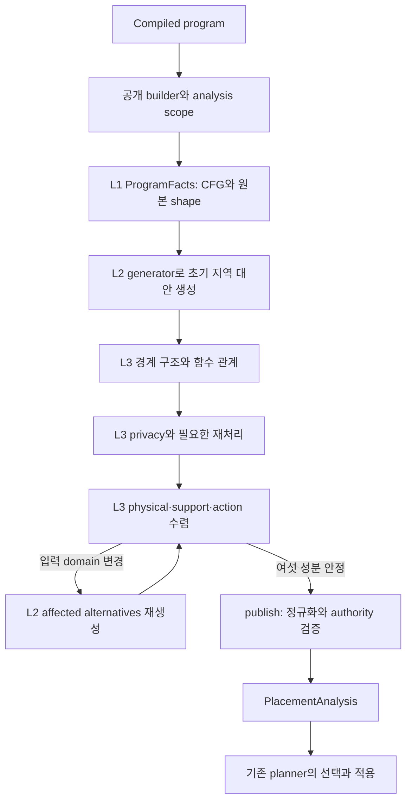

# W1357 search space: 논문 개념과 구현의 대응

## 구현 범위

승인된 2026-09-28 계획을 별도 worktree
`/home/mchoi/w1357-paper-aligned-refactor`에서 구현한다. 원본 엔진과 평가
저장소의 진행 중 변경은 보존했다. P0–P4 구현과 P5의 clean·physical·
정적 검사·동일 Docker 비교를 완료했다. OFF 단일 관측의 10.6% 증가와
측정 한계는 아래에 남기며, 성능 개선이나 시간 동등성을 주장하지 않는다. 외부 correctness 최종 commit `cfab6c8258`은 별도 diff로 반영했으며,
C0의 원래 세 메서드와 관련 clean 469건, B-21 192/36 및 전체 protected
집합·multiplicity를 확인한 뒤 P3/P4를 적용했다.

## 세 계층과 실제 진입점

| 논문 개념 | 코드 진입점 | 소유하는 사실 또는 상태 |
| --- | --- | --- |
| L1 프로그램 사실 | `PlacementProgramFacts.analyze`, `compiledOccurrenceKey`, `valueVersion` | compiler occurrence, CFG/shape 정밀화, 원본 shape snapshot, 원래 value identity |
| L2 지역 실행 대안 | `PlacementCandidateGenerator.buildNode`, `oracleConfirmsAnchorDomain`, `captureConsumerProfileFacts`, `captureDetachedConsumerProfileFacts` | ordered input domain의 새 rule/emission, anchor 확인과 consumer profile; prepared Oracle와 기존 출력 계약 |
| L3 실행 가능한 관계 | `PlacementRelationClosure.close` | 현재 nodes, ruleKeys, ruleFacts, transientBindings, relocations의 유일한 쓰기 소유자 |
| 경계 관계 | `closeBoundaryStructure`, `closeFunctionBoundaryRelations` | 모든 reaching writer, 후보에 의존하는 function/anchor/cardinality 갱신 |
| privacy 적합성 | `closePrivacyRelations`, `closePrivacyDomains` | 현재 관계에 의존하는 effective privacy와 재처리 |
| 배치·지원 관계 수렴 | `closePlacementAndFeasibility`, `closePhysicalDependencies`, `closeDirectComponents` | 현재 source/action 증명, dirty SCC 및 삭제/추가 전파 |
| support clause의 적합성 | `PlacementSupportRelations.pruneUnsupportedRealizations`, `projectCandidateNodesToExecutableStates` | OR-of-AND clause와 executable node projection; 현재 snapshot을 직접 덮어쓰지 않음 |
| 게시 | `PlacementRelationClosure.publish` | 동등한 graph-owned state 정규화, factorization, authority 검증, analysis 구성 |
| 관측 | `PlacementClosureDiagnostics`, 기존 `SearchSpaceMetrics` | recurrence/export 차이와 문자열; 의미 상태의 정본이 아님 |

`NeutralPlacementGraphBuilder`는 190행이며 공개 생성자/API, facts→closure 조립과
analysis scope의 시작·종료를 유지한다. Oracle tuple 처리, CFG 정밀화,
support 제거, 상세 진단 문자열의 본체는 각 소유자로 이동했다.

이는 책임 계층이다. 모든 분석이 프로그램당 한 번만 실행된다는 뜻은
아니다. L1의 CFG/shape 정밀화와 L3의 함수/물리/privacy 수렴은 별개다.
L3는 입력 domain이 바뀌면 같은 L2 generator를 다시 사용한다.

논문의 인터페이스는 `S = (G, {D_v}, R)`다. `G`는 occurrence와 경계 구조,
`D_v`는 occurrence별 실행 대안, `R`은 대안 사이의 입력·배치·제어흐름
호환 관계다. `Occurrence → Rule/ordered inputs → Emission → Realization →
Support clauses`의 구별과 exact owner identity를 유지한다. builder는 이
관계를 게시하고 기존 planner가 관계를 만족하는 전체 선택을 구한다.



## 실제 순서를 반영한 알고리즘

아래는 최종 구현의 실제 phase 순서다. 원래 계획의 상위 transfer 초안으로
실행 순서를 바꾸지 않았다. 각 단계 내부의 기존 반복·guard도 유지한다.

```text
BuildSearchSpace(program):
    begin analysis scope
    facts := PlacementProgramFacts.analyze(program)
    seedLocalAlternatives(facts)
    closeBoundaryStructure(program)
    closeFunctionBoundaryRelations()
    closePrivacyRelations()
    closePlacementAndFeasibility():
        repeat:
            previous := (nodes, ruleKeys, ruleFacts, transientBindings,
                         relocations, pendingPhysicalRebuildOrdinals)
            refresh function boundaries and rebuild affected physical alternatives
            bind candidate, derived-output and relocation authority
            close CFG/transient support and apply current privacy
            prune missing-source clauses; project executable nodes
            discover and bind replacement actions
            prune expired-action clauses; project executable nodes
            update pending affected owners and action authority
        until all six components equal previous
    result := publish()
    finally release closure state and end analysis scope
    return result
```

후보 수나 pending queue 길이만으로 안정성을 판정하지 않는다.
새 replacement action을 결합한 뒤 이전 action의 만료 clause를 제거한다.
유한한 후보 수만으로 전체 transfer의 단조성이나 최소 고정점을 주장하지
않는다. publication에서는 후보 생성이나 관계 복구를 호출하지 않는다.

## 후보 계층을 통과하는 작은 예제

기존 B-21 fixture의 핵심은 함수 안의 `Y=rowSums(X)`와 함수 경계다.
동일한 값이라도 호출 위치와 emitted occurrence identity를 구별한다.

1. **Occurrence / value:** L1은 `rowSums`와 `TWrite Y`의 compiler occurrence,
   callsite, 원래 value version을 제공한다. 함수 확장 시 후보에 의존하는
   synthetic boundary는 L3에서 기존 순서로 생성한다.
2. **Rule / ordered inputs:** L2는 입력 위치별 native/local 상태 조합으로
   `CandidateRuleKey`를 만들고 prepared Oracle에서 capability/shape 근거를
   얻는다. 알려진 bottom domain을 local 입력으로 바꾸지 않는다.
3. **Emission:** 연산의 CP/FED 실행 위치와 LOUT/FOUT 결과 위치를 따로
   표현한다. TRead/TWrite에는 기존 CP/LOUT 또는 FED/FOUT 계약을 적용한다.
4. **Realization / support:** L3는 해당 실행을 지탱하는 exact source,
   worker/range, placement와 action을 연결한다. 두 가능한 joint witness가
   `(X@r1 AND Y@s1) OR (X@r2 AND Y@s2)`라면 두 clause를 그대로 유지한다.
   입력별 집합의 Cartesian product로 바꾸지 않는다.
5. **Publication / selection:** 지원이 닫힌 관계를 정규화하고 소유권을
   검증한 뒤 기존 DP/Exact가 전체 선택을 수행한다. 같은 output label만으로
   source/clause/action을 합치지 않는다.

이 예제의 이항 OR-of-AND 식은 상관관계를 설명하는 일반식이다. 단항
`rowSums` 자체에 두 matrix 입력이 있다는 뜻은 아니다.

고정 기준 B-21은 P와 E 각각 192 raw proofs / 36 physical plans다. 두 값과
양방향 physical identity, multiplicity를 따로 검증하며 160/30으로 낮추지
않는다. 리팩터링 후 전체 비교 결과는 최종 검증 표에 기록한다.

## 수명과 무효화 계약

- Compiler 사실은 읽기 전용이다. 초기 `SinglePartitionFacts`와 현재
  candidate 관계에서 refinement된 cardinality를 구별한다.
- generation base, CFG replay baseline, loop seed ledger, committed proof
  inventory, native revision은 closure 안에서 기존 수명을 유지한다.
- Owner의 node/index/key/fact commit 뒤 proof inventory를 무효화한다.
  query memo reset과 source revision commit은 서로 대체하지 않는다.
- Direct support의 edge 추가/삭제가 SCC 구조를 바꾸면 schedule을 다시
  만들면서 미처리 작업을 보존한다. 이번 변경에서 이 알고리즘은 유지했다.
- metrics OFF에서는 상세 비교와 문자열을 만들지 않는다. 진단 snapshot을
  실행 상태로 사용하지 않는다.
- Builder 재사용과 예외 종료 모두 `finally`에서 closure의 현재 상태와
  proof context를 해제한다. 게시된 불변 객체를 clear하지 않는다.

## 갱신과 중복 순회 통합

P3의 `applyUpdate(ClosureUpdate)`는 기존의 완전한 네 필드 갱신 열 곳을
대체한다. `nodes`, `ruleKeys`, `ruleFacts`, `transientBindings`만 반영하고,
`ClosureUpdate` 밖의 action은 원래 소유자에게 남긴다. 반환된
`changedOrdinals`는 각 호출자가 따로 소비·병합하여 pending work에 반영한다.
일부 필드만 갱신하던 호출은 명시적인 부분 갱신으로 유지한다.

`PhysicalCandidateState.commit`은 node → exact block index → ordered keys →
facts → proof inventory 무효화를 한 경계로 묶는다. 소비자 scheduling은
그 뒤 원래 위치에서 수행한다. 기존 리스트의 구조 공유와 정확한 identity를
유지하고, 범용 transaction/pass framework는 도입하지 않았다.

P4의 `CommittedProofInventory.nodesByKey()`는 같은 불변 commit snapshot에서
edge index와 materialization resolver가 사용하던 동일 노드 순회를 공유한다.
둘을 모두 조회할 때 전체 노드 인덱스 생성과 map 할당이 **2회에서 1회**로
줄어든다. 서로 다른 revision 사이에는 공유하지 않고 resolver query memo는
매 query마다 기존대로 초기화한다. edge-first/resolver-first 순서와 변경된
worker pool, 새 revision 조회 뒤 옛 inventory 재조회까지 cold owner와 비교한다.

CFG/privacy/action transfer의 교환 가능성은 증명되지 않았으므로 global
transfer와 반복 순서를 유지했다. 후보·proof 수 감소를 이번 성과로 주장하지
않는다. 관측 횟수 보존과 중복 index 생성 제거는 서로 다른 검증 항목이다.

## 검증 결과와 추적

검증 source commit은 `cab3ca86b6eb2442f2eb14d33ee856ac61cc1f90`이다.
후속 문서 commit은 production과 테스트를 바꾸지 않는다. 전체 자료는
[/home/mchoi/w1357-diagnostics/paper-refactor-20260928](/home/mchoi/w1357-diagnostics/paper-refactor-20260928)에 보존한다.

| 항목 | 결과 | 근거 |
| --- | --- | --- |
| 외부 C0 선행조건 | 기준과 정확히 이식한 버전 모두 clean 469건, 실패/오류 0; 원래 세 메서드 실행·통과 | [C0 gate](/home/mchoi/w1357-diagnostics/paper-refactor-20260928/evidence/c0/gate.json) |
| 최종 clean + JAR | 73개 suite, 576건, 실패 0, 오류 0, 기존 public-only skip 10; 소스 전후 동일 | [clean receipt](/home/mchoi/w1357-diagnostics/paper-refactor-20260928/evidence/final/clean-73-final.json) |
| 최종 JAR | 11,663,375 bytes; SHA-256 `a2417987edcfea6a87691939f1a4bc57f22480372d228f5581522614cce4447a` | [source/JAR receipt](/home/mchoi/w1357-diagnostics/paper-refactor-20260928/evidence/final/final-jar-artifact.json) |
| Source guard 정비 | 불변 map 소유권, 모든 constructor seam, exact type, 구조 authority의 기존·음성 검사를 유지; 두 클래스 11/11 통과 | [guard receipt](/home/mchoi/w1357-diagnostics/paper-refactor-20260928/evidence/final/architecture-guards-v2.json) |
| P2/P3/P4 독립 검토 | 상태 소유권·갱신·무효화·query 순서·실제 문서 대응 승인; 낮은 우선순위 문서 2건 반영 | [review receipt](/home/mchoi/w1357-diagnostics/paper-refactor-20260928/evidence/final/implementation-review.json) |
| Branch inventory | 7,471 sites; 기존 drift와 rename/move/update/index 변화를 단계별 분류. Scanner/comparator 유지 | [분류 감사](/home/mchoi/w1357-diagnostics/paper-refactor-20260928/evidence/branch-inventory/AUDIT.md) |

최종 clean은 owner 거부, source 재등장, OR/AND sibling, 모든 writer,
privacy/action, dirty SCC, revision 수명, evidence/metrics ON/OFF 및 planner
선택·적용 경계를 포함한다. 원래 DP planning-only 회귀도 실제 실행했다.
수정된 기존 fixture/source guard는 production의 C0 계약에 맞춘 것이며,
B-21 기대값, 비교기, runtime 규칙이나 PUBLIC-only skip 정책은 완화하지 않았다.

최종 export 네 메서드는 새 파일로 실행해 4/4 통과했다. P/E 각각
**216 proofs / 56 physical plans**이며 최초 P0 및 최종 C0와의 전후 비교,
최종 P↔E 비교 다섯 쌍 모두 양방향 차이 0이고 proof multiplicity가 같다.
기존 `canonical_plan`과 `plan_space_verify.compare`를 그대로 사용했다.
B-21의 192/36 assertion도 그대로 실행·통과했다. P audit 216행은 파싱한 JSON
내용과 순서가 같고 원본 직렬화 bytes는 다르다. [Physical 비교 receipt](/home/mchoi/w1357-diagnostics/paper-refactor-20260928/evidence/final/final-physical-summary.json).

## 정적 검사와 남은 검사 한계

Java `clean` compile을 타입 검사로 사용했다. 프로젝트 POM에는 별도
Checkstyle/PMD/SpotBugs gate가 없다. 캐시된 Checkstyle 3.6.0의 기본 Sun
정책으로 별도 보고서를 생성했고, 그 실행 성공을 lint 통과로 해석하지 않는다.
새 의존성은 추가하지 않았다.

| 같은 범위의 비교 | 결과 |
| --- | ---: |
| P1 Java 7파일 → 최종 Java 7파일 | 10,706 → 11,003 findings |
| 기존 rule/message/정규화된 행 context와 일치 | 10,337 |
| 새 context / 그중 추가된 행 | 666 / 657 |
| P3 기준 closure → P4 최종 closure | 8,561 → 8,576 (+15) |
| P4 추가된 production 행에 직접 걸린 findings | 14 |
| UnusedImports | 0 |

추출·이동·형식 변경으로 context가 달라질 수 있어 666건을 전부 새로운
의미 결함으로 세지 않는다. 반대로 모두 기존 위반이라고 주장하지도 않는다.
P4 추가 행의 14건은 공백 6, 줄 길이 5, Javadoc 2, brace 1이다. 이 스타일
위반은 남아 있다. 전체 기준의 369,617건과 과거 기록 367,216건은 별도
snapshot 수치이며 이번 범위의 결과와 섞지 않는다.

정적 검사 이후 production Java/POM은 그대로다. Docker wrapper 설명 한 줄의
`DP`→`common` 수정과 테스트·문서 변경만 뒤따랐다. 상세 XML과 context 분류는
[정적 검사 보고서](/home/mchoi/w1357-diagnostics/paper-refactor-20260928/evidence/static-final/STATIC_FINAL_REPORT.md)에 있다.

## 같은 Docker 조건의 비교

실험 진입점은 [run_LAN_docker.sh](../scripts/fedplanner/run_LAN_docker.sh)다.
기존 harness의 원격 Docker lifecycle과 frozen 입력을 재사용한 evidence-local
harness를 호출한다. 고정 cell은 `ml|logreg|lan|w1|FedFirst`, X 50,000×128,
X PrivateAggregation/Y Public, coordinator so007/worker so002, LAN 5,000 Mbit와
RTT 1 ms, container 24g/cpuset 0–7, JVM `-Xms16g -Xmx16g -Xmn1600m
-XX:ActiveProcessorCount=8`이다. 각 host의 이미지, 입력, JVM, network receipt와
source/JAR hash를 전후 확인했다. [Harness provenance](/home/mchoi/w1357-diagnostics/paper-refactor-20260928/perf-harness/HARNESS_PROVENANCE.json).

기준 C0와 refactor의 OFF/ON 조합마다 새 JVM 한 번만 실행했다. 네 run은
cleanup 및 remote lease 해제를 확인했고 analysis fingerprint가 모두 같다.
selector·runtime program emission·workload execution 횟수는 모두 0이다.
따라서 공통 search-space 구성 측정이며 DP 선택기나 실제 workload 성능
측정으로 해석하지 않는다. 선택·적용은 별도 회귀 suite에서 검사했다.

| OFF 단일 관측 | 기준 C0 | Refactor | 변화 |
| --- | ---: | ---: | ---: |
| `searchSpaceSeconds` | 28.004893 s | 30.975320 s | **+10.6068%** |
| `commonPreparationSeconds` | 0.007785 s | 0.007434 s | -0.000351 s |
| `analysisSeconds` | 27.996964 s | 30.967724 s | +2.970759 s |
| `boundaryFinalizationSeconds` | 0.000144 s | 0.000163 s | +0.000019 s |
| GC 경계/종료 시점 관측 heap 최댓값 | 2,567,962,624 bytes | 2,560,622,592 bytes | -0.2858% |
| 종료 시점 heap 사용량 | 1,674,842,112 bytes | 1,659,378,520 bytes | -0.9233% |

`Tspace = commonPreparation + analysis + boundaryFinalization` 합산을 양쪽에서
확인했다. Heap 열은 동일한 GC 로그 및 probe 종료 시점에서 관측한 최댓값이며
**정확한 peak heap은 아니다**. `-Xmx16g`를 peak 사용량으로 쓰지 않는다.

| ON 진단 횟수 | 기준 C0 | Refactor |
| --- | ---: | ---: |
| 후보 fact 재계산 | 51,682 | 51,682 |
| Physical rebuild 호출 | 25 | 25 |
| Direct closure pass | 1,209 | 1,209 |
| Fixed-point / publication pass | 13 / 5 | 13 / 5 |
| Proof query / graph | 23,012 / 23,012 | 23,012 / 23,012 |
| Proof state | 1,601,661 | 1,601,661 |
| Proof alternative | 10,046,442 | 10,046,442 |
| Proof dependency edge | 15,642,493 | 15,642,493 |

OFF 증가가 계획의 5% 조사 기준을 넘어 raw phase/GC/counter와 소스 경계를
조사했다. 증가는 analysis 안에 있다. 양쪽 GC pause 16회와 누적 pause
623.257→608.088 ms는 지연 증가를 설명하지 못한다. ON의 모든 22개 phase
호출 횟수와 위 semantic 횟수는 같다. ON ANALYSIS의 allocated bytes는
21,079,321,072→21,105,336,208로 약 0.1234% 증가했다. 전체 100개 raw
metric 중 `signatureIdentityCacheHits`는 19,809,530→19,760,485(-0.2476%),
`signatureStructuralCacheHits`는 1,229,661→1,229,662로 달랐다. 위 표는
보존된 구성 횟수를 나타내며 모든 cache hit가 같다는 뜻은 아니다.

별도 ON 관측은 32.716453→29.201786 s로 OFF와 반대 방향이었다. ON으로
OFF 결과를 대체하거나 좋은 표본을 선택하지 않았다. 동일 작업량·거의 같은
heap/할당량은 불필요한 추가 pass나 proof 폭증을 뒷받침하지 않지만, OFF에
세부 CPU/JIT profile이 없으므로 2.97초 증가의 정확한 원인은 확정할 수 없다.
읽기 전용 소스·bytecode 감사에서는 중복 pass, OFF 문자열 생성, cache 수명
오류를 찾지 못했다. Local→field 상태 이동, 작은 owner 객체와 method 호출,
class loading/컴파일 경계 변화는 확인됐지만 각각이 2.97초를 설명한다는
증거는 없다. JIT·host scheduling 변동은 가능성일 뿐 관측된 원인으로
단정하지 않는다.
이 결과로 속도 개선, 5% 이내 성능 보장 또는 통계적 유의성을 주장하지 않는다.

[네 run 비교](/home/mchoi/w1357-diagnostics/paper-refactor-20260928/perf-harness/p5-comparison.json)와
[독립 성능 조사](/home/mchoi/w1357-diagnostics/paper-refactor-20260928/evidence/final/P5_PERFORMANCE_INVESTIGATION.md)에
원본 receipt 및 한계를 연결했다. 기존 paused 20초 목표는 재개하지 않았다.

## 재현 범위와 잔여 위험

- 최종 clean 명령과 모든 selector는 clean receipt 및
  [selector 파일](/home/mchoi/w1357-diagnostics/paper-refactor-20260928/final-class-selector.txt)에 있다.
  Physical export는 별도 네 메서드와 새 NDJSON 경로를 사용한다.
- 이 작업의 대상 suite에 미해결 실패는 없다. 전체 저장소의 모든 테스트를
  통과했다는 의미는 아니다. 범위 밖 `ExactPhysicalModelCertificateTest`의
  기존 60M-cell limit 실패는 기준에서도 재현됐고 cap을 바꾸지 않았다.
- L3는 8,981행으로 여전히 크다. 상태 쓰기 소유자와 실제 phase, 순수 support,
  generator, facts, diagnostics는 분리됐지만, 검증되지 않은 global transfer
  병합은 수행하지 않았다. 남은 크기와 스타일 위반은 명시적 기술 부채다.
- 전체 protected physical 집합 비교, 개별 의미 회귀, source identity guard는
  서로 보완한다. 공통 builder를 쓰는 P/E의 일치 하나만으로 모든 의미를 증명하지 않는다.
- 대표 한 조건의 OFF 시간 증가와 정확한 peak heap 미측정은 성능 검증의
  한계로 남는다. [독립 최종 검증](/home/mchoi/w1357-diagnostics/paper-refactor-20260928/evidence/final/FINAL_VERIFICATION.json).
