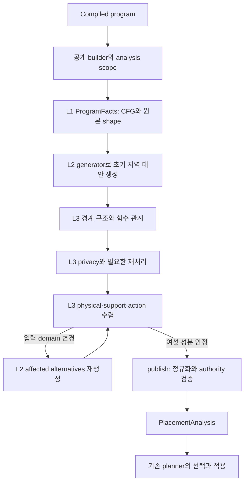

# W1357 search space: 논문 개념과 구현의 대응

## 구현 범위

승인된 2026-09-28 계획을 별도 worktree
`/home/mchoi/w1357-paper-aligned-refactor`에서 구현한다. 원본 엔진과 평가
저장소의 진행 중 변경은 보존했다. P0–P4 구현을 완료했고 최종 P5 검증을
진행한다. 외부 correctness 최종 commit `cfab6c8258`은 별도 diff로 반영했으며,
C0의 원래 세 메서드와 관련 clean 469건, B-21 192/36 및 전체 protected
집합·multiplicity를 확인한 뒤 P3/P4를 적용했다.

## 세 계층과 실제 진입점

| 논문 개념 | 코드 진입점 | 소유하는 사실 또는 상태 |
| --- | --- | --- |
| L1 프로그램 사실 | `PlacementProgramFacts.analyze`, `compiledOccurrenceKey`, `valueVersion` | compiler occurrence, CFG/shape 정밀화, 원본 shape snapshot, 원래 value identity |
| L2 지역 실행 대안 | `PlacementCandidateGenerator.buildNode` | ordered input domain을 평가한 새 rule/emission; prepared Oracle와 기존 출력 계약 |
| L3 실행 가능한 관계 | `PlacementRelationClosure.close` | 현재 nodes, ruleKeys, ruleFacts, transientBindings, relocations의 유일한 쓰기 소유자 |
| 경계 관계 | `closeBoundaryStructure`, `closeFunctionBoundaryRelations` | 모든 reaching writer, 후보에 의존하는 function/anchor/cardinality 갱신 |
| privacy 적합성 | `closePrivacyRelations`, `closePrivacyDomains` | 현재 관계에 의존하는 effective privacy와 재처리 |
| 배치·지원 관계 수렴 | `closePlacementAndFeasibility`, `closePhysicalDependencies`, `closeDirectComponents` | 현재 source/action 증명, dirty SCC 및 삭제/추가 전파 |
| support clause의 적합성 | `PlacementSupportRelations.pruneUnsupportedRealizations`, `projectCandidateNodesToExecutableStates` | OR-of-AND clause와 executable node projection; 현재 snapshot을 직접 덮어쓰지 않음 |
| 게시 | `PlacementRelationClosure.publish` | 동등한 graph-owned state 정규화, factorization, authority 검증, analysis 구성 |
| 관측 | `PlacementClosureDiagnostics`, 기존 `SearchSpaceMetrics` | recurrence/export 차이와 문자열; 의미 상태의 정본이 아님 |

`NeutralPlacementGraphBuilder`는 190행이며 공개 생성자/API, facts→closure 조립과
analysis scope의 시작·종료를 유지한다. Oracle tuple 처리, CFG 정밀화,
support 제거, 상세 진단 문자열의 본체는 각 소유자로 이동했다.

이는 책임 계층이다. 모든 분석이 프로그램당 한 번만 실행된다는 뜻은
아니다. L1의 CFG/shape 정밀화와 L3의 함수/물리/privacy 수렴은 별개다.
L3는 입력 domain이 바뀌면 같은 L2 generator를 다시 사용한다.



## 실제 순서를 반영한 알고리즘

아래는 최종 구현의 실제 phase 순서다. 원래 계획의 상위 transfer 초안으로
실행 순서를 바꾸지 않았다. 각 단계 내부의 기존 반복·guard도 유지한다.

```text
BuildSearchSpace(program):
    begin analysis scope
    facts := PlacementProgramFacts.analyze(program)
    seedLocalAlternatives(facts)
    closeBoundaryStructure(program)
    closeFunctionBoundaryRelations()
    closePrivacyRelations()
    closePlacementAndFeasibility():
        repeat:
            previous := (nodes, ruleKeys, ruleFacts, transientBindings,
                         relocations, pendingPhysicalRebuildOrdinals)
            refresh function boundaries and rebuild affected physical alternatives
            bind candidate, derived-output and relocation authority
            close CFG/transient support and apply current privacy
            prune missing-source clauses; project executable nodes
            discover and bind replacement actions
            prune expired-action clauses; project executable nodes
            update pending affected owners and action authority
        until all six components equal previous
    result := publish()
    finally release closure state and end analysis scope
    return result
```

후보 수나 pending queue 길이만으로 안정성을 판정하지 않는다.
새 replacement action을 결합한 뒤 이전 action의 만료 clause를 제거한다.
유한한 후보 수만으로 전체 transfer의 단조성이나 최소 고정점을 주장하지
않는다. publication에서는 후보 생성이나 관계 복구를 호출하지 않는다.

## 후보 계층을 통과하는 작은 예제

기존 B-21 fixture의 핵심은 함수 안의 `Y=rowSums(X)`와 함수 경계다.
동일한 값이라도 호출 위치와 emitted occurrence identity를 구별한다.

1. **Occurrence / value:** L1은 `rowSums`와 `TWrite Y`의 compiler occurrence,
   callsite, 원래 value version을 제공한다. 함수 확장 시 후보에 의존하는
   synthetic boundary는 L3에서 기존 순서로 생성한다.
2. **Rule / ordered inputs:** L2는 입력 위치별 native/local 상태 조합으로
   `CandidateRuleKey`를 만들고 prepared Oracle에서 capability/shape 근거를
   얻는다. 알려진 bottom domain을 local 입력으로 바꾸지 않는다.
3. **Emission:** 연산의 CP/FED 실행 위치와 LOUT/FOUT 결과 위치를 따로
   표현한다. TRead/TWrite에는 기존 CP/LOUT 또는 FED/FOUT 계약을 적용한다.
4. **Realization / support:** L3는 해당 실행을 지탱하는 exact source,
   worker/range, placement와 action을 연결한다. 두 가능한 joint witness가
   `(X@r1 AND Y@s1) OR (X@r2 AND Y@s2)`라면 두 clause를 그대로 유지한다.
   입력별 집합의 Cartesian product로 바꾸지 않는다.
5. **Publication / selection:** 지원이 닫힌 관계를 정규화하고 소유권을
   검증한 뒤 기존 DP/Exact가 전체 선택을 수행한다. 같은 output label만으로
   source/clause/action을 합치지 않는다.

이 예제의 이항 OR-of-AND 식은 상관관계를 설명하는 일반식이다. 단항
`rowSums` 자체에 두 matrix 입력이 있다는 뜻은 아니다.

고정 기준 B-21은 P와 E 각각 192 raw proofs / 36 physical plans다. 두 값과
양방향 physical identity, multiplicity를 따로 검증하며 160/30으로 낮추지
않는다. 리팩터링 후 전체 비교 결과는 최종 검증 표에 기록한다.

## 수명과 무효화 계약

- Compiler 사실은 읽기 전용이다. 초기 `SinglePartitionFacts`와 현재
  candidate 관계에서 refinement된 cardinality를 구별한다.
- generation base, CFG replay baseline, loop seed ledger, committed proof
  inventory, native revision은 closure 안에서 기존 수명을 유지한다.
- Owner의 node/index/key/fact commit 뒤 proof inventory를 무효화한다.
  query memo reset과 source revision commit은 서로 대체하지 않는다.
- Direct support의 edge 추가/삭제가 SCC 구조를 바꾸면 schedule을 다시
  만들면서 미처리 작업을 보존한다. 이번 변경에서 이 알고리즘은 유지했다.
- metrics OFF에서는 상세 비교와 문자열을 만들지 않는다. 진단 snapshot을
  실행 상태로 사용하지 않는다.
- Builder 재사용과 예외 종료 모두 `finally`에서 closure의 현재 상태와
  proof context를 해제한다. 게시된 불변 객체를 clear하지 않는다.

## 갱신과 중복 순회 통합

P3의 `applyUpdate(ClosureUpdate)`는 기존의 완전한 네 필드 갱신 열 곳을
대체한다. `nodes`, `ruleKeys`, `ruleFacts`, `transientBindings`만 반영하고,
반환값에 없는 action과 pending work는 원래 소유자에게 남긴다. 일부 필드만
갱신하던 호출은 명시적인 부분 갱신으로 유지한다.

`PhysicalCandidateState.commit`은 node → exact block index → ordered keys →
facts → proof inventory 무효화를 한 경계로 묶는다. 소비자 scheduling은
그 뒤 원래 위치에서 수행한다. 기존 리스트의 구조 공유와 정확한 identity를
유지하고, 범용 transaction/pass framework는 도입하지 않았다.

P4의 `CommittedProofInventory.nodesByKey()`는 같은 불변 commit snapshot에서
edge index와 materialization resolver가 사용하던 동일 노드 순회를 공유한다.
둘을 모두 조회할 때 전체 노드 인덱스 생성과 map 할당이 **2회에서 1회**로
줄어든다. 서로 다른 revision 사이에는 공유하지 않고 resolver query memo는
매 query마다 기존대로 초기화한다. edge-first/resolver-first 순서와 변경된
worker pool, 새 revision 조회 뒤 옛 inventory 재조회까지 cold owner와 비교한다.

CFG/privacy/action transfer의 교환 가능성은 증명되지 않았으므로 global
transfer와 반복 순서를 유지했다. 후보·proof 수 감소를 이번 성과로 주장하지
않는다. 관측 횟수 보존과 중복 index 생성 제거는 서로 다른 검증 항목이다.

## 검증 추적

최종 clean 검사와 physical export, 동일 Docker 비교를 진행 중이다. 확정된
원본 명령·source manifest·XML·JAR·NDJSON 및 단계별 실패 기록은
`/home/mchoi/w1357-diagnostics/paper-refactor-20260928/`에 보존한다.
최종 표는 새 clean JAR와 일치하는 artifact가 준비되면 기록한다.
