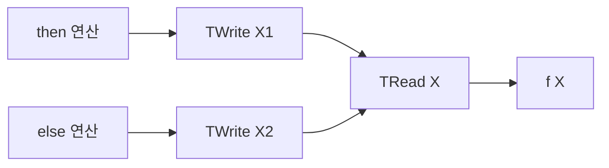
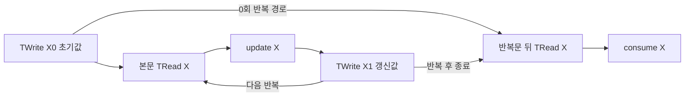

# SystemDS 블록 간 의존성과 입력 조합 기반 플래닝 분석 보고서

작성일: 2026-10-06

분석 대상은 `/home/mchoi/w1357-paper-aligned-refactor`의 현재 작업 트리다. HEAD는 `0b51cc3ef8`이며, HEAD 이후의 미커밋 수정도 포함했다. `/home/mchoi/systemds`는 HEAD가 `16e24f475d`인 오래된 작업 트리여서 이번 설명의 기준으로 사용하지 않았다. 이 보고서는 사용자가 제공한 **Cross-Block Dependencies**와 **Joint Input Dependencies** 문단을 실제 코드와 대조한다.

**핵심 결론은 두 가지다.** 첫째, if-else와 loop를 연결한다는 것은 “어느 정의가 나중의 읽기에 값을 공급할 수 있는가”를 기록하고, 그 모든 경우에 선택한 물리 계획이 성립하도록 제약을 거는 것이다. 둘째, 현재 코드는 변수별 reaching-definition 집합과 물리 구현의 호환성을 검사하지만, 논문의 \(J_v\)처럼 여러 변수의 정의를 실행 경로별 튜플로 보존하는 분석은 확인되지 않는다. 따라서 인용문의 두 subsection을 모두 이미 구현된 기능으로 설명하면 부정확하다.

| 중요도 | 판정 | 신뢰도 | 직접 근거 |
| --- | --- | --- | --- |
| 1 | 분기와 반복문을 통한 변수별 reaching-definition 분석은 구현되어 있다 | 높음 | `PlacementProgramFacts.analyzeCfg`, `connectSequence` [S1], [S2] |
| 2 | 합류 지점의 한 reader 계획은 도달 가능한 모든 writer와 호환되어야 한다 | 높음 | `addCfgConstraints`, `hasCompleteLogicalTransientSupport` [S3], [S4] |
| 3 | 실제 물리 입력 조합과 정확한 공급원 선택은 검증한다 | 높음 | `CandidateSelections`, `enumerateBindingAssignments` [S5], [S6] |
| 4 | 논문이 주장하는 cross-arm 조합 제외를 위한 일반적인 \(J_v\) 분석은 확인되지 않는다 | 높음 — 조사한 CFG와 플래닝 경로 범위 | 변수별 독립 합집합과 실제 `CfgAnalysis` 필드 [S7], [S8] |

아래에서 **구현 사실**은 코드로 확인한 동작, **설명 예시**는 동작 이해를 위한 단순화, **해석**은 그 사실로부터 도출한 의미를 가리킨다. 예시의 변수 버전과 비용은 실제 실행 로그가 아니다.

## 먼저 구분해야 하는 세 가지

### 값의 정의와 변수 이름

다음 코드에는 `X`라는 이름은 하나지만, `X`의 값을 만드는 정의는 세 개 있다.

```text
X = initial;       // 정의 X0
if (condition) {
    X = left;      // 정의 X1
} else {
    X = right;     // 정의 X2
}
Y = f(X);          // X의 사용
```

`X0`, `X1`, `X2`는 설명용으로 붙인 정적 정의 식별자다. 실제 프로그램의 변수 이름을 이렇게 바꾸었다는 뜻은 아니다. 마지막 `f(X)`에 중요한 질문은 “X라는 이름이 존재하는가”가 아니라 “이 위치의 X는 어느 정의에서 온 값인가”다.

이 예에서는 `X1` 또는 `X2`다. `X0`는 두 분기에서 모두 덮어쓰므로 마지막 사용까지 도달하지 않는다. 이처럼 **중간에 같은 변수의 다른 정의로 덮어써지지 않고 사용 위치에 도달할 수 있는 정의**를 reaching definition이라고 한다.

### Transient write와 transient read

TWrite는 블록에서 만든 값을 변수 이름에 연결하는 경계이고, TRead는 다른 블록에서 그 변수의 값을 가져오는 경계다. 둘은 디스크 파일을 쓰고 읽는다는 뜻이 아니다.

```text
앞 블록:  연산 → TWrite(X)
뒤 블록:  TRead(X) → 연산
```

블록 내부 HOP 그래프만 보면 `TRead(X)`가 어느 `TWrite(X)`에서 왔는지가 충분히 표현되지 않는다. 블록 간 분석은 이 관계를 복원한다. 실제 구현에서는 이러한 연결이 reaching-definition 정보, 그래프 제약, logical transient compatibility 관계로 표현된다. 모든 연결이 원래 HOP 객체의 물리 입력 포인터 하나를 추가하는 작업이라는 뜻은 아니다. [S1], [S3], [S4]

### 논리적 연결과 물리적 이동

```text
TWrite(X) ──값의 공급 관계──> TRead(X)
```

이 선은 “X의 값을 사용할 수 있다”는 관계다. 선을 그렸다고 네트워크 다운로드나 업로드가 자동으로 생기지 않는다. 구현 주석도 CFG의 변수 연결은 FederationMap을 보존하며, 그 연결 자체에는 FOUT를 LOUT로 바꾸는 materialization이 없다고 명시한다. 필요한 이동은 실제 지원되는 물리 동작으로 별도 계획되어야 한다. [S3]

## If else에서 어떻게 연결하는가

### 양쪽 분기가 모두 값을 쓰는 경우

앞의 예제를 블록 경계까지 펼치면 다음과 같다. 그림의 화살표는 데이터 공급 관계이며, 모든 노드를 한 실행에서 수행한다는 뜻이 아니다.



읽기 위치를 `r`이라고 하면 분석 결과는 다음과 같다.

\[
Reach(r)=\{X_1,X_2\}.
\]

런타임에는 조건에 따라 `X1` 또는 `X2` 중 하나가 실제 값을 공급한다. 컴파일 시점에는 어느 쪽도 가능하므로 둘 다 기록한다. **두 공급자를 기록하는 것과 두 값을 동시에 소비하는 것은 다르다.**

구현은 if header에서 두 arm을 재귀적으로 연결하고, 두 arm의 종료 블록들을 다음 블록의 predecessor로 넘긴다. 이후 predecessor별 정의 집합을 변수마다 합집합한다. 조건의 값을 정확하게 증명할 수 있는 경우에는 도달 가능한 arm만 연결한다. 일반적인 동적 조건에서는 양쪽을 유지한다. [S2], [S7]

### 한쪽 분기가 값을 쓰지 않는 경우

```text
X = initial;       // X0
if (condition) {
    X = left;      // X1
}
Y = f(X);
```

조건이 거짓이면 `X0`가 그대로 살아 있으므로 다음과 같이 연결해야 한다.

```text
X0 ── 거짓 경로에서 유지 ──┐
                           ├── TRead(X) ── f(X)
X1 ── 참 경로에서 재정의 ──┘
```

따라서 `Reach(r) = {X0, X1}`이다. 인용문의 “If an arm does not redefine the variable, the definition entering that arm remains a supplier”가 바로 이 경우를 말한다. 코드에서는 빈 arm의 종료 지점으로 if header를 유지하고, write가 없는 변수의 정의 집합을 그대로 전파하여 이 동작을 얻는다. [S2], [S7]

### 이 연결이 물리 계획에 주는 제약

현재 구현에서 여러 정의가 도달하는 reader에는 **각 writer와 `SAME_PLACEMENT` 제약**을 건다. 간략히 표시하면 다음과 같다.

\[
p(X_1)=p(r),\qquad p(X_2)=p(r).
\]

여기서 `p`는 선택한 placement state다. 구현의 `SAME_PLACEMENT`는 `PlacementState.equals`이며, 실행 위치, 출력 위치, FType 등의 상태를 비교한다. 정확한 worker 및 partition layout 호환성은 별도의 realization 관계로 추가 검사한다. `SAME_PLACEMENT` 하나가 모든 물리 메타데이터 검사를 대신하는 것은 아니다. [S3], [S9], [S5]

설명용으로 후보를 다음처럼 줄여 보자.

| X1의 TWrite | X2의 TWrite | 합류 TRead | 이 상태 조합의 판정 |
| --- | --- | --- | --- |
| CP / LOUT | CP / LOUT | CP / LOUT | 상태 동등 제약을 만족 |
| FED / FOUT / ROW | FED / FOUT / ROW | FED / FOUT / ROW | 상태 동등 제약을 만족하며, 정확한 물리 호환성 검사가 추가로 필요 |
| FED / FOUT / ROW | CP / LOUT | CP / LOUT | CFG 연결만으로는 허용되지 않음 |
| FED / FOUT / ROW | FED / FOUT / COL | FED / FOUT / ROW | 상태 동등 제약을 위반 |

세 번째 행에서 reader를 local로 선택한다고 첫 번째 arm의 원격 값이 자동으로 내려오지 않는다. local 합류를 선택하려면 첫 번째 arm도 합류 전에 실제로 local 값을 공급하는 합법적인 계획이어야 한다. 다운로드를 허용하는 privacy와 물리 동작의 근거가 있어야 하며, 그 비용도 반영되어야 한다.

따라서 현재 구현의 질문은 “두 arm 중 어느 writer가 더 싸니 그것만 선택할까”가 아니다. **각 arm에 계획을 정하되, 어느 arm이 실행되어도 공통 reader의 계획이 맞도록 할 수 있는가**이다.

## Loop에서 어떻게 연결하는가

### 초기값과 반복 갱신값

```text
X = initial;          // 정적 정의 X0
while (condition) {
    X = update(X);    // 정적 정의 X1
}
Y = consume(X);
```

반복문 안의 `update(X)`는 첫 번째 반복에서는 `X0`를 읽고, 이후 반복에서는 직전 반복이 `X1` 위치에서 만든 값을 읽는다.



`X1`은 정적 write 위치 하나다. 실행 횟수가 100번이라고 그래프에 `X1` 노드를 100개 만드는 방식이 아니다. 런타임의 서로 다른 값들은 같은 정적 노드의 서로 다른 실행에서 생긴다.

그래서 정적 그래프에는 `TRead → update → TWrite → TRead`라는 순환이 생긴다. 이것이 인용문의 “backedges can make G cyclic”이다. 실제 실행은 첫 반복, 두 번째 반복 순서로 진행하므로 이 정적 순환이 실행 순서의 모순을 의미하지 않는다.

### 코드가 계산하는 고정점

구현은 loop body의 종료 블록을 loop header의 predecessor에 추가한다. header에는 loop 진입 이전 블록과 body 종료 블록이 함께 연결된다. while과 for 모두 이 기본 구조를 사용한다. [S2]

정의 집합은 다음 규칙을 더 이상 바뀌지 않을 때까지 반복 계산한다.

```text
IN[블록]  = predecessor들의 OUT 집합을 변수별로 합친 것
OUT[블록] = IN에 블록 내부 정의들을 순서대로 적용한 것

X를 쓰는 정의 d를 만나면:
    현재 상태[X] = {d}
```

처음에는 entry 정의만 알려져 있어도, body를 통과하며 갱신 정의가 발견되고, backedge를 따라 header로 돌아오면 두 정의가 모두 알려진다. 새 정의가 추가되지 않는 상태가 고정점이다. 코드의 `do ... while(changed)`가 이 계산을 수행한다. [S1], [S7]

**분석의 고정점 반복과 프로그램의 loop 반복은 서로 다르다.** 분석은 정적 정의 집합을 안정화하는 작업이고, 프로그램의 loop는 실제 데이터를 갱신하는 작업이다. 분석을 3회 반복했다고 프로그램을 3회 실행한 것이 아니다.

### Loop에서도 하나의 정적 계획을 일관되게 선택한다

본문의 reader를 `r`이라고 하면, 위 예에서는 다음 두 조건이 함께 필요하다.

\[
p(X_0)=p(r),\qquad p(X_1)=p(r).
\]

초기값만 local인데 본문 read를 FED로 고르거나, 초기값은 FED인데 갱신값을 local로 바꾼 뒤 다음 반복도 같은 FED read를 사용하면 문제가 된다. 진입값과 반복 갱신값이 모두 선택한 read를 지원해야 한다. 필요한 변환이 있다면 실제 지원되는 위치에 계획되어야 하며, 초기값이 FED라는 사실만으로 이후 갱신값의 FED 실행 가능성이 보장되지는 않는다. [S3], [S4]

loop 다음의 read도 종료 시 도달할 수 있는 정의들을 고려한다. 0회 반복이 가능한 경우에는 초기값이 최종값일 수 있으므로 `X0`를 제외하면 안 된다.

**구현의 보수성:** 현재 `connectSequence`의 while/for 연결 코드는 반복 횟수를 증명하여 entry 경로를 제거하지 않는다. 따라서 인용문의 “zero iterations are possible”이라는 설명보다 넓게 entry 정의를 보존할 수 있다. 다른 전처리에서 loop가 제거된 경우와는 구분해야 한다. [S2]

## 함수 호출은 어디에 연결하는가

```text
A = f(X);
B = f(Y);
```

호출 위치가 다르므로 다음 두 경계를 구분해야 한다.

```text
X → 첫 호출의 입력 경계 → f의 formal parameter
Y → 둘째 호출의 입력 경계 → f의 formal parameter

f의 반환 정의 → 첫 호출의 출력 경계 → A의 reader
f의 반환 정의 → 둘째 호출의 출력 경계 → B의 reader
```

구현은 call occurrence마다 입력과 출력 경계를 생성한다. actual argument에서 호출별 입력 경계로 연결하고, 이 경계를 공유된 compiled body의 formal read와 연결한다. 반환 정의도 호출별 output boundary를 거쳐 caller의 read로 연결한다. [S10]

**call-site 구분과 함수 본문 계획의 독립성은 다르다.** 호출 경계가 별개라고 해서 각 호출이 공유 함수 본문의 모든 연산을 독립적인 placement로 선택한다는 뜻은 아니다. 현재 경계와 shared formal 사이에는 `SAME_PLACEMENT` 제약이 있다. 인용문의 “retains its own argument and return connections”는 확인되지만, 이것만으로 임의의 call-sensitive 본문 복제나 다중 입력의 경로 상관관계 보존을 주장할 수는 없다.

## 논문의 Joint Input Dependencies는 무엇을 뜻하는가

### 개별 공급자 집합으로는 알 수 없는 정보

```text
if (condition) {
    X = x1;
    Y = y1;
} else {
    X = x2;
    Y = y2;
}
Z = combine(X, Y);
```

각 변수만 따로 보면 다음 두 사실을 얻는다.

\[
Reach(X)=\{x_1,x_2\},\qquad Reach(Y)=\{y_1,y_2\}.
\]

두 집합을 단순히 곱하면 네 조합이 나온다.

\[
Reach(X)\times Reach(Y)
=\{(x_1,y_1),(x_1,y_2),(x_2,y_1),(x_2,y_2)\}.
\]

그러나 이 프로그램의 한 실행에서 가능한 조합은 두 개뿐이다.

\[
J_Z=\{(x_1,y_1),(x_2,y_2)\}.
\]

여기서는 원래 정의까지 공급 관계를 따라간 개념적 표기를 사용했다. 실제 블록 그래프에 TRead를 남기면 `writer → TRead → combine`이라는 중간 경계가 있다.

\(J_v\)의 각 원소는 “입력마다 하나씩 골라서 함께 공급할 수 있는 정의 목록”이다. 튜플의 순서는 입력 위치를 나타낸다. 두 입력이면 쌍, 세 입력이면 세 원소의 튜플이다. **각 입력에 대한 가능성뿐 아니라 입력 사이의 상관관계를 표현한다.**

### 왜 물리적 실행 가능성 검사에 도움이 되는가

다음은 개념을 설명하기 위한 물리 배치 예시다. `combine`이 두 입력의 worker와 partition 경계가 정렬되어야 하는 연산이라고 가정한다.

| 정의 쌍 | 물리 배치 | 실제로 함께 도달하는가 | 정렬된 입력으로 실행 가능한가 |
| --- | --- | --- | --- |
| x1, y1 | 둘 다 배치 A | 가능 | 가능 |
| x2, y2 | 둘 다 배치 B | 가능 | 가능 |
| x1, y2 | 배치 A와 B | 불가능 | 정렬되지 않을 수 있음 |
| x2, y1 | 배치 B와 A | 불가능 | 정렬되지 않을 수 있음 |

존재하지 않는 cross-arm 쌍까지 실제 입력처럼 검사하면 실행 가능한 계획을 불필요하게 배제하거나, 필요 없는 재배치를 요구할 수 있다. 반대로 서로 다른 경로에서 얻은 유리한 입력 조건만 섞으면 실행 가능한 한 조합이 있다는 잘못된 근거를 만들 수도 있다. \(J_v\)는 이러한 경로 혼합을 피하기 위한 정보다.

다만 **\(J_v\)만 있다고 배치 A와 B를 사용하는 공통 연산 계획이 자동으로 구현되는 것은 아니다.** 실제 runtime instruction과 planner의 물리 상태 표현도 두 경우를 지원해야 한다. 이 예시는 경로 상관관계의 필요성을 설명하며, 현재 SystemDS에서 이 계획이 수용되거나 거절되는지를 실행 검증한 사례는 아니다.

### Loop에서는 프로그램 위치별 조합이 중요하다

```text
X = x0;
Y = y0;
while (...) {
    Z = combine(X, Y);
    X = nextX(...);     // 정적 정의 x1
    Y = nextY(...);     // 정적 정의 y1
}
```

이 구조에서는 첫 `combine`은 `(x0,y0)`, 이후에는 `(x1,y1)`을 공급받는다고 설명할 수 있다. 하지만 `combine`을 X 갱신 뒤, Y 갱신 앞에 옮기면 `(x1,y0)` 같은 쌍이 첫 반복에서 실제로 가능해진다. 따라서 “entry끼리, backedge끼리만 묶는다”는 규칙만으로는 일반적인 loop의 \(J_v\)를 계산할 수 없다. **문장 순서와 중첩 분기까지 반영한, 사용 위치별 정의 조합**이 필요하다.

## 현재 코드는 그 Joint Input Dependencies를 구현하는가

### CFG 단계에서는 변수별 집합을 저장한다

현재 `CfgAnalysis`의 주요 필드는 다음과 같다. [S8]

```text
definitionOrdinals
versionKinds
reachingDefinitions
reachingFunctionOutputDefinitions
reachingFunctionInputs
functionExitValues
```

분기 합류 시 `mergeDefinitions`는 다음 형태로 처리한다. [S7]

```text
각 변수 name에 대해:
    merged[name] = 기존 집합[name] ∪ 들어오는 집합[name]
```

앞의 예제를 합치면 `X → {x1,x2}`, `Y → {y1,y2}`는 남지만, “x1과 y1이 같은 arm이었다”는 관계는 이 상태에 남지 않는다.

정보 손실은 다음 비교로 분명해진다.

| 프로그램 | then 공급 쌍 | else 공급 쌍 | 변수별 합집합 |
| --- | --- | --- | --- |
| A | x1, y1 | x2, y2 | X={x1,x2}, Y={y1,y2} |
| B | x1, y2 | x2, y1 | X={x1,x2}, Y={y1,y2} |

표의 정의 이름은 두 프로그램에서 공급 관계를 비교하기 위한 추상 식별자다. A와 B는 공동 공급 관계가 다르지만 변수별 합집합은 같다. **이 합집합 정보만으로는 원래 pairing을 복구할 수 없다.**

### 물리 후보의 공동 검사는 별도로 존재한다

현재 코드는 한 연산의 물리 구현을 지원하는 입력 binding들을 함께 검사한다. 한 구현을 정당화하는 support clause 안에서는 필요한 입력들이 모두 지원되어야 하고, 대체 support clause가 여러 개라면 그중 유효한 근거를 사용할 수 있다.

`enumerateBindingAssignments`는 입력별 물리 binding 선택지를 조합하며, 동일한 physical decision owner에 서로 다른 realization을 동시에 선택하는 충돌을 막는다. 그러나 이 조합 열거를 “원래 if의 같은 arm에서 나온 정의 튜플을 보존한다”는 분석으로 해석할 근거는 없다. [S6]

구분하면 다음과 같다.

| 관계 | 답하는 질문 |
| --- | --- |
| 논문의 \(J_v\) | 이 원래 정의들이 한 실행에서 함께 입력을 공급할 수 있는가 |
| 현재 물리 input binding 및 support clause | 선택한 입력 구현과 변환들이 이 연산의 물리 구현을 함께 지원하는가 |
| 현재 logical transient compatibility | 이 writer의 구현과 저 reader의 구현이 같은 런타임 변수 연결을 올바르게 표현하는가 |

또한 `OccurrenceExecutionFrequencyFacts`에는 branch activation 조건이 있다. 이는 분기별 실행 빈도와 비용 문맥을 표현하는 정보다. 해당 정보가 존재한다는 사실만으로 CFG의 다중 변수 reaching-definition 튜플이 보존된다고 볼 수 없다. [S13]

### 판정과 그 한계

**높은 신뢰도의 판정:** 조사한 CFG 생성부터 physical model 및 최종 선택 검사까지의 경로는 변수별 reaching set과 writer별 conjunctive compatibility를 사용한다. 인용문의 “The analysis preserves these pairings across branches, loop entry and backedges, and function-call bindings”를 현재 구현에 대한 사실로 뒷받침하기는 어렵다.

이 차이가 곧바로 “현재 코드가 불가능한 cross-arm 값을 실제로 섞어 실행한다”는 뜻은 아니다. 공통 placement 제약과 정확한 물리 호환성 검사가 별도로 작동한다. **문서가 주장하는 분석 정밀도와 현재 구현의 차이는 확인되지만, 구체적인 오계획이나 최적화 기회 손실의 크기는 별도 재현이 필요하다.**

## 이 관계를 기반으로 실제로 무엇을 플래닝하는가

### 선택 대상은 실행 경로가 아니라 물리 구현이다

일반적인 동적 if의 어느 arm이 실행될지는 프로그램 조건이 결정한다. 플래너는 각 정적 연산에 대해 다음 사항을 선택한다.

- coordinator에서 CP로 실행할지, worker에서 FED로 실행할지.
- 결과를 local 출력인 LOUT로 둘지, federated 출력인 FOUT로 둘지.
- FOUT라면 어떤 FType과 물리적 공급 근거를 사용할지.
- 어떤 입력 realization을 사용하며 어떤 명시적 이동이나 materialization이 필요한지.

예를 들어 TRead와 TWrite 경계에는 `<CP,LOUT>` 또는 `<FED,FOUT>` 상태가 사용된다. 일반 연산에서는 FED로 계산하고 LOUT를 만드는 후보도 있을 수 있다. 경계 노드의 허용 상태와 일반 연산의 후보를 혼동하면 안 된다.

### 후보를 만들고 모든 공급자의 지원을 검사한다

후보 reader realization을 \(a_r\), writer의 후보들을 \(A_w\)라고 하면 지원 검사의 핵심은 다음과 같다.

\[
\forall w\in Reach(r),\quad
\exists a_w\in A_w:\ Compatible(a_w,a_r).
\]

말로 풀면 **도달 가능한 writer 각각에 대해, 같은 reader 후보와 호환되는 writer 후보가 적어도 하나씩 있어야 한다**는 뜻이다. writer들 사이에는 AND, 각 writer 내부의 대체 후보들 사이에는 OR가 적용된다. [S4]

이 단계는 후보의 지원 여부를 검사하는 단계다. 여러 사용처가 서로 다른 writer 후보를 필요로 한다고 해서 그 writer가 동시에 두 후보를 선택할 수는 없다. 최종 선택에서는 각 decision owner가 선택한 정확한 realization과 모든 관계가 일치해야 한다. `CandidateSelections`가 이를 검사한다. [S5]

따라서 다음 두 질문을 구분해야 한다.

```text
후보 생성: 이 후보를 지원할 수 있는 조합이 남아 있는가?
최종 선택: 지금 선택한 하나의 전체 계획이 모든 관계를 동시에 만족하는가?
```

### 불가능한 조합을 비용 최적화 문제의 제약으로 넣는다

현재 Exact 물리 모델은 placement 제약과 writer/read compatibility를 hard factor로 변환한다. 개념적으로 다음 함수다. [S11]

\[
h(a_w,a_r)=
\begin{cases}
0 & \text{호환되는 선택이면},\\
+\infty & \text{호환되지 않는 선택이면}.
\end{cases}
\]

도달 가능한 writer가 두 개면 writer/read 관계별 factor가 두 개 생긴다. 한쪽만 만족하는 계획은 다른 factor가 무한대가 되어 유효한 계획으로 선택될 수 없다.

연산 실행비용과 실제 이동비용을 이 제약들과 함께 최적화한다. 설명을 위해 단순화하면 다음 형태다.

\[
\min_P\left[
\sum_v freq(v)\,computeCost(v,P)
+ physicalTransferCost(P)
\right]
\quad\text{subject to all compatibility constraints}.
\]

실제 비용 모델에는 공유 materialization과 재사용 등의 항목이 있으므로, 모든 그래프 간선에 독립적인 전송비용을 붙여 단순 합산한다는 뜻은 아니다. Exact optimizer는 hard factor와 비용 factor를 함께 받아 해결하고 결과를 재검증한다. [S12]

### 분기와 반복은 비용에 어떻게 반영되는가

분기의 실행 가능성은 양쪽을 고려하더라도, 두 arm의 실행비용을 항상 둘 다 1회분씩 더할 필요는 없다. 현재 빈도 분석은 증명된 조건에 0 또는 1을 적용하고, 모르는 조건에는 기본 기대 가중치를 사용한다. 관련 테스트에서는 unknown if/else에 각각 0.5를 기대한다. loop에는 반복 횟수 추정과 중첩 문맥을 반영한다. [S13], [S18]

예를 들어 다음 값들을 **설명용 가정**으로 두자. 모든 후보와 이동은 합법적이며 재사용이 없는 경우다.

| 계획 | 실행되는 arm의 계산 | 합류 전 다운로드 | 합류 후 계산 |
| --- | --- | --- | --- |
| local 합류 | 1 ms | 8 ms | 1 ms |
| FED 합류 | 1 ms | 0 ms | 2 ms |

두 arm의 비용이 같고 각각 확률 0.5라고 가정하면 local 합류는 `0.5×9 + 0.5×9 + 1 = 10 ms`, FED 합류는 `0.5×1 + 0.5×1 + 2 = 3 ms`다. 이런 경우 비용 기반 플래너는 FED 합류를 선호할 수 있다. 하지만 두 arm 모두 그 합류를 실제로 지원해야 하며, legality를 비용보다 먼저 충족해야 한다.

loop에서는 본문마다 반복되는 이동이 특히 중요하다. 예를 들어 8 ms의 이동이 100번 필요한 계획은 그 부분만 약 800 ms가 된다. 반대로 loop 바깥에서 한 번 준비한 불변 입력을 재사용한다면 같은 이동을 100번 과금해서도 안 된다. 따라서 초기 진입, 반복 갱신, 실제 값의 수명 및 재사용 관계가 비용 계산에 영향을 준다.

### 순환 그래프에서도 계획할 수 있는 이유

여기서 의존성 그래프는 실행 스케줄 그 자체가 아니라 **물리 선택 사이의 제약을 담은 그래프**다. `p(entry)=p(read)`와 `p(backedge)=p(read)` 같은 순환 관련 제약을 동시에 만족하는 배치를 찾을 수 있다.

CFG reaching-definition 계산은 고정점을 사용하고, placement dependency 처리에는 strongly connected component 즉 서로 순환 도달 가능한 노드 묶음을 다루는 코드가 있다. Exact 경로는 선택 변수와 factor로 문제를 구성한다. 따라서 “그래프가 cyclic이니 일반적인 DAG 위상 순서 DP를 그대로 적용하면 된다”고 설명하면 부정확하다. [S1], [S11], [S19]

현재 `FederatedPlanExact`는 공통 analysis에서 물리 모델과 비용을 만들고 Exact optimizer를 호출한다. `FederatedPlanLocalCost`도 같은 물리 모델과 비용 surface를 구성하지만 `LocalPhysicalOptimizer`를 호출한다. 동일한 합법성 기반을 사용한다는 것과 모든 플래너가 항상 전역 최적해를 보장한다는 것은 다르다. [S20], [S21]

선택 이후에는 공통 적용 경계에서 결과를 정규화하고 `PlacementEmissionTransaction.emit`을 호출한다. 분석 중 그린 모든 가능한 공급 관계를 네트워크 명령으로 내보내는 것이 아니라, 검증된 선택에 해당하는 물리 계획을 적용하는 과정이다. [S14]

## 인용문을 현재 구현에 맞게 읽고 수정하는 방법

| 인용문의 주장 | 현재 구현과의 관계 | 설명에 필요한 보완 |
| --- | --- | --- |
| TRead를 reaching TWrite와 연결 | 구현 확인 | 연결은 논리적 공급 및 compatibility 관계이며 자동 통신이 아님 |
| branch 양쪽의 도달 정의 연결 | 구현 확인 | 정확히 증명된 조건은 한쪽만 연결 가능 |
| 재정의하지 않은 arm은 진입 정의 유지 | 구현 확인 | 빈 arm도 입력 정의를 전달 |
| loop entry와 backedge 연결 | 구현 확인 | 정의 노드는 정적이며 고정점으로 계산 |
| 0회 실행 가능 시 종료 use에 entry 포함 | 취지 일치 | 현재 CFG 연결은 더 보수적으로 entry를 유지할 수 있음 |
| call-site별 인자와 반환 경계 유지 | 구현 확인 | 공유 본문의 물리 선택이 완전히 독립적이라는 뜻은 아님 |
| \(J_v\)로 cross-arm 조합 제외 | 현재 구현 근거 부족 | 변수별 집합과 물리 입력 binding 검사를 구분해야 함 |
| \(J_v\) pairing을 loop와 calls 전체에 보존 | 현재 구현 근거 부족 | 경로별 정의 튜플의 생성과 소비 경로가 추가로 입증되어야 함 |

현재 코드를 설명하는 논문이라면 Cross-Block Dependencies 뒤에 다음 내용을 명시하는 것이 정확하다.

> At a merge, a single selected reader realization must be compatible with every reaching definition. These logical variable bindings do not themselves introduce data movement; any required materialization must be represented by a supported physical action.

Joint Input Dependencies를 현재 구현에 맞추어 기술하려면 다음처럼 범위를 바꿀 수 있다.

> For each candidate physical realization, the analysis records supporting input bindings and checks their compatibility jointly. At transient boundaries, all reaching writers must support the same selected reader realization. The current reaching-definition analysis maintains per-variable source sets rather than path-correlated tuples of definitions across different inputs.

반대로 논문에서 원래의 \(J_v\) 주장을 유지하려면, 적어도 branch의 정의 환경을 튜플 관계로 합치는 분석, loop에서 그 관계를 안정화하는 계산, call boundary를 통한 관계 전달, 그리고 physical feasibility가 그 관계를 실제로 소비하는 경로가 필요하다. 이는 확인된 구현을 설명하는 문장 수정과는 별개의 구현 작업이다.

## Joint Input Dependencies를 구현할 가치가 있는가

**현재 common-reader 표현은 실제 correlated executions보다 강한 제약으로 runtime이 지원하는 무재배치 계획을 제외할 수 있다.** 따라서 J_v 또는 관계적 분석을 불필요하다고 결론낼 수 없다. 현재 우선 권고는 correlated/independent branch 대조 fixture로 완전성 손실을 고정하고, 경로별 map을 표현하는 reader와 공동 정렬 증명을 제한적으로 검토하는 것이다. 미구현 J_v를 구현된 것처럼 설명하는 논문 문장은 정정하되, encoded plan space의 한계도 함께 밝혀야 한다. 모든 입력 튜플을 전면 열거할지는 별도 설계 판단이다.

구체적으로 X/Y가 then에서는 pool A에서 정렬되고 else에서는 pool B에서 정렬되면, 같은 FED 덧셈 명령은 실행 시점의 map으로 두 경우 모두 직접 처리할 수 있다. 반면 현재 replay는 모든 source가 공통 layout 또는 endpoints를 지원해야 한다. 이것은 모든 실제 실행에서 안전해야 한다는 조건보다 강한 표현 제한이다. [runtime aligned 경로](/home/mchoi/w1357-paper-aligned-refactor/src/main/java/org/apache/sysds/runtime/instructions/fed/BinaryMatrixMatrixFEDInstruction.java:113), [공통 layout 요구](/home/mchoi/w1357-paper-aligned-refactor/src/main/java/org/apache/sysds/hops/fedplanner/placement/PlacementRelationClosure.java:4660)

아래의 조건부 동치식은 현재 표현 내부의 사실이며, 현재 표현이 runtime-supported plan space를 완전히 포함한다는 증명이 아니다. 이 점을 근거로 앞선 “구현 보류와 논문 정리 우선” 권고를 수정했다. 자세한 반례와 증거 범위는 [별도 도입 판단 보고서](/home/mchoi/w1357-paper-aligned-refactor/docs/JOINT_INPUT_DEPENDENCIES_ADOPTION_REVIEW_2026-10-06_KO.md)에 정리했다. 전체 DML 실행에서의 실제 배제 결과와 성능 차이는 아직 재현하지 않았다.

### 입력 시나리오의 감소와 물리 계획 후보의 감소는 다르다

한 분기에서 `(x1,y1)` 또는 `(x2,y2)`만 생긴다면, J_v는 변수별 곱집합의 네 시나리오를 두 시나리오로 줄인다. 그러나 이것이 플래너가 탐색하는 물리 계획 수도 줄인다는 뜻은 아니다.

설명용으로, 같은 후보 공간에서 모든 시나리오에 안전한 계획을 요구하는 두 검사를 비교하자.

\[
\text{곱집합 검사}:\quad \forall t\in R_1\times\cdots\times R_k,\ Safe(P,t),
\]
\[
\text{공동 도달 검사}:\quad \forall t\in J_v,\ Safe(P,t).
\]

J_v가 곱집합의 부분집합이면 뒤의 검사는 불필요한 의무를 줄인다. 따라서 앞의 검사에서 탈락했던 계획이 뒤에서는 살아날 수 있다. **입력 시나리오는 줄지만 합법 물리 계획의 집합은 오히려 커질 수 있다.** 계획 품질이 좋아질 가능성과 최적화 탐색이 더 쉬워지는지는 별개의 문제다. 현재 구현이 이 전체 곱집합을 실제로 열거한다는 뜻은 아니며, 두 가지 pruning을 구별하기 위한 수식이다.

반대로, 독립적인 입력별 근거를 잘못 섞는 느슨한 검사와 비교하면 joint 검사가 잘못된 후보를 제거할 수도 있다. 어느 효과가 생기는지는 비교 기준에 달려 있다. 현재 코드에는 이미 동일 decision owner의 선택 일관성, 물리 support clause, 모든 reaching writer의 지원 검사가 있으므로, J_v를 넣으면 그런 검사를 처음 얻는다고 설명해서는 안 된다. [S4], [S5], [S6]

### 현재 공통 reader 계약에서는 효과가 제한될 수 있다

현재 선택한 reader realization r은 모든 writer와 호환되어야 한다. 같은 추상 placement p가 모든 정의에 요구되고, downstream feasibility가 이 p들에만 의존한다면, 정의 이름의 pairing을 더 알아도 검사 결과는 달라지지 않는다.

좀 더 일반적으로, 입력 i의 공통 reader를 r_i, 정의 u와의 호환성을 C_i(u,r_i)라고 하자. J_v의 i번째 원소들을 모은 집합이 기존 R_i와 같고, 입력 결합 검사가 고정된 reader들만 사용한다면 다음 두 검사는 동치다.

\[
\bigwedge_{(u_1,\ldots,u_k)\in J_v}\ \bigwedge_i C_i(u_i,r_i)
\quad\Longleftrightarrow\quad
\bigwedge_i\ \bigwedge_{u\in R_i} C_i(u,r_i).
\]

왼쪽에서 공동 튜플을 알아도 결국 각 입력의 모든 공급자에게 같은 조건을 확인하기 때문이다. 이 동치는 “정의 pairing만 추가하고 reader 계약을 유지하는 경우”에 대한 판단 근거다. J_v 정밀화로 R_i 자체에서 불가능한 공급자가 사라지는 경우나, downstream 검사가 경로별 관계를 새로 활용하는 경우는 이 전제에 포함되지 않는다.

물리 map이 달라지는 경우에는 더 섬세하다. 예를 들어 참 경로의 X/Y는 map A에서 정렬되고 거짓 경로의 X/Y는 map B에서 정렬된다는 사실이 유용할 수 있다. 하지만 현재 `exactTransientReplay`는 모든 source가 지원하는 reader realization을 만들고, native replay도 공통 layout 또는 worker endpoints를 확인한다. [해당 코드](/home/mchoi/w1357-paper-aligned-refactor/src/main/java/org/apache/sysds/hops/fedplanner/placement/PlacementRelationClosure.java:4587)

따라서 이 경우를 일반적으로 활용하려면 단순히 J_v 테이블을 추가하는 것 외에, 경로에 따라 달라지는 map을 어떻게 표현하고, downstream 연산의 정렬을 어떻게 증명하며, 선택과 emission이 그 근거를 어떻게 유지하는지도 설계해야 한다. 동적 native-lineage 지원이 이미 일부 존재하므로 모든 경우에 새 runtime 기능이 필요하다고 단정할 수는 없지만, **현재 common-reader 제약을 무시해도 된다는 권한을 J_v가 주지는 않는다.**

### 복잡도와 pruning의 기대 효과

입력 k개에 공급자 후보가 각각 d개라면 변수별 목록의 크기는 대략 k×d인 반면, 명시적인 공동 튜플 관계는 최대 d^k개의 튜플을 가질 수 있다. 이는 정보 표현 크기의 비교이며 전체 알고리즘 시간복잡도를 그 두 식으로 단정하는 것은 아니다.

| 프로그램 형태 | 공동 관계의 크기와 기대 효과 |
| --- | --- |
| 한 if가 입력 k개를 함께 정의 | 실제로 두 튜플만 있을 수 있음. 2^k 곱집합과 비교하면 큰 상관관계 이득 |
| 입력마다 독립적인 if가 존재 | 2^k 조합 모두 실제로 가능할 수 있음. J_v가 제거할 가짜 조합이 없음 |
| 여러 loop와 함수 호출이 결합 | relation 고정점, 호출 문맥, 반복 간 정의 상관관계의 관리가 추가로 필요 |

정적 정의 노드 집합 V가 유한하면 J_v도 유한하다. loop가 있다는 이유만으로 J_v 튜플 수가 무한해지는 것은 아니다. 다만 모든 실행 history나 symbolic path condition을 그대로 유지하려고 하면 별도의 크기·종료 문제가 생긴다. Clang의 공식 데이터흐름 문서도 loop의 symbolic flow condition이 계속 커질 수 있어 조건 제거 또는 추상화가 필요하다고 설명한다. [Clang flow condition 설명](https://clang.llvm.org/docs/DataFlowAnalysisIntro.html#flow-condition)

실용적인 중간 선택은 모든 경로를 보존하기보다 필요한 관계만 선택적으로 유지하는 것이다. 이런 정밀도와 비용의 균형은 trace partitioning 연구의 주제이기도 하다. 다만 그 연구의 성과를 현재 SystemDS의 속도 개선 증거로 사용할 수는 없다. [Rival과 Mauborgne의 Trace Partitioning 연구](https://www.di.ens.fr/~mauborgn/publi/toplas29.html)

물리 solver 측에서도 여러 input owner를 하나의 큰 joint factor로 직접 묶으면 factor scope와 elimination separator가 커질 가능성이 있다. symbolic 또는 factorized 표현으로 피할 여지가 있으므로 필연적인 결과는 아니다. 현재 solver가 실제로 separator/domain 크기를 계산하고 한도를 검사한다는 점 때문에 반드시 측정해야 하는 위험이다. [ExactCategoricalSolver의 factor 크기 검사](/home/mchoi/w1357-paper-aligned-refactor/src/main/java/org/apache/sysds/hops/fedplanner/fedCostBased/fedExact/ExactCategoricalSolver.java:1196)

### 권고하는 선택과 재검토 조건

| 선택 | 판단 |
| --- | --- |
| 현재 common-reader 표현을 고정한 채 전면 J_v만 추가 | 권하지 않음. 표현 한계를 해결하지 못할 수 있음 |
| correlated-pool 반례를 고정하고 관계적 reader와 joint-layout 증명을 제한적으로 검토 | 현재 우선 권고. 구조적으로 확인된 완전성 손실을 다룸 |
| 논문의 미구현 J_v 보존 주장 정정 | 필요. 현재 모델의 표현 한계와 encoded-space 최적성 범위도 함께 기술 |
| 기존 input binding, support clause, reaching-writer 검사도 삭제 | 권하지 않음. J_v와 다른 역할을 하는 실행 가능성 검증을 잃음 |

재검토를 시작할 최소 근거는 다음과 같다.

1. 실제 workload에서 공동 입력 상관관계의 손실 때문에 계획을 놓치거나 불필요한 이동이 생기는 지점을 특정한다.
2. 같은 분기의 상관된 입력, 독립 분기의 입력, loop-carried 입력을 구분한 작은 fixture로 개선할 수 있는 합법 계획과 runtime 지원을 증명한다.
3. 그 사용처에 필요한 입력 관계만 보존하는 분석으로 계획 차이를 확인한다.
4. 분석 시간·메모리·후보 수·factor 크기·목적값과 동일 Docker 조건의 실행 결과를 비교한다. 반복 실행되는 프로그램이면 추가 planning 비용의 상각도 고려한다.

실제 가능한 튜플을 임의의 개수만 남기는 방식은 안전한 근사가 아니다. 크기 제한이 필요하면 실제 실행을 빠뜨리지 않는 보수적 상위 관계로 합쳐야 한다. 논문도 임의 프로그램의 모든 실제 경로를 정확히 판정한다는 주장 대신, 구현이 계산하는 보수적 공동 도달 관계와 정확도 범위를 명시해야 한다.

현재 권고는 구조적 근거에 기반한 판단이며 J_v 전후 성능 실험 결과는 아니다. “항상 빨라진다”, “항상 느려진다”, “어떤 workload에서도 필요 없다” 중 어느 것도 현재 증거로 확정할 수 없다.

## Loop 관련 변경 시점과 이유

사용자가 추가로 질문한 “왜 loop를 이렇게 바꾸었고 언제 수정했는가”는 **CFG 연결 도입**, **연결 대상 보정**, **물리 placement 제약 강화**를 구분해야 답할 수 있다. 현재 파일의 `git blame`에 표시되는 9월 28일은 주로 파일 분리 시점이다. 이전 `NeutralPlacementGraphBuilder.java`의 이력까지 추적하면 실제 의미 변경은 더 이르다.

아래 시각은 Git의 **CommitDate**, Europe/Berlin의 당시 현지 시각 CEST 즉 UTC+02:00 기준이다. 코드를 최초로 편집한 순간이나 실제 실험 실행 시각까지 뜻하지는 않는다. 나열한 커밋은 모두 현재 HEAD의 조상임을 `git merge-base --is-ancestor`로 확인했다.

| 커밋 시각 | 커밋 | 변경 | 확인된 이유 |
| --- | --- | --- | --- |
| 2026-07-15 02:52:47 | `df9fd3b9f8` | 실제 StatementBlock predecessor에 기반한 CFG와 reaching-definition 고정점 도입. loop body exit를 header에 연결 | 이전 namespace 전체 정의 수집과 경로 문자열 분류가 이미 덮어쓴 정의, 미래 정의, 관련 없는 정의까지 허용하는 문제 수정 |
| 2026-07-15 03:10:15 | `1d42bb0df7` | 실제 body exit인 latch를 별도 추적. 모든 multi-reaching TRead에 제약 적용 | loop header의 predecessor라는 이유만으로 초기 진입 정의까지 backedge로 분류하는 오류와, header 밖 body/post-loop read의 제약 누락 방지 |
| 2026-08-14 01:08:58 | `a922bee6d1` | 공통 CFG writer/read 제약을 `CONJUNCTIVE`에서 `SAME_PLACEMENT`로 변경 | 다운로드가 없는 변수 연결에서 FOUT writer와 LOUT reader를 함께 선택하는 불일치 방지 |
| 2026-09-01 07:26:39 | `d89a27f424` | planning-only 실험 입력을 대규모 snapshot으로 고정 | 이력 조회에서 현재 파일의 도입처럼 보일 수 있는 보존 커밋. 위 loop 의미가 처음 생긴 시점은 아님 |
| 2026-09-02 09:57:45 | `78743ea36c` | CFG 제약을 단일 공급자 read에도 적용하되 `SAME_VALUE_PLACEMENT` 사용 | 단일 공급자의 값 배치를 보존하면서 실행 종류 자체까지 같은 것으로 요구하지 않도록 구분. 다중 공급자 phi는 기존 `SAME_PLACEMENT` 유지 |
| 2026-09-28 01:24:16 | `14287414d2` | 큰 builder를 `PlacementProgramFacts`, `PlacementRelationClosure` 등으로 분리 | facts, 후보 생성, relation closure 책임 분리. loop entry/backedge 방식의 최초 도입이 아님 |

### 7월 변경은 어느 정의가 실제로 도달하는지를 바로잡았다

`df9fd3b9f8`의 메시지는 기존 namespace-wide definition scan과 path substring classification이 killed, future, unrelated definitions를 허용한다고 명시한다. diff에서는 기존의 변수별 누적 정의 조회 대신 `analyzeCfg`와 `connectSequence`를 추가하고, 각 블록의 predecessor OUT을 합친 뒤 write에서 이전 정의를 교체하는 계산으로 바꾸었다.

```text
X = initial;            // X0
while (...) {
    X = update(X);      // X1
}
Y = consume(X);
X = later;              // X2
```

이 구조에서 loop의 입력과 종료 use는 X0/X1을 고려해야 하지만, 뒤에 있는 X2를 앞쪽 read의 공급자로 넣으면 안 된다. 실제 CFG를 따라 계산하는 목적은 이런 연결을 구별하는 것이다. entry와 backedge를 함께 표현하는 것은 첫 반복과 이후 반복의 공급자를 모두 반영하기 위해서다.

바로 다음 커밋 `1d42bb0df7`은 초기 도입의 세부 오류를 보정했다. 이전의 `isLoopLatch`는 “어떤 loop header의 predecessor인가”만 검사했는데, header에는 **loop 진입 이전 블록도 predecessor로 들어온다.** 수정 후에는 `connectSequence`가 구한 `bodyExits`만 별도의 `loopLatches`에 넣는다.

또한 기존 조건은 `BRANCH_JOIN_PHI` 또는 `LOOP_HEAD_PHI` 태그가 있는 노드만 제약했다. 이를 “TRead이고 reaching definition이 둘 이상인가”로 바꾸어 body와 post-loop의 read까지 포함했다. 이때의 제약 종류는 아직 `CONJUNCTIVE`였다. 따라서 **모든 read에 제약을 적용한 시점과 제약을 equality로 강화한 시점은 다르다.**

### 8월 변경은 존재하지 않는 데이터 이동을 가정하지 못하게 했다

`a922bee6d1`의 diff는 다음 변경을 직접 보여준다.

```text
이전: 각 reaching writer → reader에 CONJUNCTIVE
이후: 각 reaching writer → reader에 SAME_PLACEMENT
```

당시 추가한 주석의 이유는 명확하다. `cpvar`는 FederationMap을 보존하며, CFG-only writer/read 연결에는 다운로드 동작이 없다. 그런데 기존 `CONJUNCTIVE` 의미는 물리 materialization을 지원하는 다른 경계에도 쓰였기 때문에, local reader가 FOUT source를 받는 조합을 허용할 수 있었다.

loop 예시로 설명하면 다음과 같은 불일치를 막는 수정이다. 이는 실제 실패 로그를 그대로 옮긴 것이 아니라 커밋의 원인을 설명하는 축약 예다.

```text
초기 TWrite X0: FED/FOUT
본문 TRead X:   CP/LOUT

실제 전달: 원격 FederationMap을 가진 값이 그대로 전달됨
계획의 기대: local 값이 전달됨
빠진 동작: FOUT를 local로 바꾸는 명시적 다운로드
```

갱신값 X1에서도 같은 문제가 생길 수 있으므로, initial writer뿐 아니라 backedge writer에도 일관성을 요구한다. 관련 당시 기록은 [8월 2일 세션 문서의 다중 reaching-definition 문제](/home/mchoi/w1357-paper-aligned-refactor/docs/SESSION_ISSUES_2026-08-02.md:2107)와 [8월 13일 세션 문서의 SAME_PLACEMENT 계약](/home/mchoi/w1357-paper-aligned-refactor/docs/SESSION_ISSUES_2026-08-13.md:296)에 남아 있다. 8월 2일 기록은 MinST 인코딩 계층의 선행 수정이며, 문서 제목 날짜를 공통 builder의 수정 커밋 날짜로 대체해서는 안 된다.

**이 변경은 모든 loop가 이론적으로 항상 같은 물리 표현을 써야 한다는 법칙을 구현한 것이 아니다.** 현재 CFG 변수 연결이 값의 alias를 전달하고, 그 선 자체에는 변환 명령이 없다는 실행 계약을 지키기 위한 것이다. 표현을 바꾸는 합법 계획을 만들려면 실제 지원되는 materialization 또는 relocation을 적절한 위치에 표현하고, 실행 가능성과 비용까지 검증해야 한다.

### 0회 실행 경로와 Joint Input Dependencies에 대한 범위

loop header를 종료 지점으로 사용하는 구조와 entry 정의의 보존은 7월 15일 CFG 도입 diff에 이미 존재한다. 따라서 이것을 9월 말이나 10월에 새로 강화한 zero-iteration 정책으로 해석하면 안 된다. 당시 커밋은 실제 제어 흐름과 reaching definition을 복원하려는 목적을 명시하지만, 반드시 1회 이상 실행되는 for-loop까지 별도로 정밀화하지 않은 이유에 대한 독립적인 설계 기록은 확인하지 못했다.

이 변경 이력은 \(J_v\)의 경로별 다중 정의 pairing을 추가하거나 제거한 이력도 아니다. 확인된 목적은 **올바른 reaching writer의 추적과 런타임 값 배치의 일관성**이다.

재현에 사용한 핵심 Git 조회는 다음과 같다.

```bash
git show df9fd3b9f8 -- src/main/java/org/apache/sysds/hops/fedplanner/placement/NeutralPlacementGraphBuilder.java
git show 1d42bb0df7 -- src/main/java/org/apache/sysds/hops/fedplanner/placement/NeutralPlacementGraphBuilder.java
git show a922bee6d1 -- src/main/java/org/apache/sysds/hops/fedplanner/placement/NeutralPlacementGraphBuilder.java
git show 78743ea36c -- src/main/java/org/apache/sysds/hops/fedplanner/placement/NeutralPlacementGraphBuilder.java
git show --stat 14287414d2
```

## 검증 근거와 남은 확인 범위

이번 검증은 현재 소스의 생성 경로, 저장 구조, 소비 경로 및 테스트 assertion을 대조한 정적 분석이다. 빌드나 테스트를 새로 실행하지 않았으며, 아래 목록은 새 PASS 결과가 아니라 저장소에 존재하는 테스트 계약이다.

| 테스트 | 확인할 수 있는 계약 |
| --- | --- |
| `branchReadCannotSeeFutureWrite` | branch 뒤 read는 해당 branch의 정의를 보며, 이후의 write를 잘못 공급자로 보지 않음 [S15] |
| `loopPhiContainsOnlyEntryAndLatchLineage` | loop header read에 entry와 latch 정의가 포함됨 [S15] |
| `multiReachingLoopReadsHaveCompleteTypedConstraints` | header, body, post-loop read 각각에 모든 reaching source의 제약이 존재함 [S15] |
| `everyReachingWriterRemainsMandatory` | 한 writer의 지원만 남은 reader 후보는 충분하지 않음 [S16] |
| `mixedFederatedBranchDoesNotAuthorizeLocalPhi` | 한쪽 predecessor가 local이라는 이유만으로 혼합 합류를 local로 승인하지 않음 [S17] |
| `unknownPredicateRetainsConfiguredExpectation` | 모르는 조건의 양 arm에 기본 기대 가중치를 적용함 [S18] |

현재 증거로 확정할 수 없는 것은 \(J_v\) 부재로 인해 특정 프로그램에서 어느 계획이 추가로 배제되는지, 비용이 얼마나 달라지는지, 또는 잘못된 계획이 발생하는지다. 이를 판별하려면 같은 변수별 reaching set을 갖지만 공동 공급 관계가 다른 두 입력을 준비하고, graph facts와 최종 후보 및 선택 결과를 비교하는 별도 회귀가 필요하다. **이 보고서의 직접적인 발견은 문서와 구현의 분석 정밀도 차이이며, 특정 runtime 오동작을 재현한 결과는 아니다.**

## 코드 근거

행 번호는 조사 시점의 작업 트리 기준이다. 함수명도 함께 적어 이후 편집으로 행 번호가 바뀌어도 찾을 수 있게 했다.

| 번호 | 파일과 위치 | 근거 내용 |
| --- | --- | --- |
| S1 | [PlacementProgramFacts.java 138행][S1] | `analyzeCfg`, predecessor merge와 reaching-definition 고정점 |
| S2 | [PlacementProgramFacts.java 295행][S2] | `connectSequence`, if 및 while/for 연결 |
| S3 | [PlacementRelationClosure.java 6857행][S3] | `addCfgConstraints`, 모든 reaching writer에 placement 제약 |
| S4 | [PlacementSupportRelations.java 598행][S4] | `hasCompleteLogicalTransientSupport`, writer별 전칭 지원 검사 |
| S5 | [CandidateSelections.java 1424행][S5] | writer 간 AND, compatibility 대안 간 OR, 정확한 최종 선택 검사 |
| S6 | [PlacementRelationClosure.java 7453행][S6] | `enumerateBindingAssignments`, 물리 입력 조합과 owner 충돌 검사 |
| S7 | [PlacementProgramFacts.java 376행][S7] | `transferDefinition`, `mergeDefinitions`, 변수별 kill와 union |
| S8 | [PlacementProgramFacts.java 420행][S8] | `CfgAnalysis` 저장 필드 |
| S9 | [NeutralPlacementGraph.java 594행][S9] | `constraintSatisfied`, state equality와 value placement 비교 |
| S10 | [PlacementRelationClosure.java 6188행][S10] | `expandFunctionBoundaryContexts`, 호출별 입력 및 출력 경계 |
| S11 | [ExactPhysicalModel.java 1092행][S11] | neutral 및 transient compatibility의 0/∞ hard factor |
| S12 | [ExactPhysicalOptimizer.java 65행][S12] | hard factor와 비용 factor의 공동 최적화 |
| S13 | [OccurrenceExecutionFrequencyFacts.java 478행][S13] | for, while, if의 빈도와 activation 문맥 |
| S14 | [PlacementPlanApplication.java 29행][S14] | 최종 정규화와 공통 emission |
| S15 | [NeutralPlacementGraphExactCfgIdentityTest.java 175행][S15] | branch 및 loop의 정의 연결 테스트 |
| S16 | [PlacementSupportDeletionWorklistTest.java 132행][S16] | 모든 reaching writer의 지원 필요성 테스트 |
| S17 | [HeuristicLocalContinuationTest.java 321행][S17] | 혼합 분기의 local phi 승인 방지 테스트 |
| S18 | [OccurrenceExecutionFrequencyFactsConstantBranchTest.java 38행][S18] | unknown branch와 이전 정의 유지 관련 테스트 |
| S19 | [PlacementDependencyComponents.java 36행][S19] | 순환 의존성을 위한 SCC 일정 |
| S20 | [FederatedPlanExact.java 50행][S20] | 공통 analysis → 물리 모델 → 비용 → Exact 선택 |
| S21 | [FederatedPlanLocalCost.java 44행][S21] | 공통 모델과 비용을 사용하는 Local 선택 |

[S1]: /home/mchoi/w1357-paper-aligned-refactor/src/main/java/org/apache/sysds/hops/fedplanner/placement/PlacementProgramFacts.java:138
[S2]: /home/mchoi/w1357-paper-aligned-refactor/src/main/java/org/apache/sysds/hops/fedplanner/placement/PlacementProgramFacts.java:295
[S3]: /home/mchoi/w1357-paper-aligned-refactor/src/main/java/org/apache/sysds/hops/fedplanner/placement/PlacementRelationClosure.java:6857
[S4]: /home/mchoi/w1357-paper-aligned-refactor/src/main/java/org/apache/sysds/hops/fedplanner/placement/PlacementSupportRelations.java:598
[S5]: /home/mchoi/w1357-paper-aligned-refactor/src/main/java/org/apache/sysds/hops/fedplanner/placement/CandidateSelections.java:1424
[S6]: /home/mchoi/w1357-paper-aligned-refactor/src/main/java/org/apache/sysds/hops/fedplanner/placement/PlacementRelationClosure.java:7453
[S7]: /home/mchoi/w1357-paper-aligned-refactor/src/main/java/org/apache/sysds/hops/fedplanner/placement/PlacementProgramFacts.java:376
[S8]: /home/mchoi/w1357-paper-aligned-refactor/src/main/java/org/apache/sysds/hops/fedplanner/placement/PlacementProgramFacts.java:420
[S9]: /home/mchoi/w1357-paper-aligned-refactor/src/main/java/org/apache/sysds/hops/fedplanner/placement/NeutralPlacementGraph.java:594
[S10]: /home/mchoi/w1357-paper-aligned-refactor/src/main/java/org/apache/sysds/hops/fedplanner/placement/PlacementRelationClosure.java:6188
[S11]: /home/mchoi/w1357-paper-aligned-refactor/src/main/java/org/apache/sysds/hops/fedplanner/fedCostBased/fedExact/ExactPhysicalModel.java:1092
[S12]: /home/mchoi/w1357-paper-aligned-refactor/src/main/java/org/apache/sysds/hops/fedplanner/fedCostBased/fedExact/ExactPhysicalOptimizer.java:65
[S13]: /home/mchoi/w1357-paper-aligned-refactor/src/main/java/org/apache/sysds/hops/fedplanner/placement/OccurrenceExecutionFrequencyFacts.java:478
[S14]: /home/mchoi/w1357-paper-aligned-refactor/src/main/java/org/apache/sysds/hops/fedplanner/placement/PlacementPlanApplication.java:29
[S15]: /home/mchoi/w1357-paper-aligned-refactor/src/test/java/org/apache/sysds/test/component/federated/placement/core/NeutralPlacementGraphExactCfgIdentityTest.java:175
[S16]: /home/mchoi/w1357-paper-aligned-refactor/src/test/java/org/apache/sysds/hops/fedplanner/placement/PlacementSupportDeletionWorklistTest.java:132
[S17]: /home/mchoi/w1357-paper-aligned-refactor/src/test/java/org/apache/sysds/hops/fedplanner/placement/HeuristicLocalContinuationTest.java:321
[S18]: /home/mchoi/w1357-paper-aligned-refactor/src/test/java/org/apache/sysds/hops/fedplanner/placement/OccurrenceExecutionFrequencyFactsConstantBranchTest.java:38
[S19]: /home/mchoi/w1357-paper-aligned-refactor/src/main/java/org/apache/sysds/hops/fedplanner/placement/PlacementDependencyComponents.java:36
[S20]: /home/mchoi/w1357-paper-aligned-refactor/src/main/java/org/apache/sysds/hops/fedplanner/fedCostBased/fedExact/FederatedPlanExact.java:50
[S21]: /home/mchoi/w1357-paper-aligned-refactor/src/main/java/org/apache/sysds/hops/fedplanner/fedCostBased/fedExact/FederatedPlanLocalCost.java:44
