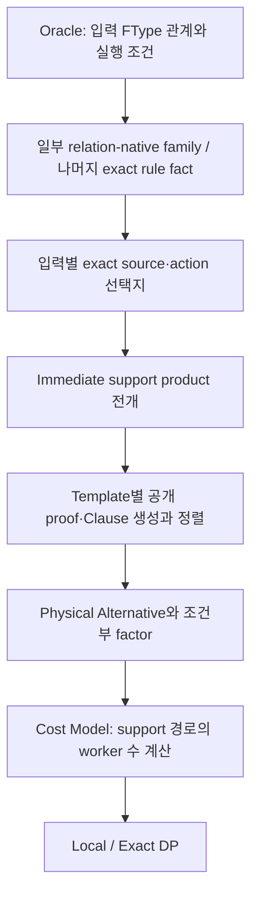

# FedPlanner: pruning, 조합 전개, 반복 계산 중 무엇이 병목인가

## 판단

현재 가장 직접적인 구조적 문제는 **물리적 source·support 조합을 펼쳐 객체로 만들고, 그 경로를 여러 단계에서 반복 처리하는 것**이다. 일부 rule·단계에만 최적화가 적용되는 문제가 여기에 연결된다. 조기 pruning 누락도 실제로 있었지만, 그 누락만 수정해서 생성 폭발이 해결되지는 않았다. 문자열 비교가 비용을 키울 수는 있으나, 문자열만의 실행시간 비중을 분리한 근거는 없다.

| 질문 | 현재 확인한 답 |
|---|---|
| pruning이 안 돼서 느린가? | 일부는 맞다. 일반 rule MRV와 루프·함수 이후 입력 privacy 적용 누락을 수정했다. 하지만 실제 Clause 생성량 감소는 약5%였다. |
| 조합을 너무 많이 펼치는가? | 맞다. 압축된 입력 축을 support template·공개 proof·Physical Alternative로 펼치는 경로가 남아 있다. |
| 일부 HOP에만 최적화가 적용되는가? | 맞다. 또한 같은 HOP도 Oracle에서는 압축하고 이후 단계에서는 다시 전개한다. HOP 종류와 처리 단계 양쪽의 적용 범위를 봐야 한다. |
| 문자열 비교가 주원인인가? | 현재 그렇게 단정할 근거는 없다. lazy/segmented signature와 identity memo가 이미 있다. 다만 전개된 객체 수만큼 비교·정렬·직렬화가 반복되어 추가 비용이 든다. |
| 분석이 끝나면 문제가 사라지는가? | 아니다. Cost Model에서 worker 수를 계산하려고 같은 support 의존 경로를 재귀적으로 따라가는 별도 반복 작업이 확인됐다. |

## 실제 COFEE LogReg에서 확인한 규모

50,000×128, W1, 동일 DML·Y·privacy·자원 설정의 완료된 **Analysis 단계**를 비교했다. 각 엔진1회 관측이며 paired 전체 compilation 결과가 아니다.

| 항목 | 이전 merged 엔진 | pruning 수정본 v1 |
|---|---:|---:|
| Analysis 시간 | 476.715초 | 490.139초 |
| CandidateRuleFact 생성 | 227,285 | 222,582 |
| Direct support leaf | 4,191,721 | 3,942,161 |
| Explicit Clause 생성 | 21,979,887 | 20,882,097 |
| Proof row 방문 | 20,778,254 | 19,957,286 |
| 누적 thread allocation | 261.50GB | 249.70GB |

이 수치는 누적 생성·방문량이다. 서로 다른 전역 실행 계획의 수, 동시에 살아 있는 객체 수, peak memory와 같지 않다. 생성량은 감소했지만 **이 관측에서 Analysis 시간 개선은 없다**.

## 왜 Oracle을 최적화했는데도 커지는가

Oracle이 보는 입력의 FType 선택과, 실제 source·relocation·support 선택은 크기가 다른 관계다. 예를 들어 `ROW`가 허용된다는 판정 하나 아래에도 여러 exact source와 전송 경로가 존재할 수 있다. Oracle 호출을 줄여도 그 경로를 후속 단계에서 전부 펼치면 큰 비용이 남는다.

입력별 물리적 선택지 수를 `s₁, …, sₙ`이라 하면, 현재 product 전개 경로의 leaf 수는 최악에 `P = ∏ sᵢ`다. MRV가 검사 순서를 개선해도 전부 살아남으면 leaf마다 객체를 만드는 경로는 최소 `Ω(P)` 작업을 한다. 독립 관계를 압축 상태로 유지하면 domain 저장은 `O(Σ sᵢ)`로 가능하다. 상관관계가 있으면 공동 제약이나 허용 row를 함께 유지해야 하며, 이를 독립 product로 바꾸면 불법 조합이 생긴다.

프로그램 전체의 비용은 각 HOP의 이런 작업과 Closure 반복·proof 방문·downstream 재탐색이 합쳐진다. 데이터 원소마다 계획 후보를 만드는 구조는 아니다.

## 캐시와 압축이 끊기는 구체적인 위치

- `NativePlacementContinuity.computeCandidateSupportAlternatives` / `enumerateImmediateSupports`: 입력별 domain을 순회하고 leaf마다 `CandidateSupportTemplate`을 만든다. 독립 owner에 대한 정적 MRV도 논리적 product 자체를 없애지는 않는다.
- `instantiateSupportTemplates`: support 계산 결과를 memoize해도 template마다 공개 `NativeContinuityProof`를 복원하고 정렬한다. 그래프 계산 재사용과 proof 객체 재사용은 별개다.
- `ExactPhysicalModel`의 `forEachRelationInputs` 경로: relation axes를 tuple로 펼친 뒤 emission·realization·support별 `Alternative`를 만든다.
- correlated support factor 구성: admitted row를 순회해 조건부 region을 만든다. sparse hole을 보존하지만 row별 작업이 남는다.
- `ExactPhysicalCostModel.realizationWorkerCount` / `executionWorkerCount`: 같은 support 경로의 worker 수를 반복 계산하는 경로가 있다. 계산 결과가 동일함을 증명한 범위의 재사용·생략이 필요하다.

## MRV·source-conflict가 0일 때의 해석

수정본 v1은 MRV 적용241회·조기 검사881회·거절0회, 입력 privacy avoided125건을 기록했다. Source MRV descriptor176,111개에서도 직접 source 비교·제거는0회였다.

Source 비교0은 검사하는 **직접 입력 owner가 서로 겹치지 않았다**는 뜻이다. 서로 다른 입력의 전이적 공유 source, VALUE_MAP, 함수 경계, sparse joint 조건까지 모두 독립이고 합법이라는 증거는 아니다. 이러한 관계의 일부는 downstream에서 처리한다. 반대로 실제로 독립적이고 모두 합법인 관계는 pruning으로 지울 수 없으므로, 조합을 압축 상태로 유지해야 한다.

## 현재 수정과 남은 우선순위

일반 rule MRV·구조적 privacy 적용 공백, 직접 owner 공유 시 MRV/forward pruning, 독립 owner의 반복 MRV 관리 비용을 수정했다. worker 수가 항상1임을 권한까지 검증한 경우 Cost Model 재귀를 생략하는 변경도 추가했다. 이 변경까지 통합692개 테스트가 통과했으며, 실제 v2 COFEE 검증은 별도 진행한다. 이것을 전체 relation-native 구현 완료로 보고하지 않는다.

추가로 dynamic layout 여부만 확인하면서 factorized/indexed support를 전개하던 경로를 metadata 조회로 바꿨다. 1,000개 논리 member의 판정을 Clause 생성0개로 수행하는 회귀 테스트와, 이를 포함한 통합 **695개 테스트(131.025초)**를 통과했다. 이 추가 수정은 실행 중인 frozen v2와 구분하며 실제 workload 시간 개선을 주장하지 않는다.

다음 우선순위는 **support→proof→Physical Alternative 전달에서 불필요한 전개를 없애는 것**, **같은 관계의 반복 재탐색 제거**, **전이적 공동 제약을 이용한 조기 pruning**이다. 문자열/ID 최적화는 남은 member당 처리 비용을 줄이는 작업으로 구분한다.

추가 실제 v2 검증에서는 Analysis460.528초 후 worker-count certificate가 성공했지만, Cost Surface의 사전 검사에서 `EXACT_VE_FACTOR_CELL_OVERFLOW`로 실패했다. 모든 raw factor의 Cartesian 크기를 정수 인덱스 범위에 맞춰 검사하는 경로가, support 감축 전에 실행된 것이다. 이는 전체 planning 성공이나 OOM이 아니며, 감축 전·후 검사의 역할을 구분하는 수정을 진행한다.

실행 조건·hash·회귀 실패와 수정·최신 실제 결과는 [COFEE 대규모 검증 기록](FEDPLANNER_COFEE_LARGE_VALIDATION_2026-10-08_KO.md)에 보존한다.
