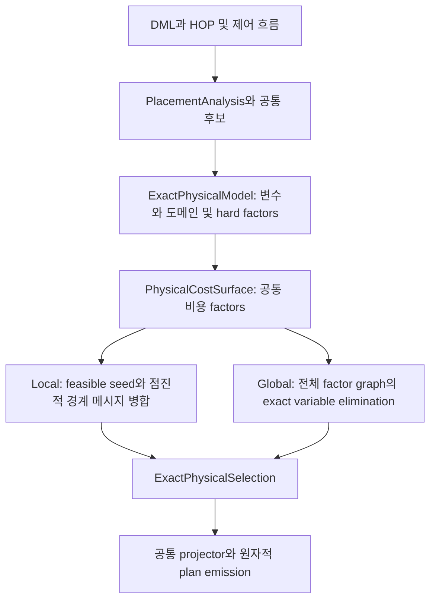

# SystemDS Local DP와 Global DP의 공통 탐색 공간 및 그룹 충돌 처리

> 후속 변경: 이 보고서의 고정 resource budget 정책은 [Local/Global DP resource policy](FEDPLANNER_RESOURCE_POLICY_2026-10-06.md)로 대체됐다. 아래 수치는 당시 빌드의 검증 이력이다.

분석 기준은 사용자가 지정한 `/home/mchoi/w1357-cost-model-main-20261006`의 커밋 `e1fdfe4446180ef9d6fbd93fd0c4f5ab899d7440`이다. 커밋 시각은 2026년 10월 6일 13:03:47 +0200이며, 로컬의 `origin/main`과 일치한다. 이하 설명은 이 worktree의 소스에 한정한다.

**핵심 결론은 Local과 Global이 같은 HOP 배치 문제를 모델링하고, 그 문제를 푸는 범위와 중단 방식에서 달라진다는 것이다.** 현재 Local은 합법적인 초기 전체 계획을 만든 뒤, 그룹 경계의 상태별 비용표를 점진적으로 병합한다. 그룹마다 정답 하나를 독립적으로 고른 뒤 단순히 합치는 방식으로 이해하면 실제 구현을 놓치게 된다.

이 문서에서 DP는 dynamic programming이다. Local이라는 이름은 최적화 방법의 범위를 뜻하며, HOP를 coordinator에서 실행하는 CP/LOUT 선택과는 별개다. Local DP도 FED 실행을 선택할 수 있다.

## 질문과 주요 판단

설명할 질문은 세 가지다. HOP와 가능한 실행계획을 두 플래너가 어떻게 공통 표현하는지, 각각 어떤 알고리즘으로 선택하는지, Local에서 그룹 간 선택이 충돌하면 무엇을 하는지다.

| 우선순위 | 판단 | 신뢰도 | 근거 |
|---|---|---|---|
| 1 | 두 플래너는 동일한 canonical physical domain, hard constraint, cost surface를 구성한다 | 높음 | 두 생산 진입점에서 같은 model과 cost builder 호출 |
| 2 | 현재 Local 본체는 feasible seed 이후 incremental boundary message DP다 | 높음 | LocalPhysicalOptimizer에서 incremental optimizer를 직접 호출 |
| 3 | 그룹은 factor를 나눈 것이며, 공유 HOP 결정 변수는 경계로 유지한다 | 높음 | factor별 초기 cluster, 공유 변수 incidence, 전체 bucket 병합 |
| 4 | Global은 전체 문제의 exact solve를 수행하고, Local도 병합을 끝까지 마치면 exact에 도달한다 | 높음 | variable elimination 구현과 Global 대조 테스트 |
| 5 | Local이 언제나 Global보다 빠르거나 실제 실행시간도 5% 이내라는 주장은 성립하지 않는다 | 판단 불가 | 모델 비용 보증과 실제 실행시간은 다른 대상이며, 해당 성능 비교는 이번 검증 범위 밖 |

표의 첫 네 항목은 코드 및 해당 테스트에 근거한 사실이다. 아래 수식과 작은 숫자 예시는 그 동작을 설명하기 위한 해석이다.

## 실제 진입점

| 구분 | 설정 값 | 플래너 | 최적화 본체 |
|---|---|---|---|
| Local DP | `COMPILE_COST_BASED` | `FederatedPlanLocalCost` | `LocalPhysicalOptimizer` → `IncrementalRegionalOptimizer` |
| Global DP | `COMPILE_EXACT` | `FederatedPlanExact` | `ExactPhysicalOptimizer` → `ExactPhysicalReducedSolver` → `ExactCategoricalSolver` |

이 매핑은 [FederatedPlannerFactory.java](/home/mchoi/w1357-cost-model-main-20261006/src/main/java/org/apache/sysds/hops/ipa/FederatedPlannerFactory.java:34)에 있다. 따라서 현재 코드를 설명할 때는 예전 `fedDP` 클래스의 HOP별 conflict repair만 따라가면 안 된다.

공통 구조는 다음과 같다.



[Local 생산 경로](/home/mchoi/w1357-cost-model-main-20261006/src/main/java/org/apache/sysds/hops/fedplanner/fedCostBased/fedExact/FederatedPlanLocalCost.java:43)와 [Global 생산 경로](/home/mchoi/w1357-cost-model-main-20261006/src/main/java/org/apache/sysds/hops/fedplanner/fedCostBased/fedExact/FederatedPlanExact.java:50)는 model, cost surface, selection, projector를 공유하고 optimizer에서 갈라진다.

## 공통 탐색 공간에서 HOP를 표현하는 방법

### HOP의 정체성은 단순 hopID보다 구체적이다

공통 그래프의 결정 키는 `CompiledHopKey`다. 이 키에는 program fingerprint, 함수 namespace, callsite, recompile context, control region, emitted HOP instance, source origin이 들어간다.

따라서 같은 소스 연산이라도 함수 호출 위치나 재컴파일 문맥이 다르면 구별할 수 있다. 반대로 같은 canonical occurrence를 여러 소비자가 참조할 때는 하나의 결정 변수로 연결된다. 변수값의 정의와 재정의, loop/branch 경계는 별도의 `ValueVersionKey`로 추적한다. [PlacementIdentity.java](/home/mchoi/w1357-cost-model-main-20261006/src/main/java/org/apache/sysds/hops/fedplanner/placement/PlacementIdentity.java:282)

그래프에는 일반 operation뿐 아니라 transient read/write, loop phi, branch join, 함수 입력·출력 경계도 있다. 실제 HOP에 직접 코드를 내보내지 않는 synthetic function boundary도 제약을 연결하는 결정 변수로 포함될 수 있다. [NeutralPlacementGraph.java](/home/mchoi/w1357-cost-model-main-20261006/src/main/java/org/apache/sysds/hops/fedplanner/placement/NeutralPlacementGraph.java:47), [ExactPhysicalModel.java](/home/mchoi/w1357-cost-model-main-20261006/src/main/java/org/apache/sysds/hops/fedplanner/fedCostBased/fedExact/ExactPhysicalModel.java:438)

### HOP 하나의 도메인은 단순 CP와 FED 두 값이 아니다

각 decision node에 대해 변수와 도메인을 만든다고 표현할 수 있다.

```text
x_v ∈ D_v
x_v = 해당 HOP occurrence에서 선택한 physical alternative의 index
```

거친 배치 상태인 `PlacementState`는 다음 정보를 가진다.

- 실행 위치 또는 방식: `ExecType`
- 출력 위치: `LOUT` 또는 `FOUT`
- federated 분할 형태: `FType`
- shape에 의존하는지 여부

예를 들어 CP/LOUT는 coordinator 계산과 local 출력을 뜻하고, FED/FOUT는 federated 계산과 federated 출력을 뜻한다. FED/LOUT는 federated 계산 결과를 local로 받는 경우다. 이런 조합은 연산·입력·privacy·runtime 지원에 따라 허용 여부가 달라지며, 모든 HOP에 모두 열리는 것은 아니다. [PlacementState.java](/home/mchoi/w1357-cost-model-main-20261006/src/main/java/org/apache/sysds/hops/fedplanner/placement/PlacementState.java:28)

실제 최적화 도메인의 원소인 `ExactPhysicalModel.Alternative`는 이보다 자세하다. 배치 상태 외에도 다음을 함께 가진다.

| 정보 | 최적화에 필요한 이유 |
|---|---|
| candidate rule과 실행 rule | 어떤 입력 조합에서 해당 실행이 합법적인지 구별 |
| emission과 realization | 선택한 계획을 실제로 생성할 수 있는지 구별 |
| durable anchor와 worker layout 근거 | 어느 worker와 range 배치에서 실행하는지 구별 |
| 입력별 authority | native local 입력, direct FOUT 입력, relocation 입력을 구별 |
| relocation 및 derived FOUT action | 명시적인 업로드나 재배치가 필요한 경우를 표현 |
| support clause | 해당 후보가 의존하는 producer 후보와 배치 증명을 연결 |

**같은 FED/FOUT 표시를 가진 후보라도 입력 공급 방식이나 anchor가 다르면 서로 다른 물리적 대안일 수 있다.** 배치 비트만 같다고 무조건 합쳐서는 안 되는 이유다. [Alternative 정의](/home/mchoi/w1357-cost-model-main-20261006/src/main/java/org/apache/sysds/hops/fedplanner/fedCostBased/fedExact/ExactPhysicalModel.java:62)

### 후보 생성과 전역 합법성은 선택 전에 공통으로 표현된다

`NeutralPlacementGraphBuilder`는 program facts를 분석하고 relation closure를 수행한다. 이 과정에서 후보와 입력 관계, 함수·transient 경계, privacy, relocation 지원 관계를 닫아 `PlacementAnalysis`를 만든다. [NeutralPlacementGraphBuilder.java](/home/mchoi/w1357-cost-model-main-20261006/src/main/java/org/apache/sysds/hops/fedplanner/placement/NeutralPlacementGraphBuilder.java:174), [PlacementRelationClosure.java](/home/mchoi/w1357-cost-model-main-20261006/src/main/java/org/apache/sysds/hops/fedplanner/placement/PlacementRelationClosure.java:778)

그 후 `ExactPhysicalModel`은 각 decision node에 하나의 categorical variable을 만들고, 후보 간 일관성을 hard factor로 연결한다. 합법적인 조합에는 0, 불법적인 조합에는 무한대 비용을 준다. 주요 제약은 다음과 같다.

- 같은 값이나 배치를 유지해야 하는 관계
- TWrite와 TRead의 호환성
- 함수 actual argument, boundary, formal parameter의 연결
- 선택한 producer가 consumer 후보의 realization을 지원하는지 여부
- FOUT 생성에 필요한 anchor와 입력 authority
- runtime이 요구하는 입력 조합

따라서 탐색 공간은 각 HOP의 후보 목록을 단순 곱한 것에서 끝나지 않는다. **후보의 곱집합 중 모든 hard factor를 만족하는 전체 assignment의 집합**이다. [변수와 factor 구성](/home/mchoi/w1357-cost-model-main-20261006/src/main/java/org/apache/sysds/hops/fedplanner/fedCostBased/fedExact/ExactPhysicalModel.java:448), [제약의 비용 표현](/home/mchoi/w1357-cost-model-main-20261006/src/main/java/org/apache/sysds/hops/fedplanner/fedCostBased/fedExact/ExactPhysicalModel.java:1092)

### 두 플래너가 최소화하는 비용도 같다

개념적으로 공통 문제는 다음과 같다.

```text
minimize C(x) = Σ cost_factor_f(x_scope(f))
subject to   hard_factor_h(x_scope(h)) = 0 for every h

동치 표현:
minimize Σ cost_factor_f + Σ hard_factor_h
hard_factor_h ∈ {0, +∞}
```

비용에는 HOP 실행비용뿐 아니라 fused kernel, 업로드, 다운로드, compiled edge의 전송, native-local 입력 전송, 함수 경계 비용이 포함된다. 실행 빈도도 반영한다. 공유 전송과 materialization 때문에 하나의 비용 factor가 여러 결정 변수를 함께 참조할 수 있다. 트리의 자식 비용을 무조건 더하는 문제로 축소되지 않는다. [ExactPhysicalCostModel.java](/home/mchoi/w1357-cost-model-main-20261006/src/main/java/org/apache/sysds/hops/fedplanner/fedCostBased/fedExact/ExactPhysicalCostModel.java:424)

여기서 “공통”은 canonical 후보·제약·비용의 의미가 같다는 뜻이다. solver 내부 테이블까지 항상 동일하다는 뜻은 아니다. auxiliary variable, factor 분해, 동등 상태 병합, shared-source encoding 같은 정확성 보존 변환으로 표현은 달라질 수 있다. Global은 수치적 인증 조건이 맞으면 별도의 shared-source/dyadic encoding도 사용한다. [Global 표현 선택](/home/mchoi/w1357-cost-model-main-20261006/src/main/java/org/apache/sysds/hops/fedplanner/fedCostBased/fedExact/ExactPhysicalOptimizer.java:41)

## Global DP는 어떻게 푸는가

Global은 모든 hard factor와 cost factor를 포함하는 전체 문제에 exact min-sum variable elimination을 적용한다.

변수 v를 제거할 때 v를 참조하는 모든 factor를 bucket으로 모은다. 나머지 변수 집합을 S라고 하면, 다음 메시지를 만든다.

```text
m_v(x_S) = min_{x_v} Σ_{f ∈ bucket(v)} f(x_scope(f))
```

즉, 경계 S의 각 상태 조합에 대해 v를 어떤 값으로 고르면 가장 싼지 계산한다. 최소 비용표와 그때의 선택인 argmin을 저장하고, 원래 bucket을 이 메시지로 대체한다. 모든 변수를 제거한 뒤에는 저장된 선택을 역순으로 따라가 전체 assignment를 복원한다. [ExactCategoricalSolver.java](/home/mchoi/w1357-cost-model-main-20261006/src/main/java/org/apache/sysds/hops/fedplanner/fedCostBased/fedExact/ExactCategoricalSolver.java:712)

공유 HOP도 처음부터 하나의 변수이므로, 두 소비자가 서로 다른 배치를 선호하면 그 변수를 참조하는 모든 factor를 함께 고려한다. 서로 다른 함수·transient 경계 변수 사이의 일관성도 hard factor가 제한한다. Global에서 group별 독립 정답을 나중에 맞추는 별도 단계가 필요하지 않은 이유다.

실제 구현은 그대로 전수 열거만 하지 않는다. finite support가 없는 값을 제거하고, incident factor가 완전히 동일하게 관측하는 값들을 합치며, singleton을 치환한다. 제거 순서도 min-fill, separator 크기, 제거 assignment 수, degree를 고려한 순서들을 비교한다. sparse support를 활용하는 경로도 있다. [ExactPhysicalReducedSolver.java](/home/mchoi/w1357-cost-model-main-20261006/src/main/java/org/apache/sysds/hops/fedplanner/fedCostBased/fedExact/ExactPhysicalReducedSolver.java:27), [제거 순서 선택](/home/mchoi/w1357-cost-model-main-20261006/src/main/java/org/apache/sysds/hops/fedplanner/fedCostBased/fedExact/ExactCategoricalSolver.java:1312)

비용은 주로 중간 경계의 크기에 좌우된다. 일반적인 해석으로, 한 단계의 dense 계산량은 대략 `|D_v| × ∏_{u∈S}|D_u|`, 메시지 크기는 `∏_{u∈S}|D_u|`다. 모든 도메인의 최대 크기를 d, induced width를 w라고 하면 전형적으로 `O(n·d^(w+1))` 성격을 가진다. HOP 수뿐 아니라 공유 관계와 고차 factor가 중요한 이유다.

완료 후 원본 canonical hard constraints와 비용을 다시 검증한다. 여기서 exact는 **현재 모델에 인코딩된 후보·제약·비용에 대한 최적성**이다. 실제 벽시계 실행시간이나 모델 밖의 모든 가능한 runtime 계획에 대한 최적성은 아니다. [결과 검증](/home/mchoi/w1357-cost-model-main-20261006/src/main/java/org/apache/sysds/hops/fedplanner/fedCostBased/fedExact/ExactPhysicalOptimizer.java:168)

## Local DP는 어떻게 푸는가

현재 생산 경로는 두 단계다.

### 첫 단계는 전체적으로 합법적인 seed 생성이다

`LocalPhysicalOptimizer`는 producer-before-consumer 순서를 구성하고, `LocalCategoricalOptimizer`로 초기 assignment를 만든다. 이때 현재 생산 호출은 일반적인 local improvement block을 빈 목록으로 전달하고 revisit 횟수도 0으로 설정한다. 소스에 남아 있는 일반 block 재방문 기능을 현재 Local의 최적화 본체라고 설명하면 부정확하다. [LocalPhysicalOptimizer.java](/home/mchoi/w1357-cost-model-main-20261006/src/main/java/org/apache/sysds/hops/fedplanner/fedCostBased/fedExact/LocalPhysicalOptimizer.java:112)

초기 선택에서 hard constraint 위반이 발생하면 다음 절차로 수리한다.

1. 위반 hard factor들의 연결 성분을 찾는다.
2. 관련 변수와 그 변수에 직접 연결된 hard-factor response region을 하나의 block으로 묶는다.
3. block에 걸린 hard factor와 cost factor를 모두 포함하고, 바깥 변수는 현재 값으로 고정해 함께 푼다.
4. 고정된 경계 때문에 해가 없으면 인접 hard factor를 따라 block을 넓힌다.
5. 최종적으로 전체 hard factor 위반이 0인지 확인한다.

이는 group 바깥과 걸친 제약을 버리는 것이 아니다. 경계를 고정한 조건부 문제 안에 그 제약도 포함한다. 더 확장해도 합법적인 해가 없으면 오류로 종료한다. [초기 선택과 최종 검증](/home/mchoi/w1357-cost-model-main-20261006/src/main/java/org/apache/sysds/hops/fedplanner/fedCostBased/fedExact/LocalCategoricalOptimizer.java:650), [conflict repair](/home/mchoi/w1357-cost-model-main-20261006/src/main/java/org/apache/sysds/hops/fedplanner/fedCostBased/fedExact/LocalCategoricalOptimizer.java:867), [경계 고정](/home/mchoi/w1357-cost-model-main-20261006/src/main/java/org/apache/sysds/hops/fedplanner/fedCostBased/fedExact/LocalCategoricalOptimizer.java:1010)

이 단계에서 얻은 전체 합법 계획이 incumbent다. 그 비용은 최적 비용의 upper bound U가 된다. 초기 계획의 canonical 비용 일치를 확인한 뒤 두 번째 단계로 진행한다.

### 두 번째 단계는 그룹의 경계 메시지를 점진적으로 병합한다

`IncrementalRegionalOptimizer`는 reduced root의 **factor 하나마다 초기 cluster 하나**를 만든다. 이후 cluster들을 합쳐 영역을 넓힌다. [Local에서 incremental 호출](/home/mchoi/w1357-cost-model-main-20261006/src/main/java/org/apache/sysds/hops/fedplanner/fedCostBased/fedExact/LocalPhysicalOptimizer.java:60), [초기 cluster 생성](/home/mchoi/w1357-cost-model-main-20261006/src/main/java/org/apache/sysds/hops/fedplanner/fedCostBased/fedExact/IncrementalRegionalOptimizer.java:119)

여기서 group의 의미가 중요하다.

| 항목 | 현재 구현의 의미 |
|---|---|
| group이 소유하는 것 | 원래 factor ordinal의 집합 |
| group 사이에서 공유할 수 있는 것 | HOP 결정 변수 및 encoding의 보조 변수 |
| 내부 변수 | 다른 active group과 더 이상 연결되지 않는 변수 |
| 경계 변수 | 다른 group과 연결되며 상태별 비용표에 남기는 변수 |
| group의 결과 | 경계 상태 조합마다 최소 비용과 복원 정보 |

따라서 group은 HOP DAG를 고정된 몇 구역으로 나눈 것과 다르다. **factor 소유권은 겹치지 않지만 변수는 여러 group에서 함께 참조할 수 있다.**

cluster C의 결과는 개념적으로 다음 함수다.

```text
M_C(b) = min_{x_internal} Σ_{f owned by C} f(x_internal, b)
```

b는 경계 변수의 상태 조합이다. 하나의 “가장 좋은 지역 계획”만 남기는 대신, 경계가 이렇게 정해졌을 때의 최선과 저렇게 정해졌을 때의 최선을 모두 보존한다. 다른 cluster와 무관한 private variable은 먼저 최소화하여 제거할 수 있다. [private variable 처리](/home/mchoi/w1357-cost-model-main-20261006/src/main/java/org/apache/sysds/hops/fedplanner/fedCostBased/fedExact/IncrementalRegionalOptimizer.java:225)

## 그룹 간 conflict를 해소하는 핵심 원리

### 실제 제약 위반과 비용 선호의 차이를 구별한다

초기 seed에서 발견한 hard constraint 위반은 실행할 수 없는 조합이므로 block repair로 해소해야 한다.

반면 incremental 단계에서 어떤 group은 공유 변수 X의 LOUT를, 다른 group은 FOUT를 선호할 수 있다. 이것은 현재 실행계획이 모순된다는 뜻이 아니다. 실행계획인 incumbent는 이미 합법적이며, 아직 합치지 않은 group들의 개별 최소 비용이 서로 다른 X 값을 가정한다는 뜻이다.

이 개별 최솟값의 합은 lower bound를 계산하는 데 사용할 수 있지만, 그대로 실행계획으로 사용할 수는 없다.

### 공유 변수에 연결된 모든 group을 함께 합친다

pivot 변수 v를 선택하면 `refresh(v)`가 v를 포함한 **모든 active message**를 수집한다. 그 scope들의 합집합에서 v만 제외한 변수가 새로운 경계가 된다.

```text
M_new(b) = min_{x_v} Σ_i M_i(x_v, b_i)
```

이 단계에서 모든 group이 동일한 v의 값을 사용한다. 두 group만 임의로 합쳐 v를 없애고, v를 사용하는 세 번째 group을 밖에 남겨두지 않는다. 코드도 병합 후 pivot이 incidence에 남으면 오류로 처리한다. [전체 bucket 구성](/home/mchoi/w1357-cost-model-main-20261006/src/main/java/org/apache/sysds/hops/fedplanner/fedCostBased/fedExact/IncrementalRegionalOptimizer.java:292), [병합과 pivot 제거 검사](/home/mchoi/w1357-cost-model-main-20261006/src/main/java/org/apache/sysds/hops/fedplanner/fedCostBased/fedExact/IncrementalRegionalOptimizer.java:175)

비용표의 각 경계 조합에 대해 합계가 최소인 내부 선택과 argmin을 저장한다. 이는 Global의 variable elimination과 같은 min-sum 원리다. [mergeBoundary 구현](/home/mchoi/w1357-cost-model-main-20261006/src/main/java/org/apache/sysds/hops/fedplanner/fedCostBased/fedExact/ExactCategoricalSolver.java:580)

### 남은 경계 값을 바꾸지 않고 현재 계획을 개선한다

새 메시지를 이용해 incumbent를 개선할 때는 **현재 incumbent의 경계 상태에 해당하는 행**을 찾아 내부 결정을 복원한다.

예를 들어 병합 결과가 `M_AB(Y)`이면, 외부 group과 공유하는 Y는 현재 값으로 유지하고 그 Y에 대응하는 내부 X만 바꾼다. v에 연결된 모든 factor를 함께 합쳤기 때문에, 제거된 v의 변경을 외부 group이 뒤늦게 관측하는 문제도 없다.

복원한 계획은 reduced 모델, 원래 encoded 모델, canonical 목적함수로 다시 평가한다. 값이 일치하고 전체 비용이 증가하지 않는지 검증하며, strict improvement가 있을 때 incumbent를 갱신한다. [조건부 복원](/home/mchoi/w1357-cost-model-main-20261006/src/main/java/org/apache/sysds/hops/fedplanner/fedCostBased/fedExact/ExactCategoricalSolver.java:297), [전체 검증과 accept](/home/mchoi/w1357-cost-model-main-20261006/src/main/java/org/apache/sysds/hops/fedplanner/fedCostBased/fedExact/IncrementalRegionalOptimizer.java:339)

### factor를 빠뜨리거나 중복 과금하지 않는다

각 group은 자신이 소유한 원래 factor ordinal 집합을 유지한다. 병합할 때 두 번 소유된 factor가 있는지 검사하고, 전체 active 및 sealed cluster가 원래 factor 전체를 정확히 덮는지 검사한다.

이것은 shared HOP나 전송 비용을 여러 group에서 중복 더하는 오류를 방지하는 구조다. 단, 어떤 전송들을 하나의 canonical cost factor로 공유할지는 앞선 비용 모델이 결정한다. cluster ownership 검사는 그 모델의 factor를 정확히 한 번씩 다룬다는 보장이다. [factor ownership 검사](/home/mchoi/w1357-cost-model-main-20261006/src/main/java/org/apache/sysds/hops/fedplanner/fedCostBased/fedExact/IncrementalRegionalOptimizer.java:373)

## 숫자로 보는 그룹 간 충돌

다음은 설명용 가상 비용이며 실제 workload 측정값이 아니다. 공유 HOP 변수 X의 대안을 단순화하여 L과 F로 표시한다.

| group의 경계 메시지 | X=L | X=F |
|---|---:|---:|
| A | 0 | 8 |
| B | 6 | 0 |

A는 L을, B는 F를 선호한다. 각 group의 최소 비용을 독립적으로 더하면 0이지만, 동일한 X에 두 값을 줄 수 없으므로 비용 0의 전체 계획은 없다.

X를 pivot으로 두 group을 합치면 다음과 같다.

```text
X=L: 0 + 6 = 6
X=F: 8 + 0 = 8
공통 선택의 최솟값: 6, X=L
```

즉, “어느 group의 주장을 우선할 것인가”를 임의로 정하지 않는다. **같은 X 값에 대한 비용을 더한 뒤 그 합을 최소화한다.**

외부 경계 Y가 남아 있다면 `M_AB(Y)=min_X[M_A(X,Y)+M_B(X,Y)]`를 저장한다. 이때도 Y마다 다른 최선의 X를 보존한다. 현재 계획을 개선할 때는 현재 Y에 대응하는 행을 사용한다. 불법적인 조합은 비용이 무한대이므로 선택에서 제외된다.

## 어떤 그룹부터 합치며 언제 멈추는가

### 병합 순서는 비용과 경계 크기를 함께 고려한다

현재 구현은 출력 경계 테이블이 가장 작은 후보들을 우선 고려한다. 그중 기본 최대 16개의 후보에 대해 공유 pivot의 min-marginal을 이용한 선호 충돌 점수를 계산한다.

```text
conflict(v)
  = min_a Σ_i marginal_i(v=a)
    - Σ_i min M_i
```

개별 group의 최선을 독립적으로 더했을 때보다, 같은 v를 강제하면 비용이 얼마나 증가하는지를 나타낸다. 이를 예상 작업량으로 나눈 값을 순서 선택에 사용한다.

이 점수는 어느 bucket을 먼저 풀지 정하는 휴리스틱이다. 정합성은 전체 bucket 병합, 경계별 비용표, 조건부 복원, factor 소유권에서 나온다. [choose와 conflict](/home/mchoi/w1357-cost-model-main-20261006/src/main/java/org/apache/sysds/hops/fedplanner/fedCostBased/fedExact/IncrementalRegionalOptimizer.java:265)

### Lower bound와 upper bound를 유지한다

최적 비용을 OPT라고 하면 다음 관계를 유지하려는 구조다.

```text
L ≤ OPT ≤ U
```

U는 전체적으로 합법적인 incumbent 비용이다. L은 factor 전체를 덮는 cluster별 하한의 합이다. 아직 공유 변수의 선택을 맞추지 않은 group별 최솟값은 낙관적인 값이므로 lower bound가 된다. 병합하면서 공유 변수의 일치를 더 강제하면 하한을 강화할 수 있다. 실제 구현은 보수적 부동소수 반올림을 적용하고, 발표한 L이 내려가지 않도록 한다. [하한 갱신](/home/mchoi/w1357-cost-model-main-20261006/src/main/java/org/apache/sysds/hops/fedplanner/fedCostBased/fedExact/IncrementalRegionalOptimizer.java:362)

| 종료 상태 | 의미 | 보증 해석 |
|---|---|---|
| `EXACT` | active 경계 메시지를 모두 제거하고 복원 완료 | 모델 기준 L=U=OPT |
| `TARGET_REACHED` | 설정한 relative gap 도달 | 설정 gap에 따른 모델 비용 보증 |
| `TIME` | incremental 실행 중 시간 조건 도달 | 합법 incumbent 반환, 목표 gap 달성은 별도 확인 |
| `RESOURCE` | 허용 자원으로 더 진행할 bucket이 없음 | 현재 incumbent와 하한 유지 |
| `RESOURCE_INITIAL` | 초기 전체 factor cover를 담기 어려움 | 부분 cover로 잘못된 하한을 만들지 않으며 초기 하한 0 사용 |

이 종료는 feasible seed와 공통 모델 구성이 성공한 뒤의 동작이다. seed 생성 실패나 모델 검증 오류까지 모두 incumbent 반환으로 처리하는 것은 아니다.

기본 설정은 다음과 같다. property 접두사는 `sysds.fedplanner.regional.incremental.`이다.

| 항목 | 기본값 |
|---|---:|
| `relativeGap` | 0.05 |
| `assignments` | 한 병합의 union assignment 최대 1,000,000 |
| `retainedSlots` | 8,000,000 |
| `timeMillis` | 10,000 |
| `scoredCandidates` | 16 |
| `earlyStop` | true |

`retainedSlots`는 내부 저장 슬롯 수이며 bytes가 아니다. `timeMillis`도 전체 컴파일을 10초 이내로 보장하는 deadline이 아니다. incremental optimizer 생성 이후 경과 시간을 반복문에서 검사하므로, 이전의 후보 생성·cost model·seed 시간은 포함하지 않으며 진행 중인 개별 계산이 그 시점을 넘을 수도 있다. [기본값과 실행 루프](/home/mchoi/w1357-cost-model-main-20261006/src/main/java/org/apache/sysds/hops/fedplanner/fedCostBased/fedExact/IncrementalRegionalOptimizer.java:44)

gap은 `(U-L)/L`이며 U를 분모로 쓰지 않는다. L=0이고 U>0이면 무한대다. 기본 목표를 만족해 `TARGET_REACHED`로 종료했다면, 보증 대상 모델에서 `U ≤ 1.05·OPT`로 해석할 수 있다. 시간·자원 종료 자체는 5% 보증이 아니다. [relativeGap 구현](/home/mchoi/w1357-cost-model-main-20261006/src/main/java/org/apache/sysds/hops/fedplanner/fedCostBased/fedExact/IncrementalRegionalOptimizer.java:396)

Local이 `EXACT`에 도달할 때 Global optimizer를 새로 호출하여 처음부터 다시 푸는 것도 아니다. 그동안 만든 메시지를 계속 병합하여 도달한다. [Local 최종 assignment 채택](/home/mchoi/w1357-cost-model-main-20261006/src/main/java/org/apache/sysds/hops/fedplanner/fedCostBased/fedExact/LocalPhysicalOptimizer.java:88)

## 두 방법의 차이와 해석

| 관점 | Local DP | Global DP |
|---|---|---|
| 공통 문제 | canonical HOP 대안과 전체 제약 및 비용 | 동일 |
| 출발 | 합법적인 전체 seed와 factor별 메시지 | 전체 factor graph의 exact solve |
| 계산 단위 | 점진적으로 합치는 factor cluster와 boundary table | 선택한 제거 순서의 bucket과 separator table |
| 공유 변수 | 경계로 보존하고 모든 incident cluster를 함께 병합 | 전체 factor graph의 단일 변수로 공동 최적화 |
| 계획 개선 | 현재 외부 경계에 조건부로 내부를 재최적화 | 최종 backtracking으로 전체 assignment 복원 |
| 종료 | gap 목표, 시간·자원 한도, 또는 exact 완료 | exact solve 완료 또는 명시적 실패 |
| 최적성 | gap 또는 exact certificate에 따라 판단 | 성공한 exact solve의 모델 내 최적성 |
| 내부 표현 | canonical 모델의 공통 encoded factors와 reduced root | 공통 모델, 조건에 따라 certified shared-source encoding |
| 모델 밖 성능 | 실제 실행시간 최적성은 별도 검증 필요 | 동일 |

사용자의 “Local은 local 문제들만 풀 텐데 group 사이 conflict는 어떻게 처리하는가”에 대한 답은 다음과 같다.

**한 번의 계산은 지역적일 수 있지만, 그 지역은 전체 factor graph와 분리되어 있지 않다. 경계의 모든 상태별 답을 남겨 외부와의 연결을 보존하고, 공유 변수를 제거할 때는 그 변수와 연결된 모든 group을 함께 푼다.** 중간에 계획을 개선할 때는 외부 경계 값을 유지한다. 이 때문에 지역 계산을 하면서도 전체 계획의 정합성을 지킬 수 있다.

두 플래너는 선택 이후에도 동일한 physical selection과 projector를 거쳐 계획을 적용한다. 선택된 canonical candidate와 실행 근거를 유지한 채 공통 emission transaction으로 전달한다. [ExactPhysicalSelection.java](/home/mchoi/w1357-cost-model-main-20261006/src/main/java/org/apache/sysds/hops/fedplanner/fedCostBased/fedExact/ExactPhysicalSelection.java:90), [PlacementPlanApplication.java](/home/mchoi/w1357-cost-model-main-20261006/src/main/java/org/apache/sysds/hops/fedplanner/placement/PlacementPlanApplication.java:25)

## 검증 근거와 한계

이번 분석에서 다음 명령을 지정된 worktree에서 실행했다.

```bash
mvn -o -DskipTests=false   -Dtest=IncrementalBoundaryMessageTest,IncrementalRegionalOptimizerTest,LocalPhysicalOptimizerIncrementalTraceTest test
```

결과는 **30 tests, 0 failures, 0 errors, 0 skipped, BUILD SUCCESS**다.

| 테스트 | 통과 수 | 확인한 내용 |
|---|---:|---|
| IncrementalBoundaryMessageTest | 15 | 경계별 최소 비용, multiway merge, 조건부·재귀 복원, 자원 거절의 원자성, 수치 잔차 |
| IncrementalRegionalOptimizerTest | 13 | 랜덤 그래프의 Global 대조, 각 checkpoint의 L≤OPT≤U, exact 완료, gap 종료, factor cover |
| LocalPhysicalOptimizerIncrementalTraceTest | 2 | checkpoint 필드와 수치 출력, locale 독립성 |

특히 [경계 유지와 복원 테스트](/home/mchoi/w1357-cost-model-main-20261006/src/test/java/org/apache/sysds/hops/fedplanner/fedCostBased/fedExact/IncrementalBoundaryMessageTest.java:241)는 여러 메시지를 합친 뒤 외부 경계를 보존하는지 확인한다. [랜덤 Global 대조 테스트](/home/mchoi/w1357-cost-model-main-20261006/src/test/java/org/apache/sysds/hops/fedplanner/fedCostBased/fedExact/IncrementalRegionalOptimizerTest.java:48)는 exact 완료 시 Global 값과 일치하는지 확인한다. [자원 한도 및 gap 테스트](/home/mchoi/w1357-cost-model-main-20261006/src/test/java/org/apache/sysds/hops/fedplanner/fedCostBased/fedExact/IncrementalRegionalOptimizerTest.java:68)는 조기 중단과 certificate의 의미를 구별한다.

추가로 [Local 공통 도메인 통합 테스트](/home/mchoi/w1357-cost-model-main-20261006/src/test/java/org/apache/sysds/hops/fedplanner/fedCostBased/fedExact/FederatedPlanLocalCostIntegrationTest.java:25)와 [초기 hard conflict 테스트](/home/mchoi/w1357-cost-model-main-20261006/src/test/java/org/apache/sysds/hops/fedplanner/fedCostBased/fedExact/LocalCategoricalOptimizerTest.java:48)는 소스상 assertion을 확인했다. 이 두 클래스는 위 30개 실행 결과에 포함되지 않는다.

이 검증은 핵심 알고리즘과 생산 호출 경로에 관한 것이다. 전체 DML 프로그램에서 후보 생성의 완전성, 비용 추정과 실제 실행시간의 오차, 모든 runtime 환경의 동작까지 증명한 것은 아니다. 소스와 테스트는 수정하지 않았고, 보고서 및 세션 기록만 추가했다.
