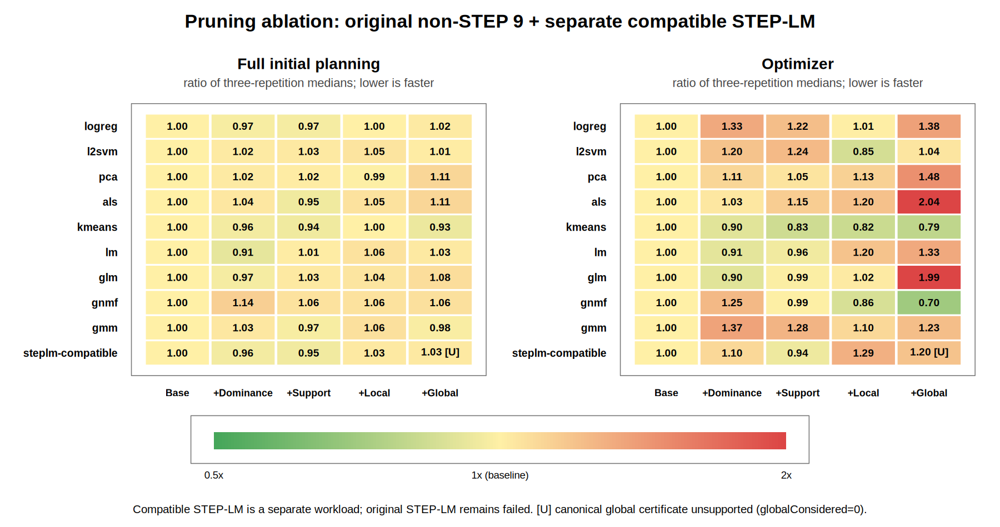

# ML training pruning ablation — 실험 설계 및 결과

> 아래는 삭제 전 누적 ablation 기록이다. 현재 구현은 local prefix pruning만 유지하며,
> dominance·추가 n-ary support·global은 삭제했다. [후속 개별 비교와 결정](PRUNING_FACTORIAL_2026-10-06.md).

## 관측 결과

**이번 설정에서 전역 상한 pruning을 상시 활성화할 latency 근거는 나오지 않았다.**
기존 `local` 대비 `global`의 전체 초기 플래닝 시간은 대응 비교 기하평균 **1.39% 증가**,
optimizer 시간은 **27.00% 증가**했다. 3회씩 측정한 탐색적 결과이므로 작은 전체 시간 차이의
통계적 유의성을 주장하지 않는다. 전역 옵션은 기본 비활성 상태를 유지한다.

기존 dominance/support/local을 합친 `local`은 baseline 대비 optimizer 시간이 **4.48% 감소**했지만,
전체 초기 플래닝 시간은 **0.03% 증가**로 사실상 같았다. pruning으로 줄인 탐색량이 전체 컴파일
지연시간의 같은 비율 감소로 연결되지는 않았다.

주 비교군은 기존 정의 그대로의 9개 workload × 5 variants × 3회 = **135회**다.
STEP-LM은 엔진과 호환되는 별도 정의로 **15회** 측정했으며 주 기하평균에서 제외했다.
총 150회 모두 compile/lowering audit를 통과했다. 원래 실패한 55개 시도는 별도로 보존했다.

| 누적 설정 | 전체 초기 플래닝 / baseline | Optimizer / baseline | 선택 비용 변화 |
|---|---:|---:|---|
| baseline | 1.0000× (+0.00%) | 1.0000× (+0.00%) | 동일 |
| dominance | 0.9984× (-0.16%) | 1.0373× (+3.73%) | 동일 |
| support | 0.9913× (-0.87%) | 1.0271× (+2.71%) | 동일 |
| local | 1.0003× (+0.03%) | 0.9552× (-4.48%) | 동일 |
| global | 1.0141× (+1.41%) | 1.2130× (+21.30%) | L2SVM −26.46%; GNMF +2.37%; 나머지 동일 |

각 값은 같은 workload·반복 번호의 대응 비율을 모은 기하평균이다. 1 미만이 더 빠르다.


## 질문과 비교 대상

현재 CostBased DP에서 pruning이 실험용 ML workload의 플래닝 지연시간을 줄이는지 측정한다.
`baseline → dominance → support → local → global`의 누적 ablation이다.
baseline에서도 기존 equality quotient, unary/binary support, privacy 및 runtime legality 검사는 유지한다.

| Variant | 추가 기법 |
|---|---|
| baseline | 동일 바이너리에서 이번 dominance/support/local 개선을 비활성화한 대조군 |
| dominance | 같은 외부 관측 상태에서 더 비싼 unary 후보 제거 |
| support | 다항 factor의 불가능한 값에 대한 support propagation 추가 |
| local | boundary merge 중 불가능 prefix 및 비용 prefix 가지치기 추가 |
| global | 검증된 초기 feasible plan의 U와 값별 separable lower bound 비교 추가 |

global은 `round(Σ factor별 조건부 최소) > U`인 값만 제거한다. 동일 비용은 보존하며,
canonical/encoded 수치 인증이 모두 통과해야 한다. 이 실험은 초기 U를 이용한 값별 제거이며,
실행 중 갱신되는 U나 여러 boundary 값의 조합 전체를 제거하는 방식까지 평가하지 않는다.
이 제거는 runtime 합법성 판단이 아니라 incumbent보다 좋은 해를 만들 수 없다는 비용 증명에 따른 것이다.
runtime 지원 조합 및 원본 모델의 canonical evaluator는 변경하지 않는다.
이는 과거 바이너리와의 비교가 아니라 동일 코드·계측 조건에서 각 기능을 누적 활성화한 비교다.
기능 간 상호작용을 전부 분리하는 factorial study는 아니다. 기본 설정은 `local`과 같으며
`global`은 명시적인 실험 property를 지정할 때만 켜진다.

전역 하한은 변수 `v=a`를 고정했을 때 각 factor의 최소 비용을 더한 값이다.
서로 다른 factor가 다른 assignment에서 최소를 얻을 수 있으므로 실제 완성 플랜 비용의 하한이다.
인증된 하한이 초기 feasible plan의 비용 U보다 **엄격히 클 때** 그 값만 제거한다.
모든 valid plan을 보존하는 pruning은 아니며, U보다 좋은 최적해를 보존하는 비용 pruning이다. 이 전역 비용 비교 단계는 U와 같은 비용의 해도 배제하지 않는다.

## 고정 조건

- 주 비교군 9개: logreg, l2svm, pca, als, kmeans, lm, glm, gnmf, gmm.
- 별도 호환 비교군: steplm-compatible. 원래 STEP-LM 정의가 성공한 것으로 계산하지 않는다.
- 기존 sealed 데이터: X=50,000×128, ROW, PrivateAggregation; Y가 있으면 50,000×1 Public.
- 현재 canonical 템플릿을 별도 stage에 동결했다. 데이터 attestation 2,216개는 동일하다.
  STEP-LM의 현재 정의(`maxi=10,max_features=2`)는 이 엔진의 builtin signature와 맞지 않아
  파싱에서 실패했다. 이 실패를 보존하고, STEP-LM은 기존 호환 정의(`maxi=20`, `max_features` 없음)를
  원래 sealed stage 및 대응하는 Git renderer로 별도 측정한다. 다른 workload의 정의는 바꾸지 않는다.
- worker 3개, WAN-Mid에 대해 이미 측정된 비용 profile의 11개 cost 환경 변수를 동일하게 고정.
- 기존 템플릿의 iteration 및 seed 유지. CostBased=`COMPILE_COST_BASED`.
- 동일 content-addressed Docker image, JVM 16 GiB heap/8 logical processors, container 24 GiB.
- 별도 CPU 집합에서 매번 새 coordinator container/JVM. 한 번에 한 sample만 측정.
- 각 workload/variant 3회. workload/repetition block 안에서 variant 순서를 순환한다.
- cold JVM latency를 측정하므로 별도 JVM warmup을 포함하지 않는다.
- optimizer의 wall-clock 10초 cutoff는 모든 variant에서 해제한다. 기존 gap/assignment/memory 한도는 유지한다.
  따라서 시간 제한에 먼저 도달해서 서로 다른 양의 탐색을 한 효과를 줄인다. 종료 사유와 최종 비용은 별도로 비교한다.
- 구체적인 한도: relative gap 0.05, merge당 assignments 1,000,000, retained slots 8,000,000,
  scored candidates 16, earlyStop=true, timeMillis=0. gap은 `(U−L)/L`에 보수적 반올림을 적용한다.
- 실행 호스트 `dams-so002`, CPU 8–15. 비용 profile의 모델상 coordinator/worker 토폴로지와
  컴파일러를 측정하는 실제 호스트는 구분한다. 공유 호스트의 다른 작업을 중단하지 않았다.

## 격리와 측정 범위

공유 multi-host runtime lane은 다른 캠페인이 사용 중이다. 기존 coordinator-only Docker ablation의
격리 방식을 재사용하되 현재 `MatrixCampaignProbe`의 정규 full compile 경로를 호출한다.
`scripts/fedplanner/run_LAN_docker.sh --pruning-ablation`이 유일한 실행 진입점이다.
local metadata를 동일 경로에 read-only mount하고 `--network none`으로 실행한다.
worker 컨테이너를 띄우거나 기존 netem/worker/runtime lane을 변경하지 않는다.
이 호스트의 Docker snap은 `/grid/3` bind mount를 볼 수 없어 실제 mount와 실행 결과는 별도의
`/home/mchoi/w1357-pruning-ablation-20261006` 디렉터리에 둔다. 데이터의 read-only hardlink 복사본을
사용하며 수정한 템플릿과 seal은 hardlink를 끊고 독립 파일로 교체했다. 원본 stage의 내용은 유지된다.

주 지표는 `planningFullInitialNanos`, 보조 지표는 전체 compile time, optimizer time, analysis time이다.
정규 HOP planning, LOP lowering, runtime-program construction까지 실행하고 workload 실행 직전에 반환한다.
probe가 실제 planner, compile-only, lowering 누락/불일치 0, workload 실행/dispatch 0을 검증한다.
이는 고정 비용 모델 하의 컴파일 latency 실험이며 실제 training runtime 또는 WAN 전송 성능 측정이 아니다.

`full_initial_planning_seconds`에는 분석·탐색·선택 반영·lowering 등이 포함된다.
`optimizer_seconds`는 전역 하한 준비 비용도 포함한다. 일부 phase timer는 서로 중첩되므로
analysis/optimizer/selection 값을 더해 전체 시간을 재구성하지 않는다.
비용 U는 cost model의 목적함수이며 초 단위 실측 training time으로 해석하지 않는다.
`reducedValues`는 DP 변수의 domain 크기 합계이며 전체 플랜 개수나 HOP 개수가 아니다.

각 cell에서 중앙값과 최소·최대값을 보존한다. 전체 비교는 workload별 시간비의 기하평균을 사용하며
주 지표는 같은 workload·반복 번호의 시간비 27개를 모은 기하평균이다.
STEP 호환군은 이 주 비교군에서 제외한다. workload별 3회 중앙값의 비율을 다시 기하평균한 값은
별도의 기술 통계로 남기며, 반복별 대응 비교와 섞지 않는다. 3회 cold-JVM 측정은 탐색적 결과이며
통계적 유의성이나 작은 차이의 반복 재현성을 주장하지 않는다. 같은 자원/gap 정책을 고정한 실험이므로
선택 비용이 달라지면 동일 품질의 플랜을 찾는 데 걸린 시간의 비교와도 구분한다.

## 검증과 결과

Java pruning 대상 테스트 **67건**, 실행·분석 harness 회귀 **12건**이 통과했다. 전역 제한 후 자원 한도/조기 종료에서도
`lower ≤ 원래 문제의 brute-force optimum ≤ upper`인지 12개의 작은 무작위 모델에서 완전 열거와 비교한다.
이 검증은 `RESOURCE_INITIAL`, `RESOURCE`, `TARGET_REACHED` 종료를 포함한다.
runtime 합법성을 완화하거나 fallback을 추가하지 않았다. 대형 ML workload를 완전 열거하여
최적성을 증명한 실험은 아니며, 실제 worker training 실행의 수치 정확성도 이번 검증 범위에 포함하지 않는다.

기존 broader suite의 unknown-width golden hash 실패 1건은 이번 변경 전에도 재현되는 별도 이슈다.
golden을 교체하거나 전체 suite가 통과했다고 처리하지 않았다.

실행 중 외부 실험 저장소와 작업 worktree가 다른 정리 작업에서 삭제됐다. 원래 성공한 95개 결과를 보존하고,
누락된 non-STEP r3 40개는 동결 설정으로 복구했다. STEP 호환군은 별도로 15개를 측정했다.
삭제된 경로를 복원하는 대신 새 worktree에 백업을 적용했으며 production source 2,175개, runner 및
측정 JAR hash가 정확히 일치한다. 복구 반복은 원래 sample key와 variant 순서를 유지한다.
원래 실패 55개(지원하지 않는 STEP parameter 10개, topology 경로 소실 45개)는 별도 기록으로 남기며
성공 latency에 포함하지 않는다. 환경 중단으로 반복의 측정 시점이 벌어진 점도 해석의 한계다.


## Workload별 절대 시간

아래 표는 3회 중앙값이며 단위는 초다. 최소·최대값과 각 반복의 대응 비율은
[CSV](pruning-ablation-20261006/ablation.csv) 및 [JSON](pruning-ablation-20261006/analysis.json)에 있다.

| Workload | Baseline | +Dominance | +Support | +Local | +Global |
|---|---:|---:|---:|---:|---:|
| logreg | 28.930 | 28.132 | 28.027 | 28.870 | 29.602 |
| l2svm | 10.292 | 10.519 | 10.565 | 10.778 | 10.425 |
| pca | 2.720 | 2.769 | 2.767 | 2.702 | 3.014 |
| als | 3.925 | 4.069 | 3.710 | 4.140 | 4.351 |
| kmeans | 6.086 | 5.845 | 5.742 | 6.076 | 5.665 |
| lm | 2.208 | 2.018 | 2.231 | 2.340 | 2.272 |
| glm | 75.816 | 73.479 | 77.884 | 78.981 | 82.026 |
| gnmf | 3.092 | 3.520 | 3.269 | 3.274 | 3.287 |
| gmm | 6.227 | 6.441 | 6.037 | 6.605 | 6.093 |
| steplm-compatible | 9.120 | 8.746 | 8.679 | 9.402 | 9.381 |



그림은 workload별 **중앙값의 비율**을 보여주는 기술 통계다. 위의 주 기하평균은 반복별 대응 비율을 사용한다.
참고로 중앙값 비율의 기하평균으로 계산하면 global/local은 전체 +0.14%, optimizer +24.12%다.
집계 방법에 따른 차이는 있지만, 이 실험에서 전역 옵션이 안정적으로 latency를 줄인다는 근거가 없다는 해석은 같다.

## 후보 감소와 계산 오버헤드

| Workload | Local 후보 값 | Global 후보 값 | 추가 감소 | 전역 준비 시간, ms | Local optimizer, s | Global optimizer, s |
|---|---:|---:|---:|---:|---:|---:|
| logreg | 23,762 | 23,762 | 0 | 1015.966 | 2.415 | 3.310 |
| l2svm | 9,168 | 2,224 | 6,944 | 277.996 | 1.029 | 1.260 |
| pca | 385 | 352 | 33 | 52.443 | 0.137 | 0.180 |
| als | 358 | 320 | 38 | 68.443 | 0.121 | 0.205 |
| kmeans | 1,696 | 1,671 | 25 | 134.912 | 0.629 | 0.606 |
| lm | 208 | 122 | 86 | 36.621 | 0.109 | 0.121 |
| glm | 186,147 | 186,147 | 0 | 11557.215 | 11.120 | 21.714 |
| gnmf | 575 | 343 | 232 | 55.680 | 0.223 | 0.181 |
| gmm | 1,107 | 766 | 341 | 81.275 | 0.237 | 0.263 |
| steplm-compatible | 1,071 | 1,071 | 0 | 0.006 | 0.263 | 0.245 |

- **logreg·GLM:** 최종 후보 수가 줄지 않았다. 그런데 전역 하한 계산과 제한 factor 추가·root 재구성에
  각각 중앙값 약 1.016초, 11.557초가 들었다. GLM은 양쪽 모두 `RESOURCE_INITIAL`로 끝났고 선택 비용도 같다.
- **L2SVM:** 후보 값이 9,168→2,224로 줄어 같은 자원 정책에서 더 싼 플랜을 선택했다.
  다만 전역 준비에 약 278ms가 들어 optimizer 중앙값은 1.029→1.260초로 늘었다.
- **기존 local pruning:** 실제 child 비용 조회는 logreg 34,847,773→12,334,382(64.60%),
  L2SVM 28,427,566→12,030,740(57.68%), kmeans 15,583,870→4,053,792(73.99%)로 감소했다.
  이 비교는 support→local이며 최종 선택 비용은 같다. 연산량 절감은 확인했지만 전체 지연시간 효과는 작았다.
- **STEP 호환군:** 전역 설정에서 `UNSUPPORTED_CANONICAL`로 나왔다. 비용 합산의 수치 인증 조건이 충족되지 않아
  전역 제한을 적용하지 않았다. 모든 variant의 최종 후보 수 1,071과 선택 비용은 같았다.
  이 workload의 global timing을 실제로 적용된 전역 pruning의 효과로 해석하면 안 된다.

`globalPruned`는 원본 domain에 대해 계산하므로 기존 reduction으로 이미 사라진 값을 포함할 수 있다.
반대로 이후 propagation이 추가 값을 제거할 수도 있다. 따라서 순수한 추가 감소량은 최종 `reducedValues`를
local과 비교해서 계산했다. raw counter만 보면 logreg·GLM에서도 효과가 있는 것처럼 오해할 수 있다.

## 선택 품질과 유효성

| Workload | Local 선택 비용 U | Global 선택 비용 U | 비용 변화 | Global 종료 |
|---|---:|---:|---:|---|
| logreg | 74333.656 | 74333.656 | +0.00% | RESOURCE |
| l2svm | 1691.4353 | 1243.8568 | -26.46% | RESOURCE |
| pca | 1998.5261 | 1998.5261 | +0.00% | TARGET_REACHED |
| als | 1348514.7 | 1348514.7 | +0.00% | TARGET_REACHED |
| kmeans | 2758.986 | 2758.986 | +0.00% | EXACT |
| lm | 51.407386 | 51.407386 | +0.00% | TARGET_REACHED |
| glm | 79553.5 | 79553.5 | +0.00% | RESOURCE_INITIAL |
| gnmf | 10947.473 | 11206.622 | +2.37% | TARGET_REACHED |
| gmm | 8225.2386 | 8225.2386 | +0.00% | TARGET_REACHED |
| steplm-compatible | 36712074 | 36712074 | +0.00% | TARGET_REACHED |

`baseline`, `dominance`, `support`, `local`의 선택 플랜 fingerprint와 목적함수는 모든 workload에서 동일하다.
`global`은 L2SVM과 GNMF에서 선택이 달라졌다. 각 workload/variant의 **50개 조합 모두**
3회 반복 간 선택 fingerprint와 목적함수가 동일했다.

GNMF는 특히 시간과 품질을 함께 봐야 한다. local은 `L≈10,947.473`, `U≈10,947.473`까지 탐색했다.
global은 `L≈10,884.508`, `U≈11,206.622`, gap **2.959%**에서 `TARGET_REACHED`로 끝났다.
초기 feasible seed의 비용은 두 설정에서 같다. domain 축소 후 탐색 경로와 stopping 시점이 달라져
더 비싼 초기 feasible plan이 허용 gap 안에서 채택된 것이다. assignments는 245,585→13,280으로
줄었지만 선택 비용은 **2.367% 증가**했다. 전역 pruning이 최적해를 보존한다는 성질과
자원/gap 한도가 있는 solver가 매번 같은 품질의 해를 반환한다는 주장은 구분해야 한다.

L2SVM도 `RESOURCE` 종료이며 최적성이나 5% gap을 만족한 결과로 보고하지 않는다.
컴파일에서 합법적인 플랜을 얻었다는 검증과 대형 workload의 전역 최적성을 증명했다는 주장은 다르다.

## 재현 자료 및 구현 상태

- [원시 통계·provenance JSON](pruning-ablation-20261006/analysis.json): 205개 전체 시도, 성공 150개,
  실패 55개, manifest/result 경로와 SHA, attempt 경로 및 command/log hash, 동일성 검증, 반복별 대응 비율.
  receipt 내용은 hash가 기록된 result.json에 포함되며 원래 `tmp/receipt.json`도 원시 실험 디렉터리에 보존했다.
- [집계 CSV](pruning-ablation-20261006/ablation.csv), [자동 생성 표](pruning-ablation-20261006/tables.md),
  [PNG](pruning-ablation-20261006/latency.png), [SVG](pruning-ablation-20261006/latency.svg).
- 원시 실험 root: `/home/mchoi/w1357-pruning-ablation-20261006`.
  `study-v1`은 성공 95/실패 55, `recovery-r3-v1`은 성공 40, `steplm-compatible-v1`은 성공 15다.
  canary는 주 통계에서 제외했다.
- 원시 자료 보존본: `/grid/3/cofee-lm-sweep-mchoi-20260914/pruning-ablation-20261006/raw-results`.
  `archive-verification.json`에서 208개 manifest/result의 복사 전후 hash 일치를 확인할 수 있다.
- 복구 작업 저장소: `/home/mchoi/w1357-pruning-ablation-20261006/repository`,
  branch `experiment/pruning-ablation-20261006`, 기준 HEAD `3d0d683c1bca099f004edf9105f5387369b4abea`.
- 측정 JAR SHA: `aeb0deda220ed7dc96cccd9661e96d6d7d2ca8658373d9ccb67a1e2477c007f6`.
- 입력 비용 profile SHA: `91f543a40a522c774be99a4d9b59257a70d4f4279b78ec4010ec057d232eca5a`.
- 구현은 `PruningAblation` gate, solver의 세 기존 기법 제어, `RegionalSearchProblem`의 초기-U 제한,
  `LocalPhysicalOptimizer`의 실험 receipt, Docker launcher 및 분석기다. 별도의 production fallback은 추가하지 않았다.

동일 원시 결과로 표·그림을 다시 만드는 명령:

```bash
python3 scripts/fedplanner/analyze_pruning_ablation.py \
  --study /home/mchoi/w1357-pruning-ablation-20261006/study-v1 \
  --recovery /home/mchoi/w1357-pruning-ablation-20261006/recovery-r3-v1 \
  --compatibility /home/mchoi/w1357-pruning-ablation-20261006/steplm-compatible-v1 \
  --output docs/pruning-ablation-20261006
```

실험을 새로 실행하는 진입점은 `scripts/fedplanner/run_LAN_docker.sh --pruning-ablation`이며
각 cohort의 `ablation.json`에 stage/renderer/CPU/JVM/profile와 실행 순서를 남겼다.
전역 제한의 후속 성능 개선을 시도한다면 이미 제거된 값의 재검사와 효과 없는 root 재구성 비용부터
줄이는 것이 이번 관측으로 뒷받침되는 우선순위다. 이 개선을 구현하거나 검증한 결과까지 포함하지는 않는다.

그림은 기존 설치된 base R의 PNG/Cairo 및 SVG 장치로 생성한다. 새 package 의존성은 추가하지 않았으며
`--no-plots`로 수치 검증과 표 생성만 재실행할 수 있다.
